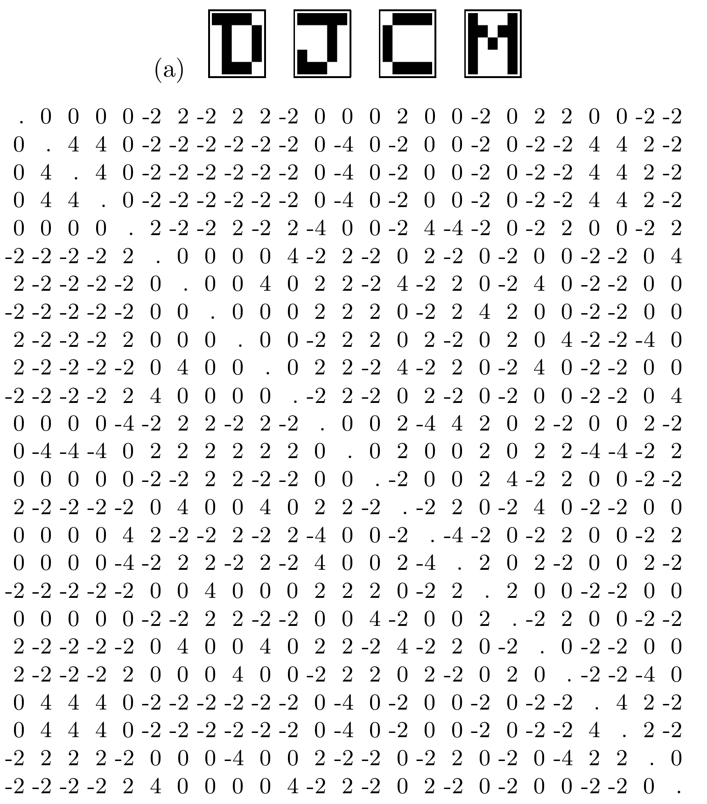
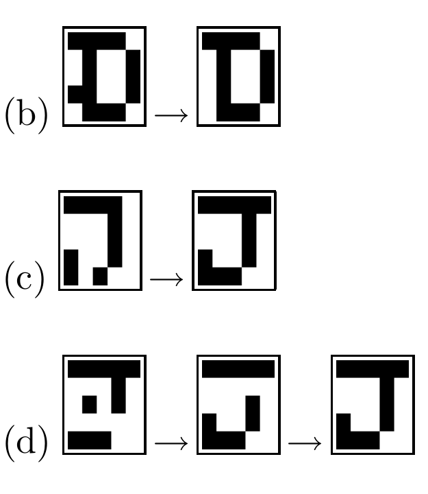
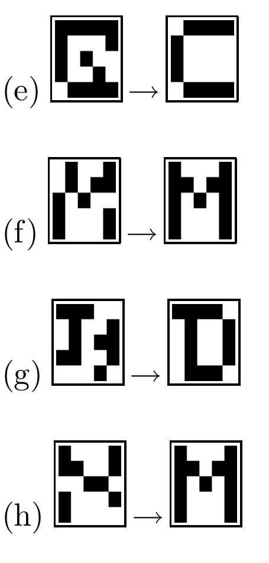
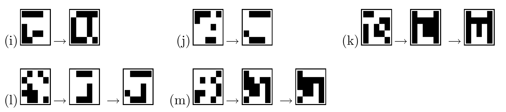

<!-- 原书 PDF 物理页 521；印刷页 509。整页图 42.3，四块高清裁图对应 (a)、(b)–(d)、(e)–(h)、(i)–(m)。 -->

图 42.3：储存四种记忆的二值 Hopfield 网络。(a) 四种记忆及权重矩阵。(b)–(h) 与目标记忆相差一、二、三、四，甚至五个比特的初始状态，经过一次或两次迭代后恢复为该记忆。(i)–(m) 有些初始状态与这些记忆相距较远，会收敛到四种记忆以外的稳定状态：(i) 的稳定状态看起来像是“D”和“J”两种记忆的混合；(j) 的稳定状态像是“J”和“C”的混合；(k) 得到“M”记忆的受损版本（相差两个比特）；(l) 得到“J”的受损版本（相差四个比特）；(m) 的状态起初看似伪状态，直到我们认出它是稳定状态 (l) 的反态。
