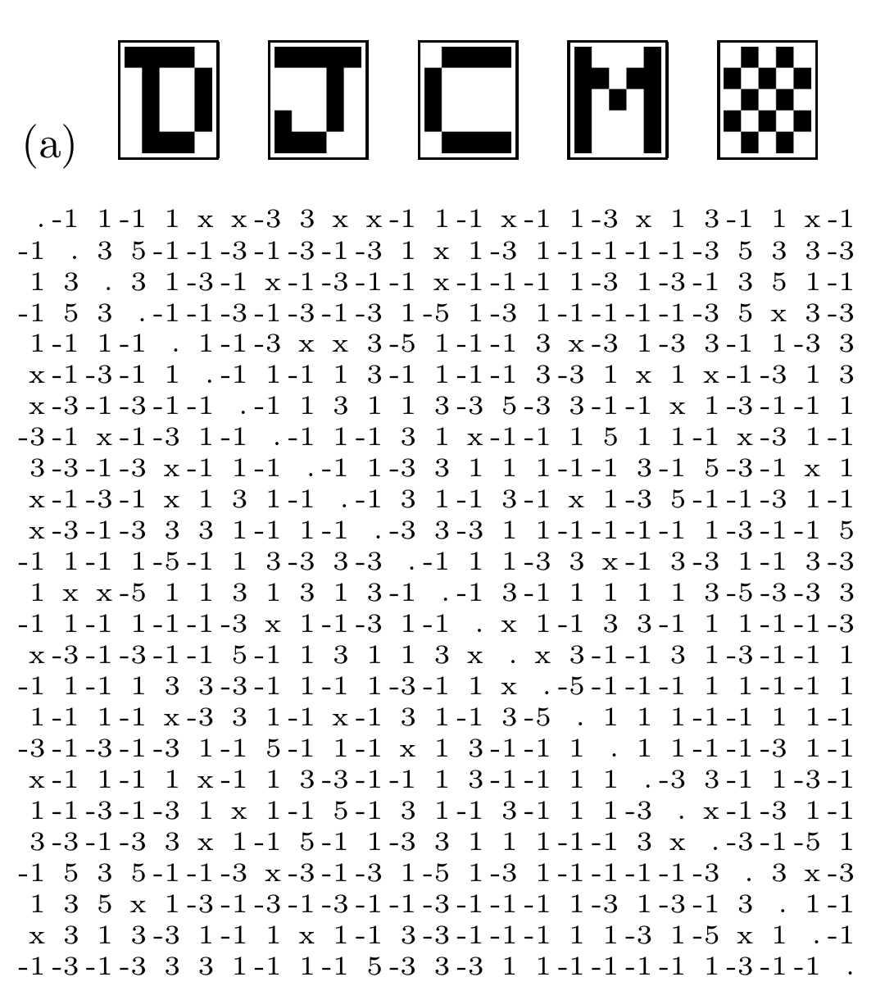
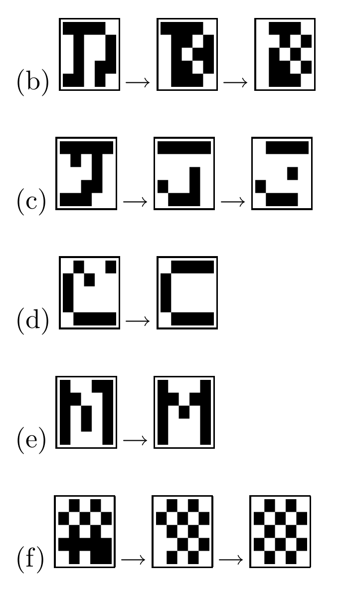
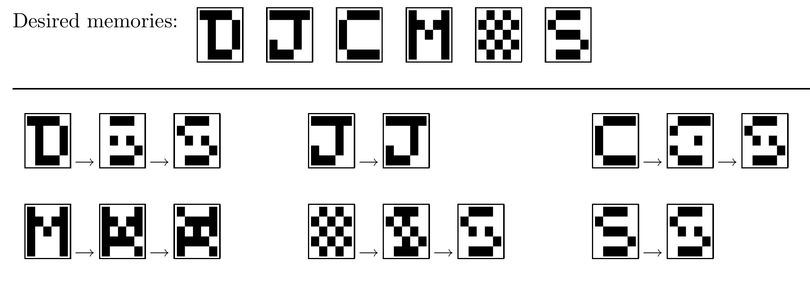

<!-- 原书 PDF 物理页 523；印刷页 511。整页图 42.4 和图 42.5。 -->

图 42.4：储存五种记忆的 Hopfield 网络，其 300 个权重中有 26 个被删除。(a) 五种记忆及网络的权重；被删除的权重以“x”表示。(b)–(f) 与某个记忆有三个随机比特不同的初始状态：有些恢复为原记忆，有些却收敛到其他状态。

图 42.5：用六种记忆训练的过载 Hopfield 网络，其中大多数记忆不是稳定状态。图内的“Desired memories”意为“预期记忆”。
