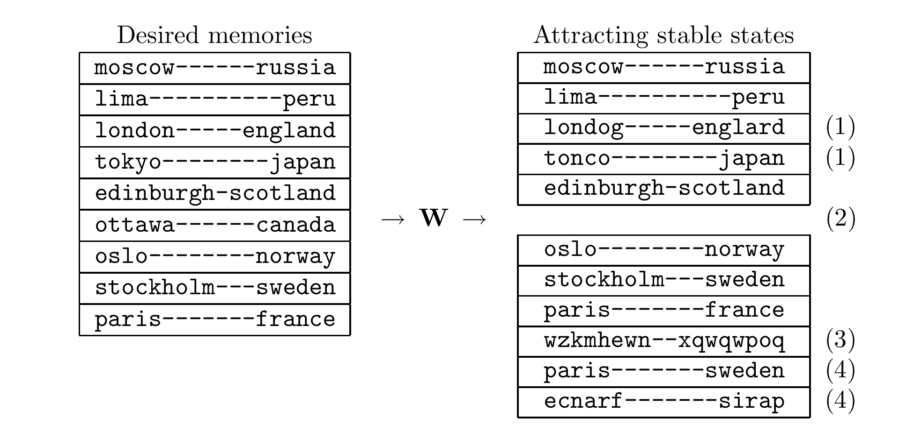

<!-- 原书 PDF 物理页 524；印刷页 512。图 42.6、§42.6 结尾、习题 42.6、§42.7 开头与四项失效形式。 -->

图 42.6：Hopfield 网络的失效形式（高度示意化）。左边是预期记忆的列表，右边是由此得到的、能吸引邻近状态的稳定状态。注意：(1) 有些记忆虽被保留下来，却带有少量错误；(2) 有些预期记忆完全丢失，在该记忆及其附近都没有吸引性的稳定状态；(3) 出现了与原列表无关的伪稳定状态；(4) 出现了由预期记忆拼凑出的伪稳定状态。

图内“Desired memories”为“预期记忆”，“Attracting stable states”为“具有吸引性的稳定状态”，中间的 $\mathbf W$ 是权重矩阵。左侧九对记忆依次是“莫斯科—俄罗斯、利马—秘鲁、伦敦—英格兰、东京—日本、爱丁堡—苏格兰、渥太华—加拿大、奥斯陆—挪威、斯德哥尔摩—瑞典、巴黎—法国”。右侧保留的正常词对也分别对应这些中文地名；`londog—englard` 是“伦敦—英格兰”两侧词都写错的形式，`tonco—japan` 是“东京—日本”的城市名写错的形式；原书的 `wzkmhewn—xqwqwpoq` 是无对应地名的字母串；`paris—sweden` 错把巴黎与瑞典配在一起；`ecnarf—sirap` 则分别是 `france—paris` 的字符反序。

其中，$f(a)$ 是激活函数，例如 $f(a)=\tanh(a)$。对于恒定的激活量 $a_i$，活动量 $x_i(t)$ 会以时间常数 $\tau$ 指数式地趋近 $f(a_i)$。

现在来看一个很好的结论：只要权重矩阵对称，这个系统就以式 (42.15) 的变分自由能为 Lyapunov 函数。

▷ 习题 42.6。（难度 1）计算 $\frac{\mathrm d}{\mathrm dt}\widetilde F$，证明变分自由能 $\widetilde F(\mathbf x)$ 是连续时间 Hopfield 网络的 Lyapunov 函数。

如果系统的动力学沿函数 $L$ 作最速下降，即 $\frac{\mathrm d}{\mathrm dt}x_i(t)\propto\frac{\partial L}{\partial x_i}$，通常特别容易证明 $L$ 是 Lyapunov 函数。对于连续时间的连续型 Hopfield 网络，情况没有这么简单；不过，$\frac{\mathrm d}{\mathrm dt}x_i(t)$ 的每个分量确实与 $\frac{\partial\widetilde F}{\partial x_i}$ 同号。这意味着，只要选用适当定义的度量，Hopfield 网络的动力学确实沿 $\widetilde F(\mathbf x)$ 作最速下降。

## 42.7　Hopfield 网络的容量

研究单个神经元的学习时，我们曾把学习视为一种通信：把训练数据集的标签从一个时刻传到更晚的时刻。我们发现，线性阈值神经元的容量是每个权重 2 比特。

类似地，我们也可以把 Hopfield 联想记忆看成一个通信信道（图 42.6）。一组预期记忆通过式 (42.5) 的赫布规则，或者通过其他学习规则，被编码进一组权重 $\mathbf W$。接收者只得到权重 $\mathbf W$，然后找出 Hopfield 网络的稳定状态，并把它们当作原来的记忆。图中说明了这种通信系统可能以各种方式失效：

1. 某些记忆中的个别比特可能损坏，也就是说，Hopfield 网络的某个稳定状态与预期记忆略有偏离。
2. 网络的吸引子列表中，可能整个缺少某些记忆；也可能虽然存在对应的稳定状态，但它的吸引域小到无法用于模式补全和纠错。
3. 可能出现与预期记忆无关的额外伪记忆。
4. 还可能出现额外的伪记忆，它们是对预期记忆进行混合、反转等操作得到的。
