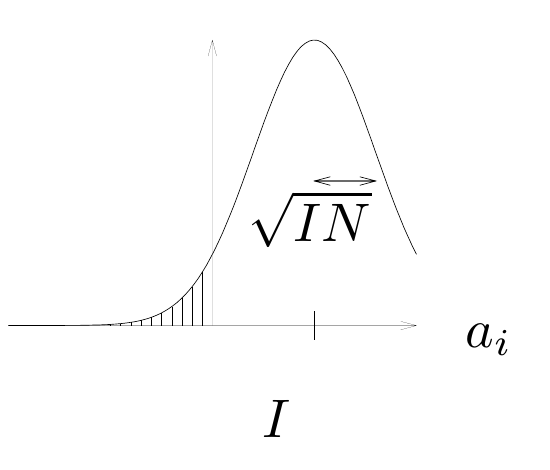

<!-- 原书 PDF 物理页 525；印刷页 513。§42.7 严格容量定义、式 (42.18)–(42.22) 与图 42.7。 -->

在这些失效形式中，第 1、2 类显然都不理想，第 2 类尤其如此。只要每种预期记忆都有很大的吸引域，第 3 类或许并不太要紧。第 4 类在某些情境下甚至可以看成有益。例如，让一个网络记住“约翰爱玛丽”（John loves Mary）和“约翰得到蛋糕”（John gets cake）这样的有效句子后，如果发现“约翰爱蛋糕”（John loves cake）也是网络的稳定状态，我们可能会很高兴。我们可以把这种行为称为“泛化”（generalization）。

一个有 $I$ 个神经元的 Hopfield 网络，其容量可以定义为：在第 2 类失效没有显著发生概率的条件下，它能储存多少个随机模式 $N$。如果进一步要求第 1 类失效的概率也极小，得到的容量就会小得多。下面我们研究这两种容量定义。

*Hopfield 网络的容量——严格定义*

首先，我们考察用赫布规则学习的二值 Hopfield 网络的信息储存能力。假设网络的状态被设为某个预期模式 $\mathbf x^{(n)}$，我们只考察这个模式的一个比特是否稳定。待储存的模式假定是随机选取的二值模式。

某个神经元 $i$ 的激活量是

$$a_i=\sum_j w_{ij}x_j^{(n)},\tag{42.18}$$

其中，对 $i\ne j$，权重为

$$w_{ij}=x_i^{(n)}x_j^{(n)}+\sum_{m\ne n}x_i^{(m)}x_j^{(m)}.\tag{42.19}$$

这里把 $\mathbf W$ 分成两项：第一项贡献“信号”，强化预期记忆；第二项贡献“噪声”。将 $w_{ij}$ 代入，激活量成为

$$a_i=\sum_{j\ne i}x_i^{(n)}x_j^{(n)}x_j^{(n)}+\sum_{j\ne i}\sum_{m\ne n}x_i^{(m)}x_j^{(m)}x_j^{(n)}\tag{42.20}$$

$$\phantom{a_i}=(I-1)x_i^{(n)}+\sum_{j\ne i}\sum_{m\ne n}x_i^{(m)}x_j^{(m)}x_j^{(n)}.\tag{42.21}$$

第一项是预期状态 $x_i^{(n)}$ 的 $I-1$ 倍。如果只有这一项，它就会把神经元牢牢固定在预期状态。第二项是 $(I-1)(N-1)$ 个随机量 $x_i^{(m)}x_j^{(m)}x_j^{(n)}$ 的和。稍加思考就能确认，这些量是相互独立的随机二值变量，均值为 0、方差为 1。

因此，对随机模式组成的总体考察 $a_i$ 的统计性质，可以得到：$a_i$ 的均值是 $(I-1)x_i^{(n)}$，方差是 $(I-1)(N-1)$。

为了简化表述，下面假设 $I$ 和 $N$ 都足够大，可以忽略 $I$ 与 $I-1$、$N$ 与 $N-1$ 的差别。于是，上述结论可改述为：$a_i$ 服从均值为 $Ix_i^{(n)}$、方差为 $IN$ 的高斯分布。

图 42.7：当 $x_i^{(n)}=1$ 时，激活量 $a_i$ 的概率密度；比特 $i$ 发生翻转的概率等于左侧阴影尾部的面积。图内横轴是 $a_i$，均值标为 $I$，双向箭头标出的尺度为 $\sqrt{IN}$。

那么，如果把网络置于状态 $\mathbf x^{(n)}$，选中的比特保持稳定的概率是多少？在 Hopfield 网络动力学的第一次迭代中，比特 $i$ 发生翻转的概率是

$$P(i\text{ 不稳定})=\Phi\!\left(-\frac{I}{\sqrt{IN}}\right)=\Phi\!\left(-\frac{1}{\sqrt{N/I}}\right),\tag{42.22}$$
