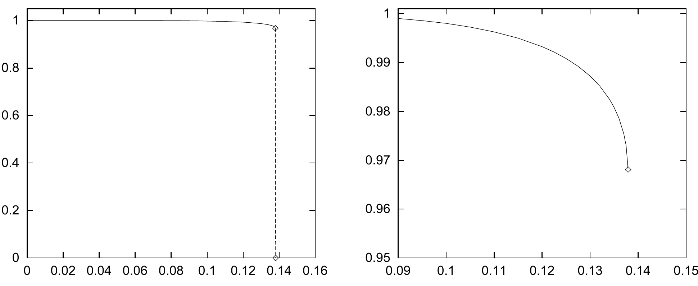

<!-- 原书 PDF 物理页 526；印刷页 514。图 42.8、式 (42.23)–(42.26)、习题 42.7 及两种容量定义。 -->

图 42.8：预期记忆与最接近它的稳定状态之间的重叠量，作为负载率 $N/I$ 的函数。重叠量定义为缩放后的内积 $\sum_i x_ix_i^{(n)}/I$：完全恢复时为 1，稳定状态中有 50% 的比特翻转时为 0。在 $N/I=0.138$ 处发生突变，重叠量从 0.97 降为 0。

其中，

$$\Phi(z)\equiv\int_{-\infty}^{z}\mathrm dz\,\frac{1}{\sqrt{2\pi}}e^{-z^2/2}.\tag{42.23}$$

重要的量 $N/I$ 是储存的模式数与神经元数之比。例如，如果尝试在 Hopfield 网络中储存约 $N\simeq0.18I$ 个模式，那么，某个指定模式中的指定比特在第一次迭代时不稳定的概率就是 1%。

现在可以推导第一个容量结果：它对应不允许预期记忆出现任何损坏的情形。

▷ 习题 42.7。（难度 2）假设我们希望所有预期模式都完全稳定——把网络置于任何预期模式状态时，都不希望有任何比特翻转——并且出现任何错误的总概率须小于一个很小的数 $\epsilon$。利用 $z$ 很大时误差函数的近似式

$$\Phi(-z)\simeq\frac{1}{\sqrt{2\pi}}\frac{e^{-z^2/2}}{z},\tag{42.24}$$

证明可储存的最大模式数 $N_{\max}$ 为

$$N_{\max}\simeq\frac{I}{4\ln I+2\ln(1/\epsilon)}.\tag{42.25}$$

不过，如果允许记忆发生少量损坏，可储存的模式数就会增加。

*统计物理学家的容量*

导出式 (42.22) 的分析告诉我们：如果尝试在 Hopfield 网络中储存约 $N\simeq0.18I$ 个模式，那么从某种预期记忆出发，第一次迭代中约有 1% 的比特不稳定。我们的分析并未说明后续迭代会发生什么。这些比特翻转之后，可能使其他比特也变得不稳定，让需要翻转的比特越来越多。这个过程可能引起级联，使网络最终状态与预期记忆相距很远。

事实上，$N/I$ 较大时，这种级联确实会发生；$N/I$ 较小时，通常不会发生——每种预期记忆附近都有一个稳定状态。在 $I$ 很大的极限下，Amit *等人*（1985）用统计物理方法数值求出了这两类行为之间的转变。下列位置出现明显的不连续变化：

$$N_{\mathrm{crit}}=0.138I.\tag{42.26}$$
