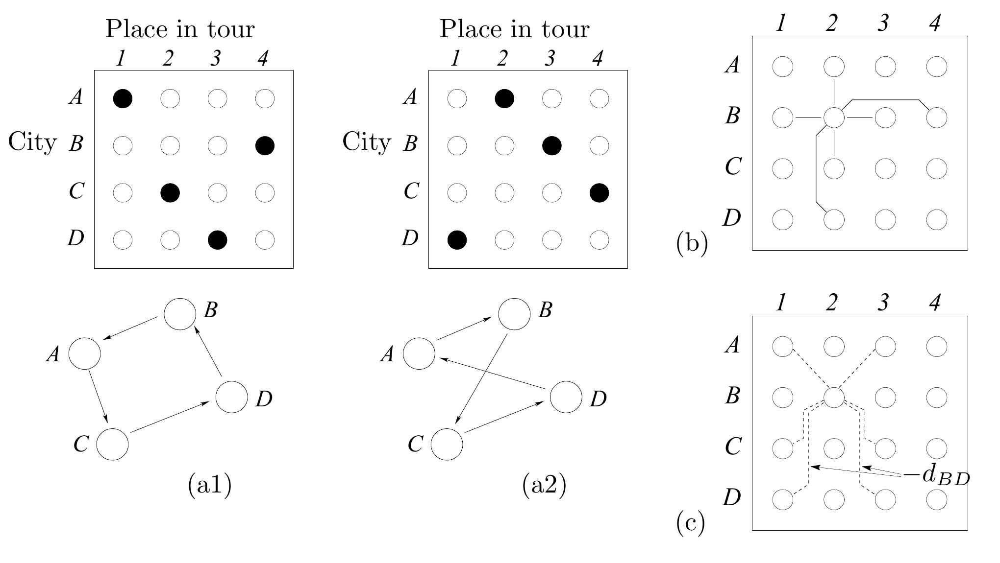

<!-- 原书 PDF 物理页 529；印刷页 517。图 42.10、旅行商问题与权重的两种作用。页末句延续到 PDF 530；译稿在本页补足完整句。 -->

图 42.10：用 Hopfield 网络求解含 $K=4$ 个城市的旅行商问题。(a1、a2) 这个 16 神经元网络的两个解状态，黑色圆点表示活动量 1、白色圆点表示 0；下方是分别对应的路线。(b) 节点 $B2$ 与其他节点之间的负权重，用来确保路线有效。(c) 表示距离目标函数的负权重。图内“Place in tour”意为“路线中的次序”，“City”意为“城市”；$A$–$D$ 是四座城市，$-d_{BD}$ 表示城市 $B$ 与 $D$ 之间距离的负值。

Hopfield 和 Tank（1985）提出，可以选取一个有趣的约束满足问题，为二值或连续型 Hopfield 网络设计权重，让网络趋于稳定的过程最小化该问题的目标函数。

*旅行商问题*

Hopfield 网络曾被用于求解一个经典的约束满足问题：旅行商问题。

给定 $K$ 座城市以及列出它们之间 $K(K-1)/2$ 个距离的矩阵，任务是找到一条闭合路线，每座城市恰好访问一次，而且总路程最短。旅行商问题的求解难度与 NP 完全问题等价。

Hopfield 和 Tank 建议用一个包含 $I=K^2$ 个神经元、呈方阵排列的网络状态来表示候选解。每个神经元代表“某座城市位于路线中某个次序”的假设。这里把神经元状态看成 $0$ 到 $1$ 之间的值，比看成 $-1$ 到 $1$ 之间的值更方便。图 42.10(a) 展示了四城市旅行商问题的两个解状态。

Hopfield 网络中的权重有两种作用。首先，它们必须定义一个能量函数，使网络状态只有在表示*有效*路线时才能达到能量最小值。有效状态看起来像一个置换矩阵：每一行和每一列都恰好有一个“1”。为落实这条规则，可以在同一行或同一列中的任意两个神经元之间设置较大的负权重，并给所有神经元设置正偏置，确保有 $K$ 个神经元开启。图 42.10(b) 展示了与神经元“$B2$”相连的负权重；它表示“城市 $B$ 在路线中排第二”。

其次，权重还必须编码我们想最小化的目标函数，即总路程。为此，可以在相邻列的节点之间设置与相应距离成正比的负权重。例如，若相邻列分别是 $B$、$D$ 两城的节点，权重便取 $-d_{BD}$。图 42.10(c) 展示了与神经元 $B2$ 相连的这些负权重。其结果是：网络处于有效状态时，总能量等于相应路线的总路程，再加上由偏置能量决定的一个常数。
