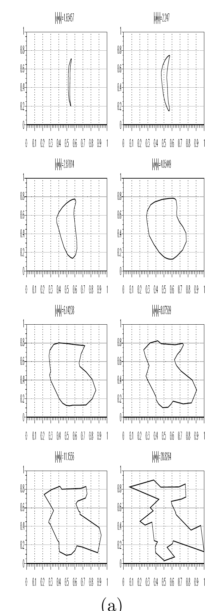
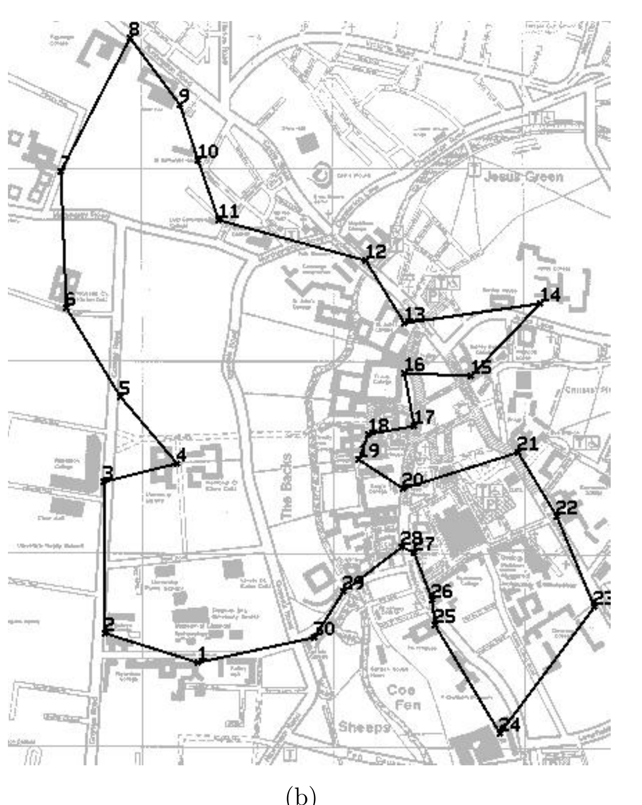

<!-- 原书 PDF 物理页 530；印刷页 518。图 42.11 两联图及 §42.9 结尾；承接 PDF 529 的页首半句已在前页译为完整句。 -->

图 42.11：(a) 连续型 Hopfield 网络采用 Aiyer（1991）的逐步非凸化方法求解旅行商问题时，其状态的演化；网络状态被投影到城市所在的二维空间。投影时，依据各神经元的活动量，把路线中每个位置所对应城市的质心作为该位置的坐标。(b)“巡访学者问题”：连接剑桥 27 所学院、工程系、大学图书馆以及 Sree Aiyer 家的最短路线。引自 Aiyer（1991）。图 (a) 的八个小图表示逐步变化的路线，坐标轴从 $0$ 到 $1$；图 (b) 地图中的数字是访问点编号。底图可辨的 `Jesus Green`、`Coe Fen`、`The Backs` 分别是“耶稣绿地”“科芬草地”“后园地带”；下缘可见 `Sheeps`，后续字样在原图中无法辨清。

既然 Hopfield 网络会最小化自身能量，我们或许希望，二值或连续型 Hopfield 网络的动力学能把状态带到一个表示有效路线的能量极小值，甚至带到最优路线。然而，对规模较大的旅行商问题，如果不作一些审慎的修改，这个希望无法实现。前面并未规定确保路线有效的权重，相对于距离权重应有多大；设定两者的尺度比并不容易。如果把确保有效性的权重设得“很大”，网络就会很快落入某个有效状态，却几乎不顾路线距离；如果把它们设得“很小”，距离权重可能使网络采取一个*无效*状态，而它的能量甚至低于任何有效状态。最初的能量函数写法使目标函数与解的有效性可能彼此冲突。

Sree Aiyer（1991）的工作解决了这个困难。他说明如何修改距离权重，让它们不会干扰解的有效性；还说明如何定义一个连续型 Hopfield 网络，使其动力学始终局限于“有效子空间”。Aiyer 使用*逐步非凸化*（graduated non-convexity）或*确定性退火*（deterministic annealing），借助这些 Hopfield 网络找到较好的解。确定性退火的方法是逐渐增大神经元的增益 $\beta$，从 $0$ 增至 $\infty$；到达这一极限时，网络状态对应一条有效路线。图 42.11(a) 展示了用该方法求解一个 30 城市旅行商问题时得到的一系列轨迹。

图 42.11(b) 展示了 Aiyer 用连续型 Hopfield 网络找到的“巡访学者问题”（travelling scholar problem）的一种解。
