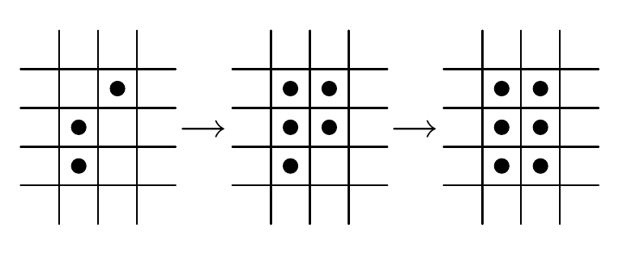
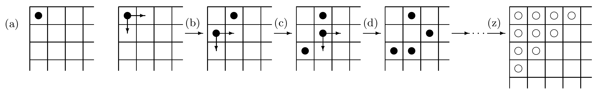

<!-- 原书 PDF 物理页 532；印刷页 520。Lyapunov 函数/东南移动谜题、图 42.12/42.13、习题 42.11/42.12 与 §42.11 第一则解答。 -->

*Lyapunov 函数*

习题 42.11。（难度 3）埃里克的谜题。在康威生命游戏的一个简化版本中，细胞排在方格网上。每个细胞要么存活，要么死亡。活细胞不会死亡；一个死细胞若有两个或更多直接相邻的活细胞，就会变成活细胞。（只计北、南、东、西四个方向的邻居。）按这些规则，至少需要多少个活细胞，才能最终让整个 $N\times N$ 方阵中的细胞都存活？

图 42.12：埃里克谜题的动力学。黑点是活细胞，箭头表示状态演化；原图从左到右展示连续三种状态。

对于同一游戏的 $d$ 维版本，规则改为：只要有 $d$ 个邻居存活，该细胞就会存活。至少需要多少个活细胞，才能让整个 $N\times N\times\cdots\times N$ 超立方体都变成活的？（这些活细胞应如何排列？）

*东南移动谜题*

图 42.13：东南移动谜题。(a) 左上角的一枚初始棋子；(b)–(d) 按规则移动的若干步；(z) 左上角附近标出的十个目标格子。黑点为棋子，空心圆标示习题要求清空的格子，箭头表示可行移动或后续状态。

东南移动谜题在一张半无限棋盘上进行，从它的西北角（左上角）开始。规则有三条：

1. 初始状态下，最西北角的格子里放一枚棋子（图 42.13(a)）。
2. 任一格子里不允许出现多于一枚棋子。
3. 每一步从棋盘上移去一枚棋子，再用两枚棋子替代它：一枚放在紧邻其东侧的格子里，另一枚放在紧邻其南侧的格子里，如图 42.13(b) 所示。每做这样一步，棋盘上的棋子总数就增加一枚。

完成图 42.13(b) 所示的移动后，可以选择两枚棋子中的任何一枚继续移动。图 42.13(c) 展示了移动下面一枚棋子的结果。下一步可以选择这三枚棋子中的最下面或中间的一枚；最上面一枚不能选，因为那样会违反规则 2。图 42.13(d) 移动的是中间那枚棋子。此时，除了最左边那枚棋子，其他任何一枚都可以移动。

现在，谜题是：

▷ 习题 42.12。（难度 4；解答见原书第 521 页）能否达到这样一种状态：离西北角最近、在图 42.13(z) 中标出的十个格子全都空着？

［提示：这个谜题与数据压缩有关。］

## 42.11　解答

**习题 42.3 的解答（原书第 508 页）。** 取一个含两个神经元的二值反馈网络，令 $w_{12}=1$、$w_{21}=-1$。每当神经元 1 更新时，它就变得与神经元 2 同状态；每当神经元 2 更新时，它就变得与神经元 1 反状态。因此不存在稳定状态。
