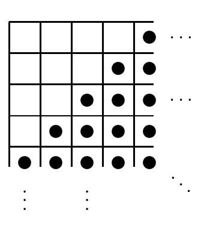

<!-- 原书 PDF 物理页 533；印刷页 521。§42.11 习题 42.4、42.12 的解答与图 42.14；第 42 章终页。 -->

**习题 42.4 的解答（原书第 508 页）。** 取一个含两个神经元的二值 Hopfield 网络，令 $w_{12}=w_{21}=1$，初始状态为 $x_1=1$、$x_2=-1$。如果动力学采用同步更新，那么每次迭代时两个神经元都会翻转状态。因此，动力学不会收敛到一个固定点。

**习题 42.12 的解答（原书第 520 页）。** 解这道题的关键是看出它与构造二进制符号码相似。从空字符串出发，我们可以反复把一个码字拆成两个码字，从而构建一棵二叉树。每个码字都有一个隐含概率 $2^{-l}$，其中 $l$ 是该码字在二叉树中的深度。每次将一个码字拆成两个、得到长度增加一位的两个新码字时，这两个新码字各自的隐含概率都是原码字的一半。对于一个完备的二进制码，Kraft 等式表明，这些隐含概率之和为 1。

同样地，在东南移动谜题（`southeast`）中，可以给棋盘上的每枚棋子赋一个“权重”：位于左上角格子的棋子权重为 1；与左上角距离为 1 的格子中，棋子权重为 $1/2$；距离为 2 时，权重为 $1/4$；依此类推。这里的“距离”指沿棋盘格边行走的距离（city-block distance）。这样，东南移动谜题中的每一步合法移动都不会改变棋盘上所有棋子的权重之和。Lyapunov 函数有两类：一类是状态的函数，其值始终保持不变；另一类也是状态的函数，其值有下界，并且总是减小或保持不变。总权重是第二类 Lyapunov 函数。

图 42.14：东南移动谜题中一种可能的棋子摆放状态。黑点表示棋子；省略号表示同一摆放方式向右和向下无限延伸。

初始总权重是 1，所以现在有一个有力的工具：一个状态的守恒函数。是否可能让权重最高的十个格子都空着，同时总权重仍为 1？如果棋盘上*所有*其他格子都放有棋子（图 42.14），总权重是多少？此时总权重为 $\sum_{l=4}^{\infty}(l+1)2^{-l}$，等于 $3/4$。因此，不可能清空那十个格子。
