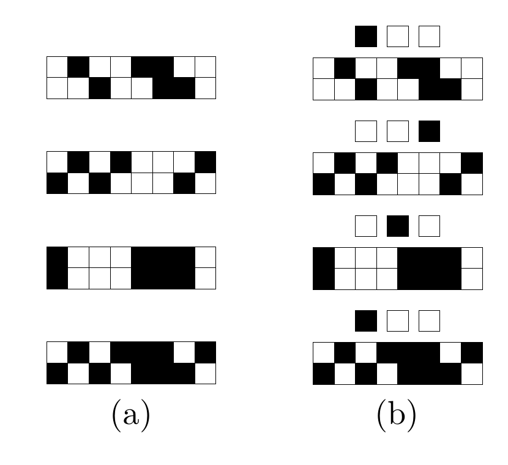

<!-- 原书 PDF 物理页 536；印刷页 524。§43.1 清醒／睡眠解释续、模型批评、图 43.1 与式 (43.13)。 -->

网络“睡眠”时，用生成模型 (43.4) 去“梦见”世界，并测量模型世界中 $x_i$ 与 $x_j$ 的相关量；这些相关量决定权重按比例*减小*。如果梦中世界的二阶相关量与现实世界的相关量相符，两项就会平衡，权重不再变化。

*对 Hopfield 网络和简单玻尔兹曼机的批评*

到目前为止，我们讨论的 Hopfield 网络和玻尔兹曼机中，所有神经元都对应可见变量 $x_i$。这样得到的概率模型经过优化，可以捕捉环境的二阶统计量。［一个样本集合 $P(\mathbf x)$ 的二阶统计量，是所有成对乘积 $x_i x_j$ 的期望值 $\langle x_i x_j\rangle$。］但现实世界通常还存在更高阶的相关关系；要有效描述现实世界，就必须把它们纳入模型。二阶相关量本身往往只携带很少、甚至完全不携带有用信息。

例如，设想一组椅子的二值图像。椅子的设计可以多种多样：有四条腿的椅子、舒适的椅子、带五条腿和轮子的椅子、木椅、软垫椅，以及以摇椅弧形底座代替椅腿的椅子。孩子很容易学会把这些图像与胡萝卜和鹦鹉的图像区分开来。但我认为，原始数据的二阶统计量对描述这组椅子图像没有用。二阶统计量只反映两个像素是否可能处于相同状态。要为椅子图像建立良好的生成模型，还需要更高阶的概念。

另有一种图像样本集合更简单，却同样离不开高阶统计量：它称为“平移样本集合”（shifter ensemble），有两种形式。图 43.1(a) 展示了“普通平移样本集合”的几个样本。每幅图像的下方八个像素，都是上方八个像素的副本：它可以向左平移一个像素、不平移，或向右平移一个像素。（上方八个像素是随机设定的。）这个样本集合可以看作进入大脑早期视觉处理阶段的双眼信号的一个简单模型。两只眼睛接收到的信号彼此相似，却会因视觉世界中的物体深度不同而有小幅平移。这个样本集合容易描述，但它的二阶统计量不传达有用信息：任一像素与其上方三个像素中任意一个的相关量为 $1/3$，而其他任意两个像素的相关量为零。

图 43.1：“平移”样本集合。(a) 普通平移样本集合的四个样本。(b) 带标签平移样本集合中与之对应的四个样本；图 (b) 每个样本上方的三个方格标记左移、不平移、右移三类，黑色方格表示选中的类别。

图 43.1(b) 展示了“带标签平移样本集合”的几个样本。在这里，我们增加三个神经元作为标签，标明相应视觉图像属于“左移”“不平移”或“右移”子集合，从而让问题变得容易一些。但即使有了这些额外信息，仍无法只凭二阶统计量学得这个样本集合。任何标签神经元与任何图像神经元之间的二阶相关量都是零。我们需要能捕捉环境高阶统计量的模型。

那么，该如何建立这类模型？一种想法是直接捕捉高阶相关量，例如

$$P'(\mathbf x\mid\mathbf W,\mathbf V,\ldots)=\frac1{Z'}\exp\!\left(\frac12\sum_{ij}w_{ij}x_i x_j+\frac16\sum_{ij}v_{ijk}x_i x_j x_k+\cdots\right).\tag{43.13}$$

这样的*高阶玻尔兹曼机*也能同样容易地用随机更新来模拟，而高阶参数 $v_{ijk}$ 的学习规则与 $w_{ij}$ 的学习规则等价。
