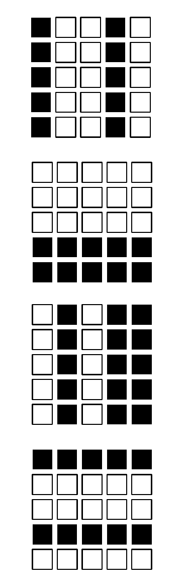

<!-- 原书 PDF 物理页 538；印刷页 526。§43.2 末段、§43.3 习题 43.3 与图 43.2；第 43 章终页。 -->

第一项 $\langle y_i y_j\rangle_{P(\mathbf h\mid\mathbf x^{(n)},\mathbf W)}$ 是在把可见变量固定为 $\mathbf x^{(n)}$、让隐变量按其条件分布自由抽样时，通过模拟玻尔兹曼机得到的 $y_i$ 与 $y_j$ 的相关量。第二项 $\langle y_i y_j\rangle_{P(\mathbf x,\mathbf h\mid\mathbf W)}$ 是玻尔兹曼机从自身模型分布生成样本时，$y_i$ 与 $y_j$ 的相关量。

Hinton 和 Sejnowski 证明，利用带隐单元的玻尔兹曼机，可以学会像带标签平移样本集合这样并不简单的样本集合。隐单元充当特征检测器，识别可能与三种平移之一相关的模式。

模拟玻尔兹曼机很费时间，因为计算对数似然的梯度需要求两个梯度之差，而这两个梯度都要靠蒙特卡罗方法求出。因此，玻尔兹曼机尚未得到广泛使用。如何用更高效的计算方法构建具有相同能力的模型，仍是一个活跃的研究方向（Hinton 等，1995；Dayan 等，1995；Hinton 和 Ghahramani，1997；Hinton，2001；Hinton 和 Teh，2001）。

## 43.3　习题

▷ 习题 43.3。（难度 3）图 43.2 的“横条与竖条”样本集合（bars and stripes ensemble）能否由没有隐单元的玻尔兹曼机学得？［答案可能会让你吃惊！］

图 43.2：“横条与竖条”样本集合中的四个样本。生成每个样本时，先选水平或竖直方向；再逐条考虑该方向上的自旋（水平时为横条，竖直时为竖条），以 $1/2$ 的概率把整条自旋都设为开启。黑色方格表示开启，空心方格表示未开启。
