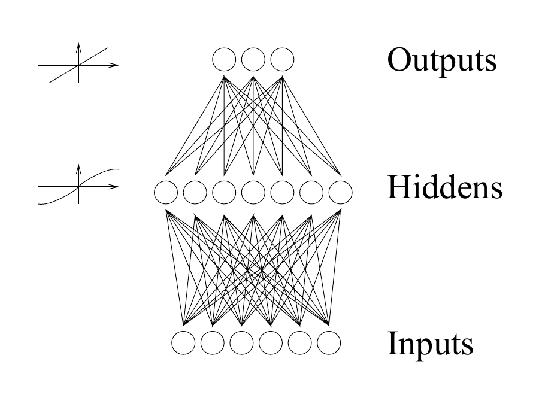
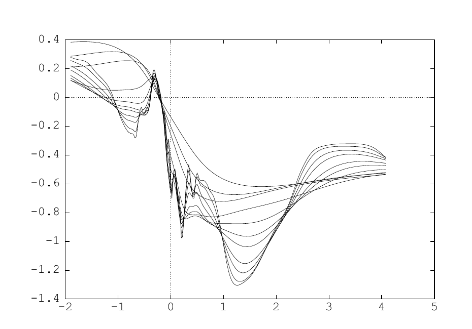

<!-- 原书 PDF 物理页 539；印刷页 527。第 44 章起页、§44.1、图 44.1/44.2、式 (44.1)/(44.2)。末段跨 PDF540 的完整句合于本页。 -->

# 第 44 章　多层网络中的监督学习

> **编者导读（非原书正文）**　本章先说明多层前馈网络怎样表示回归和分类函数，再讨论用误差函数训练网络的方法。后半章从概率模型出发，解释正则化、模型复杂度和预测不确定性为何与监督学习有关。

## 44.1　多层感知机

讲授神经网络的课程，若不讨论监督学习的多层网络——也称反向传播网络——就不完整。

*多层感知机*是一种前馈网络。它包含输入神经元、隐神经元和输出神经元。隐神经元可以按顺序排成若干层。最常见的多层感知机只有一个隐层，被称为“双层”网络；这里的“两层”只计神经元层数，不计输入层。

这种前馈网络定义了从输入 $\mathbf x$ 到输出 $\mathbf y=\mathbf y(\mathbf x;\mathbf w,\mathcal A)$ 的非线性参数化映射。输出是输入和参数 $\mathbf w$ 的连续函数；网络结构，也就是映射的函数形式，用 $\mathcal A$ 表示。前馈网络可以经过“训练”，完成回归和分类任务。

图 44.1：典型的双层网络：六个输入、七个隐单元、三个输出。每条连线表示一个权重。图中文字“Outputs”“Hiddens”“Inputs”分别表示输出、隐单元和输入；左侧小曲线示意两层采用的不同激活函数。

*回归网络*

对于回归问题，含一个隐层的网络可以具有如下映射形式：

$$\text{隐层：}\quad a_j^{(1)}=\sum_l w_{jl}^{(1)}x_l+\theta_j^{(1)};\qquad h_j=f^{(1)}(a_j^{(1)})\tag{44.1}$$

$$\text{输出层：}\quad a_i^{(2)}=\sum_j w_{ij}^{(2)}h_j+\theta_i^{(2)};\qquad y_i=f^{(2)}(a_i^{(2)})\tag{44.2}$$

例如，可以取 $f^{(1)}(a)=\tanh(a)$、$f^{(2)}(a)=a$。这里，$l$ 遍历输入 $x_1,\ldots,x_L$，$j$ 遍历隐单元，$i$ 遍历输出。各个“权重”$w$ 和“偏置”$\theta$ 共同组成参数向量 $\mathbf w$。隐层的非线性 S 形函数 $f^{(1)}$ 使这个神经网络比标准线性回归模型具有更强的计算灵活性。图形上，我们可以把神经网络表示为多层相连的神经元（图 44.1）。

*这些网络能实现什么样的函数？*

图 44.2：从单输入网络的函数先验中抽取的样本。依次取 $\sigma_{\mathrm{bias}}=8,6,4,3,2,1.6,1.2,0.8,0.4,0.3,0.2$，并设 $\sigma_{\mathrm{in}}=5\sigma_{\mathrm{bias}}^{w}$，每个取值各显示一条随机函数。网络的其他超参数为 $H=400$、$\sigma_{\mathrm{out}}^{w}=0.05$；曲线图的横轴约为 $-2$ 至 $5$，纵轴约为 $-1.4$ 至 $0.4$。

正如第 39 章中我们通过考察单个神经元能产生的函数来探索其权重空间，这里也来探索多层网络的权重空间。在图 44.2 和图 44.3 中，我取一个具有一个输入、一个输出和大量隐单元（数量为 $H$）的网络，随机设定偏置和权重 $\theta_j^{(1)}$、$w_{jl}^{(1)}$、$\theta_i^{(2)}$ 与 $w_{ij}^{(2)}$，再画出得到的函数 $y(x)$。
