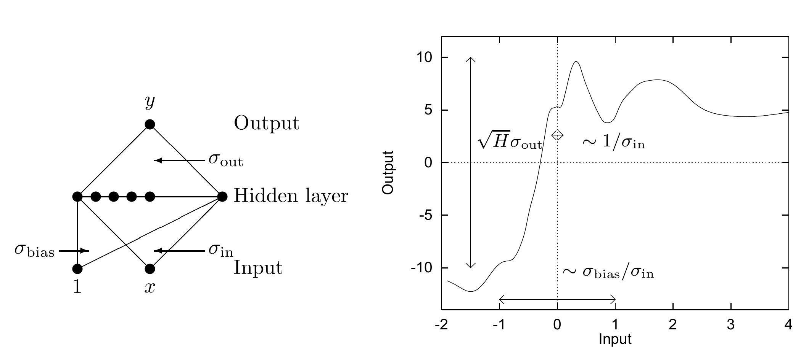
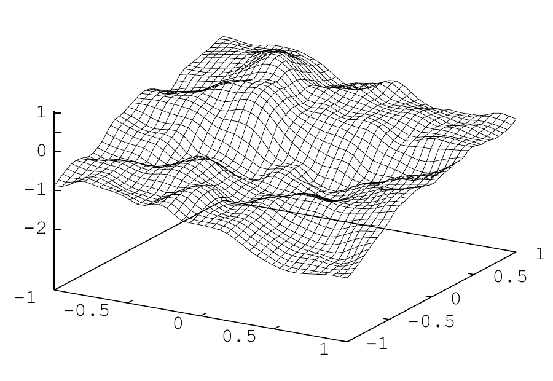

<!-- 原书 PDF 物理页 540；印刷页 528。图 44.3/44.4、§44.1 末与 §44.2 起，式 (44.3)。页首承接 PDF539 的句子已合于前页。 -->

图 44.3：随机网络生成函数的性质。典型函数的纵向尺度约为 $\sqrt H\sigma_{\mathrm{out}}$；函数显著变化的横向范围约为 $\sigma_{\mathrm{bias}}/\sigma_{\mathrm{in}}$；最短的横向长度尺度约为 $1/\sigma_{\mathrm{in}}$。图示函数来自一个有 $H=400$ 个隐单元的随机网络，其高斯权重参数为 $\sigma_{\mathrm{bias}}=4$、$\sigma_{\mathrm{in}}=8$、$\sigma_{\mathrm{out}}=0.5$。图内“Output”“Hidden layer”“Input”分别表示输出、隐层和输入；曲线图的纵轴“Output”为输出，横轴“Input”为输入，三个尺度标记对应上述量。

我从均值为零、标准差为 $\sigma_{\mathrm{bias}}$ 的高斯分布中，随机设置隐单元的偏置 $\theta_j^{(1)}$；输入到隐层的权重 $w_{jl}^{(1)}$ 则按标准差 $\sigma_{\mathrm{in}}$ 随机设置；输出偏置 $\theta_i^{(2)}$ 和输出权重 $w_{ij}^{(2)}$ 按标准差 $\sigma_{\mathrm{out}}$ 随机设置。

得到哪类函数，取决于 $\sigma_{\mathrm{bias}}$、$\sigma_{\mathrm{in}}$ 和 $\sigma_{\mathrm{out}}$ 的取值。权重和偏置越大，函数越复杂，特征越多，对输入变量也越敏感。使用随机权重时，网络生成的典型函数在纵向的尺度约为 $\sqrt H\sigma_{\mathrm{out}}$；函数显著变化的横向范围约为 $\sigma_{\mathrm{bias}}/\sigma_{\mathrm{in}}$；最短的横向长度尺度约为 $1/\sigma_{\mathrm{in}}$。

Radford Neal（1996）还证明，在 $H\to\infty$ 的极限下，随机化权重所生成函数的统计性质，与隐单元数量无关。因此，有意思的是，函数的复杂度也与模型中的参数数量无关。决定典型函数复杂度的是权重的典型大小。由此可以预期：拿这些模型拟合真实数据时，要控制拟合函数的复杂度，一种重要办法是控制权重的典型大小。

图 44.4：双输入网络的函数先验中的一个样本，超参数 $\{H,\sigma_{\mathrm{in}}^{w},\sigma_{\mathrm{bias}}^{w},\sigma_{\mathrm{out}}^{w}\}=\{400,8.0,8.0,0.05\}$；网格曲面表示网络输出随两个输入变化。

图 44.4 展示了一个有两个输入、一个输出的网络所生成的典型函数。相比之下，传统线性回归模型生成的是平面。神经网络可以生成比线性回归更复杂的函数。

## 44.2　传统方法如何训练回归网络

训练这个网络时，使用数据集 $D=\{\mathbf x^{(n)},\mathbf t^{(n)}\}$，调整 $\mathbf w$，使误差函数尽可能小，例如：

$$E_D(\mathbf w)=\frac12\sum_n\sum_i\left(t_i^{(n)}-y_i(\mathbf x^{(n)};\mathbf w)\right)^2.\tag{44.3}$$

这个目标函数是多个项之和，每一对输入与目标值 $\{\mathbf x,\mathbf t\}$ 对应一项，用来度量输出 $\mathbf y(\mathbf x;\mathbf w)$ 与目标值 $\mathbf t$ 有多接近。

要使目标函数最小化，需要反复求取 $E_D$ 的梯度。这个梯度可以用*反向传播*（backpropagation）算法（Rumelhart 等，1986）高效计算；该算法通过链式法则求导。
