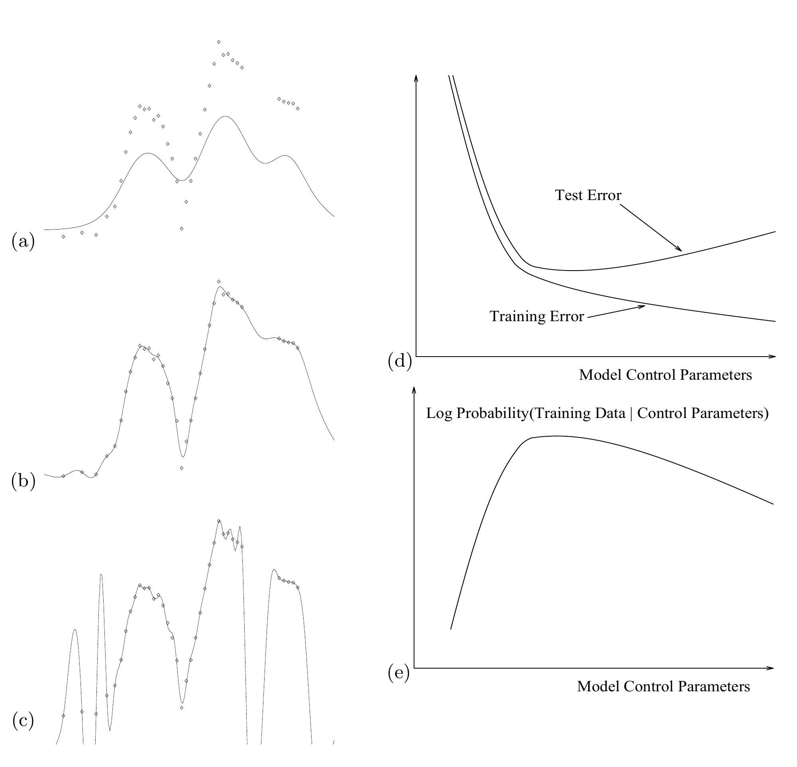
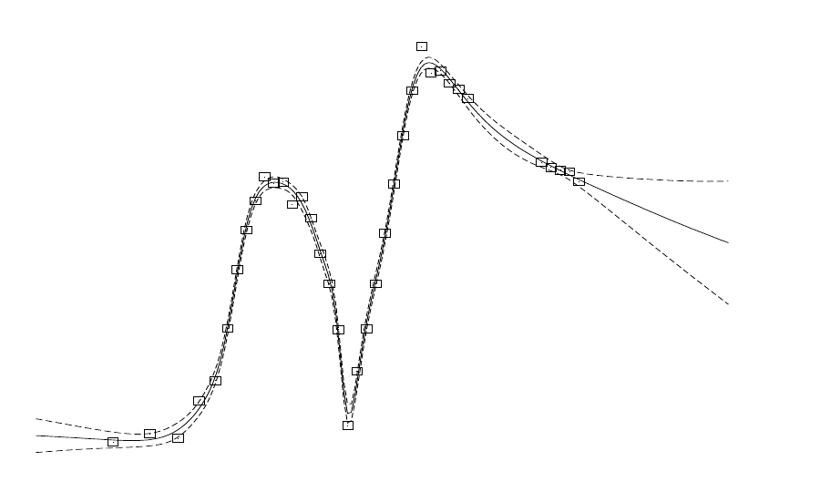

<!-- 原书 PDF 物理页 543；印刷页 531。§44.4 的图 44.5、44.6 与正文。 -->

图 44.5　模型复杂度的优化。(a)–(c) 展示一个径向基函数模型对简单数据集的插值，该数据集有一个输入变量和一个输出变量。改变正则化常数，使模型复杂度从 (a) 到 (c) 增加时，插值曲线对训练数据的拟合越来越好；但超过某个点后，模型的泛化能力（测试误差）反而变差。借助概率论，不需要测试集也能优化控制参数。图内文字译注：(d) 的 “Test Error” 为“测试误差”，“Training Error” 为“训练误差”；(d)、(e) 的横轴 “Model Control Parameters” 为“模型控制参数”；(e) 的 “Log Probability(Training Data | Control Parameters)” 为“对数概率（训练数据｜控制参数）”。

用贝叶斯方法控制模型复杂度，可以解决*过拟合问题*。

如果赋予模型概率解释，就能评估控制参数取不同值时的证据。如第 28 章所述，过于复杂的模型实际上具有较低的概率，而证据 $P(\text{数据}\mid\text{控制参数})$ 可作为优化模型控制参数的目标函数［图 44.5(e)］。使证据达到最大的 $\alpha$ 对应的拟合结果见图 44.5(b)。

用贝叶斯方法优化模型控制参数有四个重要优点。(1) 不需要“测试集”或“验证集”，因此全部训练数据既可用于拟合模型，也可用于比较模型。(2) 正则化常数可在线优化，即与一般模型参数同时优化。(3) 与交叉验证的评价指标相比，贝叶斯目标函数没有噪声。(4) 可以计算证据对控制参数的梯度，从而同时优化大量控制参数。

概率建模还能自然地处理*不确定性*。它给出一种明确的方法——*边缘化*（marginalization）——把参数的不确定性纳入预测；如第 41 章所见，这样能得到更好的预测。图 44.6 展示了已训练神经网络的预测误差棒。

图 44.6　已训练的回归网络预测值的误差棒。实线是多层感知机在这些数据点上训练后，以最佳拟合参数作出的预测。误差棒（虚线）来自参数 $\mathbf w$ 的不确定性。注意，数据稀疏的地方，误差棒会变大。

*贝叶斯推断的实现*

如第 41 章所述，多层网络的贝叶斯推断可以通过蒙特卡罗采样实现，也可以通过采用高斯近似的确定性方法实现（Neal, 1996；MacKay, 1992c）。
