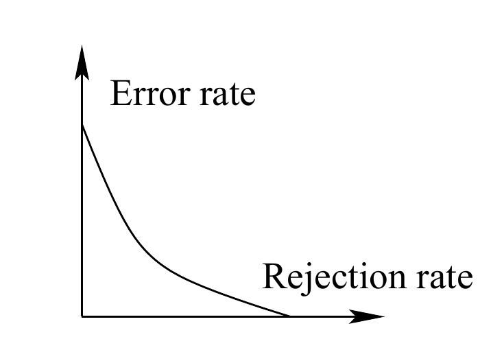

<!-- 原书 PDF 物理页 545；印刷页 533。习题 44.1 后半、图 44.7 和式 (44.12)；第 44 章终页。 -->

- 第二，如果转向数字识别等多类别分类问题，错误类型就会从两种增至 $10\times9=90$ 种——每一种都对应把类别 $t$ 与另一个类别 $t'$ 混淆。最好能找到一个合理办法，把这 90 个数字归并为一个可用于排序的数值，而且这个数值比错误率更有意义。

不喜欢错误率的另一个原因，是它没有认可分类器准确说明自身不确定性的能力。设想分类器可以给出三种输出：“0”、“1”，以及表示不确定的*拒判*类别“?”。考虑下面的分类器 D 和 E，它们的频数表以百分比表示；行为真实值 $t$，列为输出 $y$。

分类器 D

<table>
<thead><tr><th>$t\backslash y$</th><th>0</th><th>?</th><th>1</th></tr></thead>
<tbody><tr><td>0</td><td>74</td><td>10</td><td>6</td></tr><tr><td>1</td><td>0</td><td>1</td><td>9</td></tr></tbody>
</table>

分类器 E

<table>
<thead><tr><th>$t\backslash y$</th><th>0</th><th>?</th><th>1</th></tr></thead>
<tbody><tr><td>0</td><td>78</td><td>6</td><td>6</td></tr><tr><td>1</td><td>0</td><td>5</td><td>5</td></tr></tbody>
</table>

这两个分类器的 $(e_+,e_-,r)$ 都是 $(6\%,0\%,11\%)$。但它们同样好吗？比较 E 和 C：这两个分类器是等价的。E 只是换了副面孔的 C——取 C 的输出，当 C 输出“1”时抛一枚硬币，决定输出“1”还是“?”，就能得到 E。因此 E 等同于 C，也就不如 B。再比较 D 和 B。你能否说明 D 比 B 传达的信息更多，因而也优于 E？然而 D 和 E 的 $(e_+,e_-,r)$ 分数完全相同。

人们常绘制*错误率—拒判率曲线*（error-reject curves，也称 ROC 曲线；ROC 是“接收者操作特征”，receiver operating characteristic 的缩写）：让 $r$ 从 0 变化到 1，画出总错误率 $e=(e_++e_-)$ 随 $r$ 的变化，并用这些曲线比较分类器（图 44.7）。［在二分类问题这个特例中，也可以改画 $e_+$ 随 $e_-$ 的变化。］但如前所见，错误率作为性能指标缺乏鉴别力。把一种错误率画成另一种错误率的函数，就能克服这一弱点吗？

图 44.7　一条错误率—拒判率曲线。有些人用曲线下的面积衡量分类器质量。图内文字“Error rate”为“错误率”，“Rejection rate”为“拒判率”。

在本题中，你可以构造一个明确的例子，说明错误率—拒判率曲线及其曲线下面积未必是比较分类器的好办法；或者证明它们确实*是*好办法。

作为一种可供考虑的分类器比较方法，考察输出与目标之间的*互信息*：

$$I(T;Y)\equiv H(T)-H(T\mid Y)=\sum_{y,t}P(y)P(t\mid y)\log\frac{P(t)}{P(t\mid y)},\tag{44.12}$$

它衡量分类器的输出传达了关于目标的多少*比特*信息。

计算上文分类器 A–E 的互信息。

研究这一性能指标，并讨论它是否有用。它在实际应用中有什么缺点吗？
