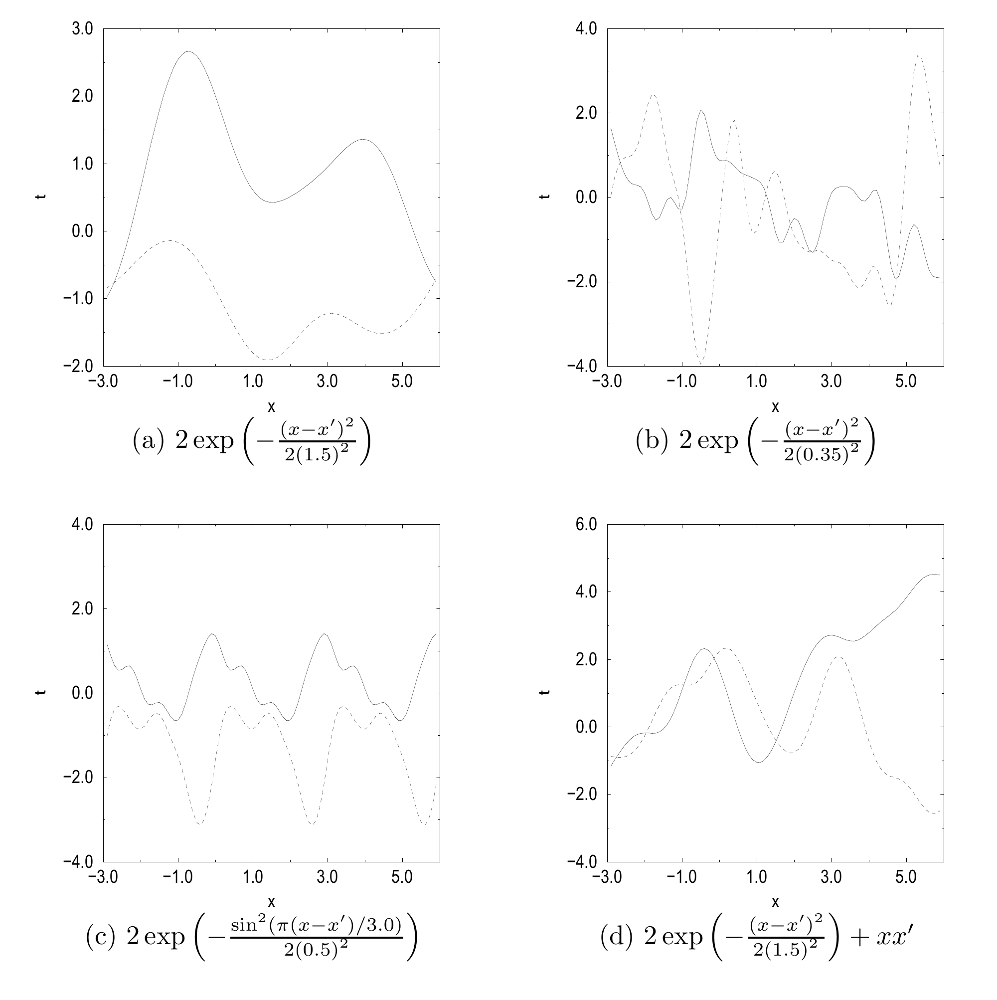

<!-- 原书 PDF 物理页 554；印刷页 542。图 45.1、§45.3 起、式 (45.34)。页末句续至 PDF 555，译文在本页写成完整句。 -->

图 45.1　从高斯过程先验中抽取的样本。每幅图都显示从一个高斯过程先验中抽取的两个函数。四个相应的协方差函数列在各图下方。从 (a) 到 (b)，长度尺度缩小，因此函数起伏得更快。(c) 中协方差函数的周期性在样本中清晰可见。(d) 的协方差函数含有非平稳项 $xx'$，它对应直线的协方差，因此典型函数带有线性趋势。引自 Gibbs（1997）。图内文字译注：各图横轴为输入 $x$，纵轴为函数值 $t$；四幅图下方依次写有 (a) $2\exp[-(x-x')^2/(2(1.5)^2)]$，(b) $2\exp[-(x-x')^2/(2(0.35)^2)]$，(c) $2\exp[-\sin^2(\pi(x-x')/3.0)/(2(0.5)^2)]$，(d) $2\exp[-(x-x')^2/(2(1.5)^2)]+xx'$。

*多层神经网络与高斯过程*

图 44.2 和图 44.3 给出了从一些标准多层感知机所定义的函数先验分布中随机抽出的样本；这些网络都包含大量隐单元。那些样本看起来与图 45.1 中的高斯过程样本颇为相似。事实上，Neal（1996）证明：如果采用标准的“权重衰减”（weight decay）先验，那么当隐层神经元数趋于无穷时，具有一个隐层的神经网络（如式 (45.4)）的性质会趋于高斯过程的性质。这个高斯过程的协方差函数取决于对网络权重所设先验的具体形式，以及隐单元所用的激活函数。

## 45.3　利用给定的高斯过程模型进行回归

我们已经花了一些篇幅讨论先验。现在回到数据和预测问题：怎样用高斯过程作预测？

建立式 (45.32) 定义的协方差矩阵 $\mathbf C$ 后，我们的任务是根据观测向量 $\mathbf t_N$ 推断 $t_{N+1}$。联合密度 $P(t_{N+1},\mathbf t_N)$ 是高斯分布，因此条件分布

$$P(t_{N+1}\mid\mathbf t_N)=\frac{P(t_{N+1},\mathbf t_N)}{P(\mathbf t_N)}\tag{45.34}$$

也是高斯分布。现在用下标区分不同大小的协方差矩阵 $\mathbf C$：$\mathbf C_{N+1}$ 是向量 $\mathbf t_{N+1}\equiv(t_1,\ldots,t_{N+1})^{\mathsf T}$ 的 $(N+1)\times(N+1)$ 协方差矩阵。
