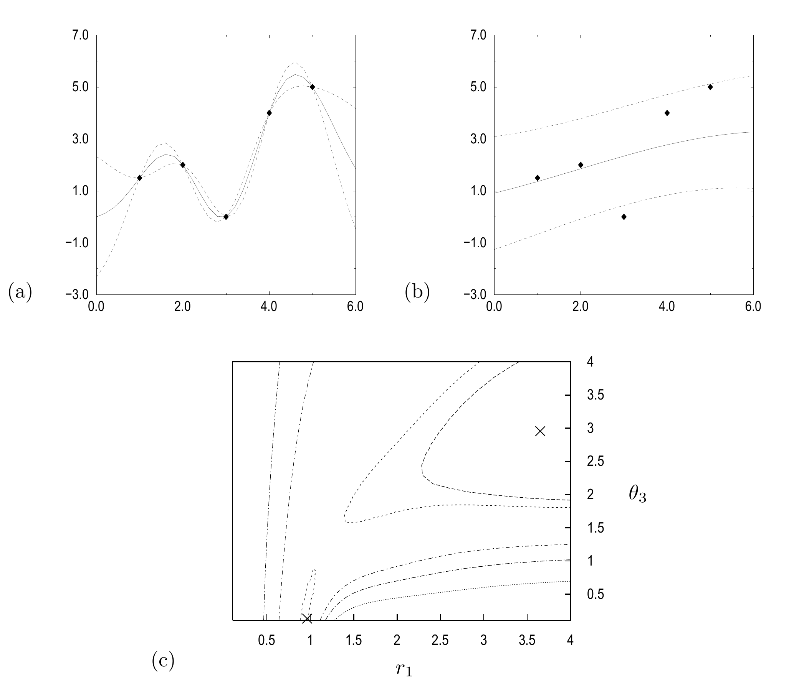

<!-- 原书 PDF 物理页 557；印刷页 545。图 45.2、§45.4 续、§45.5 起，式 (45.49)–(45.50)。页末跨页句在此译完。 -->

图 45.2　高斯过程的多峰似然函数。用简单的协方差函数 (45.47) 对一个含五个点的数据集建模，另有超参数 $\theta_3$ 控制噪声方差。图 (a) 和 (b) 展示超参数 $\boldsymbol\theta$ 取两组使似然 $P(\mathbf t_N\mid\mathbf X_N,\boldsymbol\theta)$ 达到局部最大值的数值时，最可能的插值函数及其 $1\sigma$ 误差棒：(a) $r_1=0.95$、$\theta_3=0.0$；(b) $r_1=3.5$、$\theta_3=3.0$。图 (c) 是似然随 $r_1$ 和 $\theta_3$ 变化的等高线图，两处最大值用叉号标出。引自 Gibbs（1997）。图内标记译注：(c) 的横轴为 $r_1$，纵轴为 $\theta_3$；(a)、(b) 的菱形为五个数据点，实线及虚线分别给出插值函数与其误差范围。

当 $\nu=2$ 时，式 (45.48) 是前一个协方差函数的特例。当 $\nu\in(1,2)$ 时，这一先验生成的典型函数平滑，但不是解析函数。当 $\nu\leq1$ 时，典型函数连续，却不平滑。

若函数沿第 $i$ 个输入方向以已知周期 $\lambda_i$ 周期性变化，可用下列协方差函数建模：

$$C(\mathbf x,\mathbf x';\boldsymbol\theta)=\theta_1\exp\!\left[-\frac12\sum_i\left(\frac{\sin\!\left(\frac{\pi}{\lambda_i}(x_i-x_i')\right)}{r_i}\right)^2\right].\tag{45.49}$$

图 45.1 展示了从具有多种不同协方差函数的高斯过程中随机抽取的样本。

*非平稳协方差函数*

最简单的非平稳协方差函数对应于线性趋势。考虑平面 $y(\mathbf x)=\sum_i w_i x_i+c$。若 $\{w_i\}$ 与 $c$ 均服从均值为零的高斯分布，方差分别为 $\sigma_w^2$ 与 $\sigma_c^2$，那么这个平面的协方差函数为

$$C_{\mathrm{lin}}(\mathbf x,\mathbf x';\{\sigma_w,\sigma_c\})=\sum_{i=1}^{I}\sigma_w^2 x_i x_i'+\sigma_c^2.\tag{45.50}$$

图 45.1d 展示了包含线性项的随机样本函数。

## 45.5　高斯过程模型的自适应调整

假设已经选定协方差函数的形式，但它还取决于未确定的超参数 $\boldsymbol\theta$。我们希望从数据中“学习”这些超参数。
