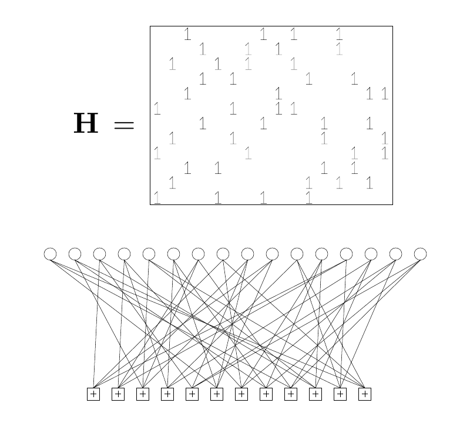

<!-- 原书 PDF 物理页 569；印刷页 557。章题、§47.1–§47.2 起、图 47.1、式 (47.1)。两节标题前均有实心三角，供专属构建器保留。 -->

# 第 47 章　低密度奇偶校验码

> 编者导读（非原书正文）：本章从稀疏奇偶校验矩阵和对应的图出发，讨论低密度奇偶校验码的理论性质与实际译码。阅读时可把矩阵中的一个 $1$ 对应到图上的一条边，再看比特节点与校验节点之间如何传递消息。

低密度奇偶校验码（low-density parity-check code，也称 Gallager 码）是一种分组码，其奇偶校验矩阵 $\mathbf H$ 的每一行、每一列都是“稀疏的”。

*规则 Gallager 码*是一种低密度奇偶校验码：$\mathbf H$ 的每一列都有相同的重量 $j$，每一行都有相同的重量 $k$；规则 Gallager 码在满足这些约束的条件下随机构造。图 47.1 展示了一个 $j=3$、$k=4$ 的低密度奇偶校验码。

图 47.1　码率为 $1/4$、分组长度 $N=16$、有 $M=12$ 条约束的低密度奇偶校验码，其奇偶校验矩阵及对应的图。每个白色圆圈代表一个发送位。每个位都参与 $j=3$ 条约束，约束由带加号的方框表示。每条约束都要求与它相连的 $k=4$ 个比特之和为偶数。

## 47.1　理论性质

低密度奇偶校验码便于从理论上研究。以下结果已由 Gallager（1963）和 MacKay（1999b）证明。

尽管构造方法简单，低密度奇偶校验码*在使用最优译码器时*仍是好码（“好码”的含义见第 11.4 节）。此外，它们还有好的距离性质（见第 13.2 节）。只要列重量 $j\geq3$，这两项结果就成立。还有一些低密度奇偶校验码序列，其中 $j$ 随 $N$ 缓慢增长，$j/N$ 仍趋于零；这些码序列*非常好*，而且具有非常好的距离性质。

然而，我们并没有最优译码器，低密度奇偶校验码的译码是一个 NP 完全问题。那么实践中该怎么办？

## 47.2　实际译码

给定信道输出 $\mathbf r$，我们希望找到使似然 $P(\mathbf r\mid\mathbf t)$ 最大的码字 $\mathbf t$。低密度奇偶校验码的所有有效译码策略都是消息传递算法。目前已知最好的算法是和积算法，也称迭代概率译码或信念传播。

我们假定信道无记忆（不过，对于更复杂的信道，也很容易在一个更复杂的图上运行和积算法来处理；这个图表示差错之间预期的相关性，见 Worthen 和 Stark，1998）。对任何无记忆信道，译码问题都有两种处理方法；两者都会导向同一个一般问题：“找出使下式最大的 $\mathbf x$：”

$$P^*(\mathbf x)=P(\mathbf x)\mathbb{1}[\mathbf H\mathbf x=\mathbf z],\tag{47.1}$$

其中 $P(\mathbf x)$ 是定义在二元向量 $\mathbf x$ 上的可分离分布，$\mathbf z$ 是另一个二元向量。这两种方法都用因子图来表示译码问题（第 26 章）。
