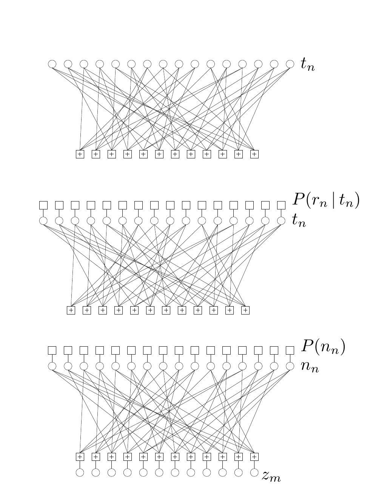

<!-- 原书 PDF 物理页 570；印刷页 558。§47.2 续、图 47.2(a)–(c)、式 (47.2)–(47.4)。末段跨 PDF 571，在本页补全。 -->

(a) 码字的先验分布为 $P(\mathbf t)\propto\mathbb{1}[\mathbf H\mathbf t=\mathbf 0]$。变量节点是发送比特 $\{t_n\}$。每个带加号的节点代表因子 $\mathbb{1}[\sum_{n\in\mathcal N(m)}t_n=0\pmod 2]$。

(b) 码字的后验分布为 $P(\mathbf t\mid\mathbf r)\propto P(\mathbf t)P(\mathbf r\mid\mathbf t)$。上方的每个函数节点代表一个似然因子 $P(r_n\mid t_n)$。

(c) 噪声 $\mathbf n$ 与伴随式 $\mathbf z$ 的联合概率为 $P(\mathbf n,\mathbf z)=P(\mathbf n)\mathbb{1}[\mathbf z=\mathbf H\mathbf n]$。上方的变量节点现在是噪声比特 $\{n_n\}$，底部增加的变量节点是伴随式取值 $\{z_m\}$。每个定义 $z_m=\sum_n H_{mn}n_n\pmod 2$ 都由一个带加号的因子施加约束。

图 47.2　与一个低密度奇偶校验码对应的因子图。图中圆圈表示变量节点，带加号的方框表示校验因子；图内标记 $t_n$ 为发送比特，$P(r_n\mid t_n)$ 为似然因子，$n_n$ 为噪声比特，$P(n_n)$ 为噪声先验因子，$z_m$ 为伴随式分量。

*码字译码视角*

首先注意，码字的先验分布

$$P(\mathbf t)\propto\mathbb{1}[\mathbf H\mathbf t=\mathbf 0\pmod 2],\tag{47.2}$$

可以表示为因子图（图 47.2a），其因子分解为

$$P(\mathbf t)\propto\prod_m\mathbb{1}\!\left[\sum_{n\in\mathcal N(m)}t_n=0\pmod 2\right].\tag{47.3}$$

（以下不再写出“$\bmod 2$”。）码字的后验分布等于这个先验分布乘以似然，因此又引入 $N$ 个因子，每个接收比特对应一个：

$$\begin{aligned}P(\mathbf t\mid\mathbf r)&\propto P(\mathbf t)P(\mathbf r\mid\mathbf t)\\&\propto\prod_m\mathbb{1}\!\left[\sum_{n\in\mathcal N(m)}t_n=0\right]\prod_n P(r_n\mid t_n).\end{aligned}\tag{47.4}$$

与这个函数对应的因子图见图 47.2b。它与先验分布的图相同，只是给发送比特添上了一些似然“小挂件”（dongles）。在这一视角下，接收信号 $r_n$ 可以取自任意符号表；重要的只有 $P(r_n\mid t_n)$ 的数值。

*伴随式译码视角*

另一种方法是用接收到的二元向量 $\mathbf r$ 和噪声向量 $\mathbf n$ 来描述信道输出。噪声的概率分布 $P(\mathbf n)$ 可以由信道性质及信道输出端提供的其他信息推得。

例如，对于二元对称信道，我们定义噪声使 $\mathbf r=\mathbf t+\mathbf n$，伴随式 $\mathbf z=\mathbf H\mathbf r$，噪声模型 $P(n_n=1)=f$。对于其他信道，例如输出为 $\mathbf y$ 的高斯信道，我们也可以按需要定义一个接收到的二元向量 $\mathbf r$，并由 $\mathbf y$ 得到一个有效的二元噪声模型 $P(\mathbf n)$（习题 9.18，原书第 155 页；习题 25.1，原书第 325 页）。
