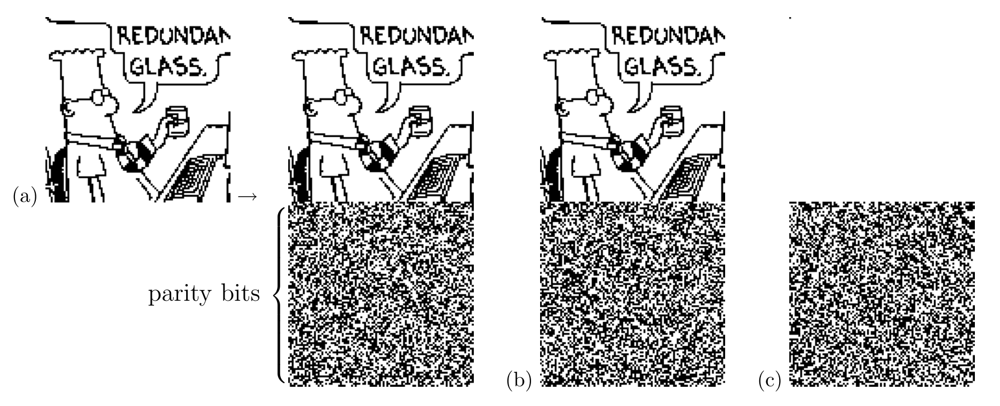

<!-- 原书 PDF 物理页 574；印刷页 562。图 47.3、编码与译码代价、§47.4 起段及脚注 1。页首续 PDF 573 的段落已在前页译完。 -->

图内文字译注：漫画人物的气泡首行可辨为 “REDUNDAN…”（末字在原图中截断），次行为 “GLASS”，意为“备用玻璃杯”；左侧括号所指的 “parity bits” 是“奇偶校验比特”。(a)、(b)、(c) 标出三幅图；箭头表示从 (a) 到加上奇偶校验比特的图样。

图 47.3　用码率为 $1/2$ 的 Gallager 码演示编码。编码器由一个非常稀疏的 $10\,000\times20\,000$ 奇偶校验矩阵导出；该矩阵每列有三个 $1$（图 47.4）。(a) 该码生成的发送向量由 $10\,000$ 个信源比特和 $10\,000$ 个奇偶校验比特组成。(b) 这里把信源序列的第一位改掉了。注意，许多奇偶校验比特随之改变。每个奇偶校验比特大约依赖一半的信源比特。(c) 当 $\mathbf s=(1,0,0,\ldots,0)$ 时发送的向量；它等于 (a) 和 (b) 两个发送向量按模 $2$ 相减所得的差。[Dilbert 图像版权 © 1997 United Feature Syndicate, Inc.；经许可使用。]

**代价。** 若采用蛮力方法，生成生成矩阵所需的时间随 $N^3$ 增长，其中 $N$ 是块长。编码时间随 $N^2$ 增长；但编码只涉及二进制运算，因此在这里研究的块长范围内，它所花的时间远少于模拟高斯信道。每轮译码大约需要 $6Nj$ 次浮点乘法，所以每个译出比特的总运算次数（假设迭代 $20$ 轮）大约为 $120t/R$，与块长无关。对下一节介绍的码来说，这大约是 $800$ 次运算。

利用 Richardson 和 Urbanke（2001b）提出的巧妙编码技巧，或者专门构造奇偶校验矩阵（MacKay *等*，1999），可以降低编码复杂度。

用低精度消息代替实数传递，只需付出很小的性能损失，就能降低译码复杂度（Richardson 和 Urbanke，2001a）。

## 47.4　Gallager 码的图示演示

图 47.3–47.7 直观地说明了：在什么条件下，低密度奇偶校验码能够通过二元对称信道和高斯信道进行可靠通信。这些演示也可以在万维网上以动画形式观看。[^47-1]

[^47-1]: [http://www.inference.phy.cam.ac.uk/mackay/codes/gifs/](http://www.inference.phy.cam.ac.uk/mackay/codes/gifs/)
