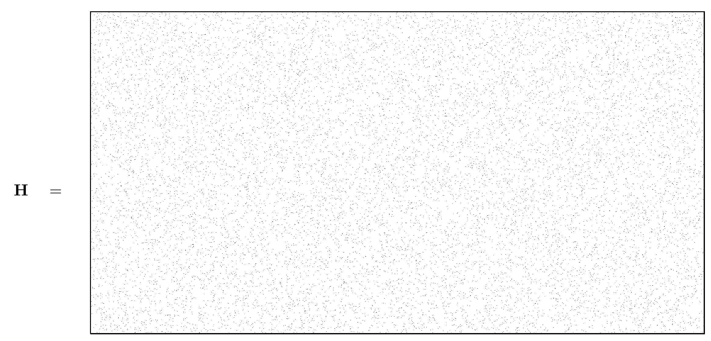

<!-- 原书 PDF 物理页 575；印刷页 563。§47.4 续，图 47.4、斜体小标题“编码”“迭代译码”。 -->

图 47.4　一个低密度奇偶校验矩阵：它有 $N=20\,000$ 列，列重 $j=3$；有 $M=10\,000$ 行，行重 $k=6$。

*编码*

图 47.3 演示了一个 Gallager 码的编码过程，其奇偶校验矩阵是一个 $10\,000\times20\,000$ 的矩阵，每列有三个 $1$（图 47.4）。图 47.3b 和图 47.3c 显示了 $10\,000$ 个信源比特中有一位改变时，发送向量会怎样变化；这说明*生成矩阵*的密度很高。当然，这里展示的信源图像具有很高的冗余，实际上应在编码前先压缩。演示中之所以选用冗余图像，是为了更容易看清迭代译码期间的纠错过程。译码算法*并不*利用信源向量的冗余性；无论选用哪种信源向量，它的工作方式都完全相同。

*迭代译码*

发送向量经过噪声水平为 $f=7.5\%$ 的信道；接收向量见图 47.5 左上角。图 47.5 后续各图展示了迭代概率译码过程。这组图依次显示译码器经过 $0$、$1$、$2$、$3$、$10$、$11$、$12$ 和 $13$ 轮迭代后，对每一位作出的最佳猜测。第 $13$ 轮后，最佳猜测不违反任何奇偶校验，译码器于是停止。最终译码结果没有错误。

若传输的噪声异常大，译码算法就找不到有效的译码结果。对这种码和噪声水平为 $f=7.5\%$ 的信道，这类失败约每 $100\,000$ 次传输发生一次。图 47.6 将这一错误率与经典纠错码的块错误率作了比较。
