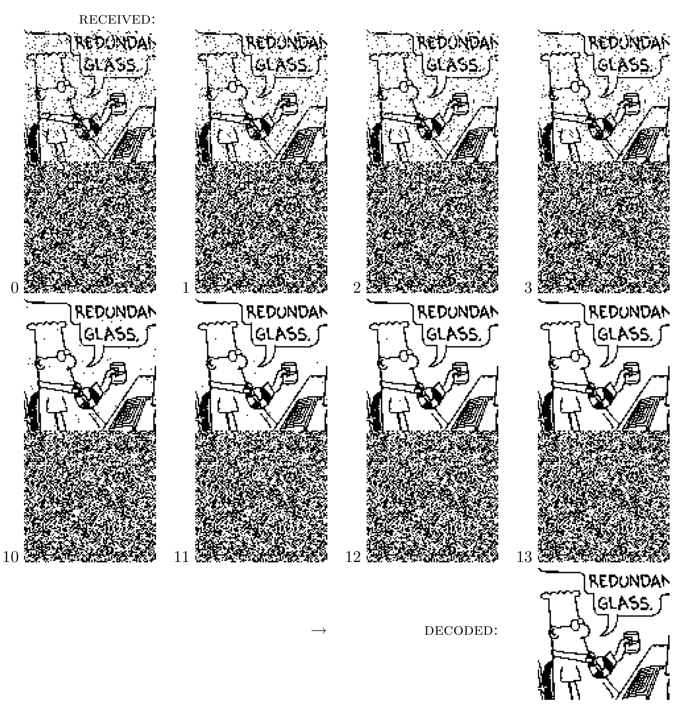
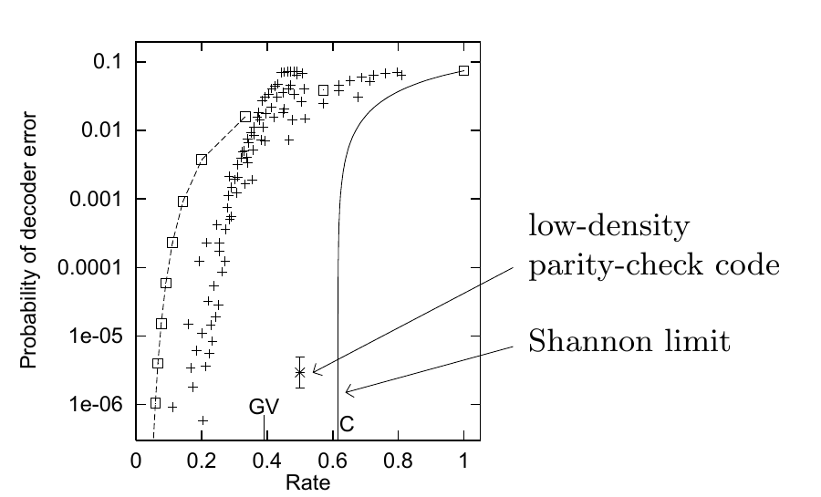

<!-- 原书 PDF 物理页 576；印刷页 564。§47.4 续，整页图 47.5 与图 47.6。 -->

图内文字译注：“RECEIVED”表示“接收到的图像”；“DECODED”表示“译码结果”；数字 $0$、$1$、$2$、$3$、$10$、$11$、$12$、$13$ 表示迭代轮数。漫画气泡首行可辨为 “REDUNDAN…”（末字在原图中截断），次行为 “GLASS”，意为“备用玻璃杯”。

图 47.5　低密度奇偶校验码对噪声水平为 $f=7.5\%$ 的信道上传输的信号进行迭代概率译码。这组图依次显示译码器经过 $0$、$1$、$2$、$3$、$10$、$11$、$12$ 和 $13$ 轮迭代后，对每一位作出的最佳猜测。第 $13$ 轮后，最佳猜测不违反任何奇偶校验，译码器于是停止。最终译码结果没有错误。

图内文字译注：纵轴 “Probability of decoder error”为“译码器错误概率”；横轴 “Rate”为“码率”；箭头所指 “low-density parity-check code”为“低密度奇偶校验码”，“Shannon limit”为“香农极限”；图内还标有 “GV” 和 “C”。

图 47.6　低密度奇偶校验码在 $f=7.5\%$ 的二元对称信道上的错误概率（带误差棒），与代数码比较。方框表示重复码和 Hamming $(7,4)$ 码；其他点表示 Reed–Muller 码和 BCH 码。
