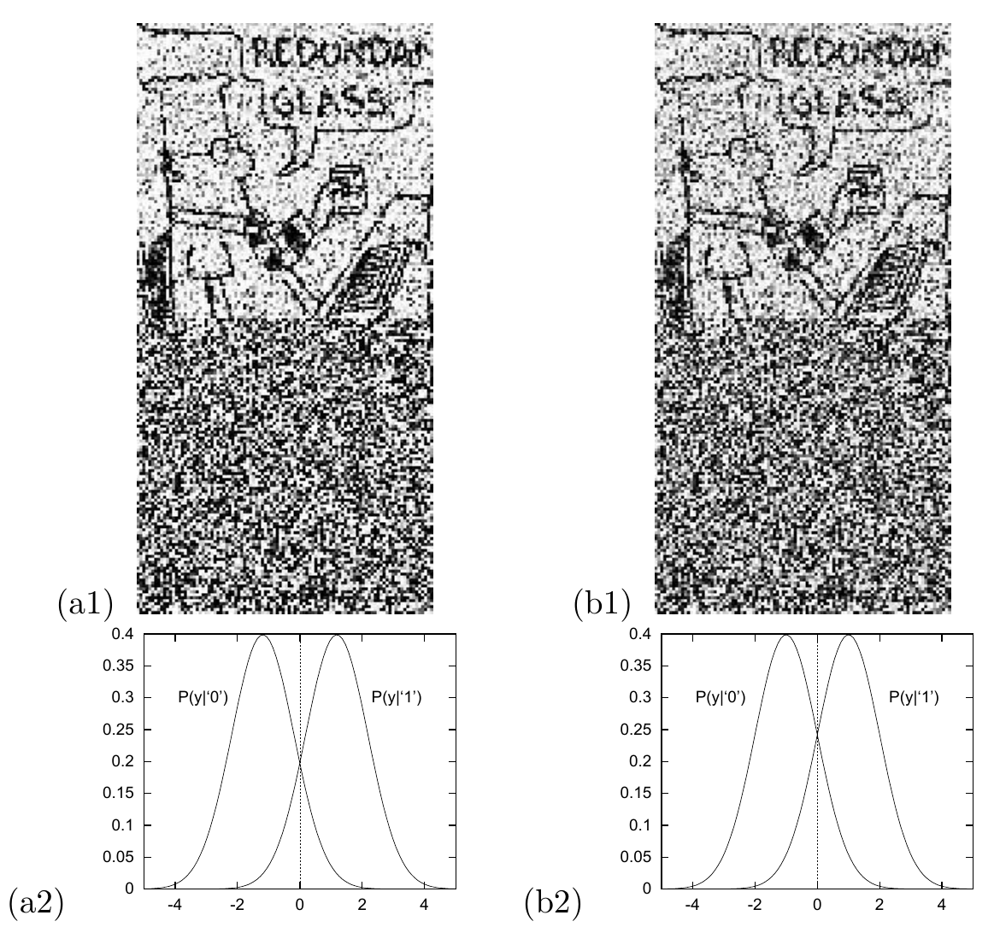
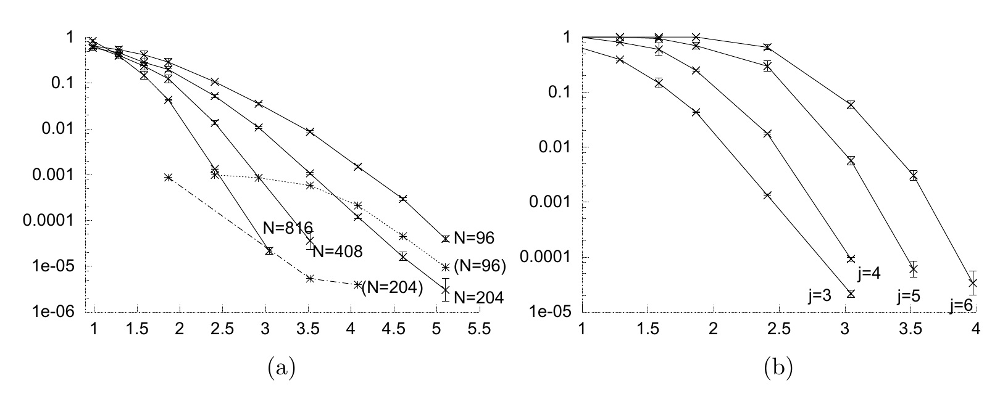

<!-- 原书 PDF 物理页 577；印刷页 565。§47.4 续，图 47.7/47.8、两个斜体小标题；页末段续 PDF 578，在本页合完首句。 -->

图内文字译注：四幅小图标为 (a1)、(a2)、(b1)、(b2)；两张曲线图中的 $P(y\mid ‘0’)$ 与 $P(y\mid ‘1’)$ 分别表示输入为 $0$ 与 $1$ 时输出 $y$ 的分布。漫画气泡首行可辨为 “REDUNDAN…”（末字在原图中截断），次行为 “GLASS”，意为“备用玻璃杯”。

图 47.7　Gallager 码在高斯信道上的演示。(a1) 经过 $x/\sigma=1.185$（$E_b/N_0=1.47\,\mathrm{dB}$）的高斯信道后收到的向量。灰度表示归一化似然的数值。用和积译码器可以把这次传输完全正确地译出。译码失败的经验概率约为 $10^{-5}$。(a2) 当 $x/\sigma=1.185$ 时，两种可能输入分别对应的信道输出 $y$ 的概率分布。(b1) 经过 $x/\sigma=1.0$ 的高斯信道后收到的传输；这个值对应香农极限。(b2) 当 $x/\sigma=1.0$ 时，两种可能输入分别对应的信道输出 $y$ 的概率分布。

图内文字译注：(a) 中的 $N=816$、$N=408$、$N=204$、$N=96$ 标出各块长曲线，括号中的 $(N=96)$、$(N=204)$ 标出虚线；(b) 中的 $j=3,4,5,6$ 标出不同列重的曲线。

图 47.8　码率为 $1/2$ 的 Gallager 码在高斯信道上的性能。纵轴为块错误概率，横轴为信噪比 $E_b/N_0$。(a) 对 $(j,k)=(3,6)$ 的码，性能随块长 $N$ 的变化。从左到右依次为 $N=816$、$N=408$、$N=204$、$N=96$。虚线表示未检出错误的发生频率；只有块长小到 $N=96$ 或 $N=204$ 时，才能测得这种频率。(b) 块长为 $N=816$ 的码，性能随列重 $j$ 的变化。

*高斯信道*

图 47.7 的左图显示了信号通过 $x/\sigma=1.185$ 的高斯信道后收到的向量。灰度表示归一化似然 $\frac{P(y\mid t=1)}{P(y\mid t=1)+P(y\mid t=0)}$ 的数值。在这个信噪比 $x/\sigma=1.185$ 所对应的噪声水平下，码率为 $1/2$ 的 Gallager 码可以可靠通信（错误概率约为 $10^{-5}$）。为了说明这距离香农极限有多近，右图给出了信噪比降至 $x/\sigma=1.0$ 时收到的向量；对于码率为 $1/2$ 的码，这个值对应香农极限。

*性能随码参数变化*

图 47.8 显示参数 $N$ 和 $j$ 如何影响低密度奇偶校验码的性能。正如香农的理论所预示的，增加块长会改善性能。性能对 $j$ 的依赖则呈现另一种模式。如果使用*最优*译码器，性能最好的应是最接近随机码的码，也就是 $j$ 最大的码。然而，在稠密图上，和积译码器的进展不佳，因此 $j$ 较小时性能最好。在图中所示的 $j$ 值里，当块长为 $816$ 时，$j=3$ 的表现最好，一直到块错误概率低至 $10^{-5}$ 都是如此。
