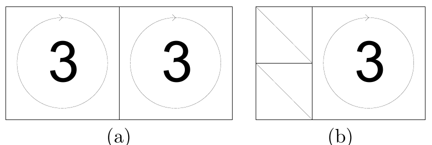
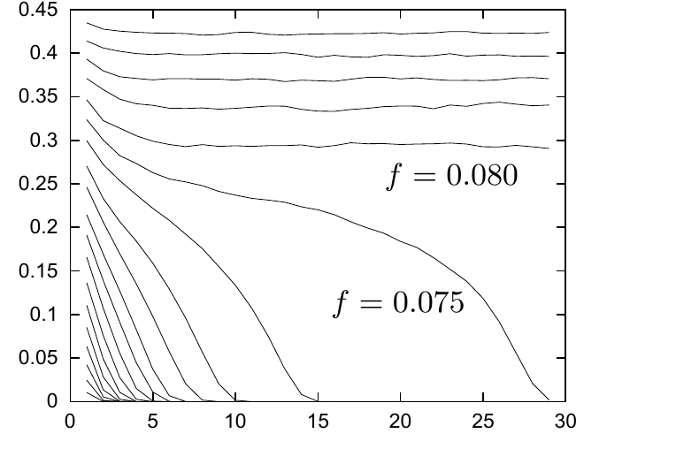
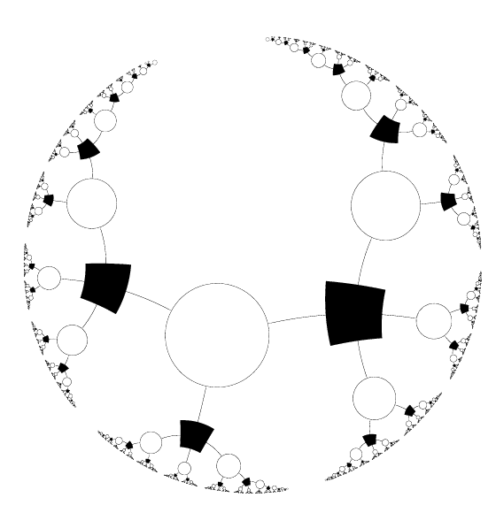

<!-- 原书 PDF 物理页 578；印刷页 566。图 47.9–47.11、§47.4 尾段、§47.5 起段。页首上一句已在 PDF 577 合完；末段续 PDF 579 并在本页合完。 -->

图 47.9　两种 Gallager 码构造的示意图：(a) 完全规则的码，$j=3$、$k=6$、$R=1/2$；(b) 码率为 $1/3$ 的近规则码。图中整数表示叠加在所在方格上的置换矩阵个数；对角线表示单位矩阵。

图 47.10　对 $j=4$、$k=8$ 的译码过程进行密度演化的蒙特卡罗模拟。每条曲线给出一个比特的平均熵随迭代次数的变化；每轮使用 $10\,000$ 个样本，用蒙特卡罗算法估计该熵。二元对称信道的噪声水平 $f$ 从最下方曲线的 $0.010$ 到最上方曲线的 $0.100$，每次增加 $0.005$。显然，阈值约为 $f=0.075$：超过它，算法便无法确定 $\mathbf x$。据 MacKay（1999b）。

图 47.11　列重 $j=3$、行重 $k=4$ 的 Gallager 码图的局部拓扑。白色结点表示比特 $x_l$；黑色结点表示校验 $z_m$；每条边对应 $\mathbf H$ 中的一个 $1$。

这个观察促使我们构造一些列重为 $2$ 的 Gallager 码。图 47.9b 给出了有 $M/2$ 列的列重为 $2$ 的构造。若列重为 $2$ 的列太多，得到的码就会差得多。

如后文将讨论的，若让码更加不规则，性能还可以进一步提高。

## 47.5　密度演化

研究译码算法的一种方法，是设想它运行在一棵无限大的树状图上；该图的局部拓扑与 Gallager 码的图相同。矩阵 $\mathbf H$ 越大，码的译码性质就应该越接近这张无限图的性质。

设想一个没有环的无限信念网络，其中每个比特 $x_n$ 连到 $j$ 个校验，每个校验 $z_m$ 连到 $k$ 个比特（图 47.11）。考察信息在该网络中的迭代传播，并研究一个比特的平均熵如何随迭代次数变化。每迭代一次，该比特就从局部网络中获得向外多一层的信息，其覆盖半径等于迭代次数。只有当迭代次数增加时比特的平均熵降至零，译码才会成功。

可以用蒙特卡罗方法模拟无限信念网络的迭代；Gallager（1963）最先使用了这一方法。设想一个以某个比特为中心、半径为 $I$（总迭代次数）的网络。我们的目标是：给定半径 $I$ 内所有校验的状态 $\mathbf z$，计算中心比特 $x$ 的条件熵。给定一个*特定的*伴随式 $\mathbf z$，若要计算中心比特为 $1$ 的概率，就需要让信息从网络外围向中心传播 $I$ 步。在第 $i$ 次迭代中，半径 $I-i+1$ 处的概率 $r$ 被转换为 $q$，再转换为半径 $I-i$ 处的 $r$；转换取决于半径 $I-i$ 处未知比特的状态 $x$。采用蒙特卡罗方法时，我们无需精确模拟整张网络——那样所需时间会随 $I$ 指数增长——而是在每次迭代中生成一个有代表性的 $\{r,x\}$ 值样本（例如大小为 $100$）。对参数为 $j,k$ 的规则网络，第 $i$ 次迭代列表中的每一对新 $\{r,x\}$，都通过从分布中抽取一个新 $x$，并从第 $i-1$ 次迭代的列表中随机、有放回地抽取 $(j-1)(k-1)$ 对 $\{r,x\}$ 来生成；把它们组装为一段树（图 47.12），再从上到下运行和积算法，求出与新结点关联的 $r$ 值。
