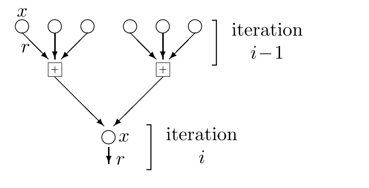

<!-- 原书 PDF 物理页 579；印刷页 567。§47.5 续、图 47.12、表 47.13–47.15、§47.6 起段。页首续段已在 PDF 578 译完；页末段续 PDF 580 并在本页合完。 -->

图内文字译注：“iteration $i-1$”和“iteration $i$”分别表示“第 $i-1$ 次迭代”和“第 $i$ 次迭代”；圆圈为比特结点，带加号的方框为校验结点，图中还标出 $x$、$r$ 的传播位置。

图 47.12　密度演化的蒙特卡罗模拟过程中构造的一个树片段。这个片段适用于规则的 $j=3$、$k=4$ Gallager 码。

例如，图 47.10 给出了 $j=4$、$k=8$，噪声密度 $f$ 介于 $0.01$ 与 $0.10$ 之间，并在每次迭代中使用 $10\,000$ 个样本所得的运行结果。噪声水平足够低时，经过少数几轮迭代，熵就降至零；噪声较高时，熵则降至一个非零值，对应译码失败。

这两种行为的分界称为二元对称信道上该译码算法的*阈值*。图 47.10 的蒙特卡罗模拟表明，对规则的 $(j,k)=(4,8)$ 码，该阈值约为 $0.075$。Richardson 和 Urbanke（2001a）运用相当繁复的直接解析方法，推导出了规则码的阈值。表 47.13 列出了其中一些结果。

| $(j,k)$ | $f_{\max}$ |
| :---: | :---: |
| $(3,6)$ | $0.084$ |
| $(4,8)$ | $0.076$ |
| $(5,10)$ | $0.068$ |

表 47.13　采用和积译码算法时，规则低密度奇偶校验码的阈值 $f_{\max}$，据 Richardson 和 Urbanke（2001a）。码率为 $1/2$ 的码对应的香农极限是 $f_{\max}=0.11$。

*近似密度演化*

在实际应用中，可以用高斯分布近似密度演化中的消息概率分布，只更新这些近似分布的参数，以降低密度演化的计算代价。关于这些技术的进一步资料，以及由此得到的 EXIT 图（EXIT charts），参见 ten Brink（1999）、Chung *等*（2001）和 ten Brink *等*（2002）。

## 47.6　改进 Gallager 码

Gallager 码被重新发现以后，人们找到了两种提高其性能的方法。

*把比特与校验分别聚成组*

第一种方法是构造这样的 Gallager 码：把变量结点组合成元变量（metavariable），例如每个元变量由三个二元变量组成；同样，把校验结点组合成元校验（metacheck）。和以前一样，可以构造一张稀疏图，将元变量与元校验连接起来，而组内变量与校验具体如何接线则有很大的自由度。一种确定接线的方法是在 $GF(q)$ 等有限域中工作，例如 $GF(4)$ 或 $GF(8)$；用 $GF(q)$ 的元素定义低密度奇偶校验矩阵，再用表 47.14 所示的 $GF(4)$ 映射，把二元消息转换到 $GF(q)$。此时，译码过程中传递的消息，是关于多个二元变量*联合取值*的概率和似然。例如，若每组含三个二元变量，似然就要描述这三个比特的八种可能状态各自的似然。

| $GF(4)$ | $\leftrightarrow$ | 二进制 |
| :---: | :---: | :---: |
| $0$ | $\leftrightarrow$ | $00$ |
| $1$ | $\leftrightarrow$ | $01$ |
| $A$ | $\leftrightarrow$ | $10$ |
| $B$ | $\leftrightarrow$ | $11$ |

表 47.14　消息符号在 $GF(4)$ 与二进制之间的转换。

| $GF(4)$ | $\rightarrow$ | 二进制矩阵 |
| :---: | :---: | :---: |
| $0$ | $\rightarrow$ | $\begin{smallmatrix}0&0\\0&0\end{smallmatrix}$ |
| $1$ | $\rightarrow$ | $\begin{smallmatrix}1&0\\0&1\end{smallmatrix}$ |
| $A$ | $\rightarrow$ | $\begin{smallmatrix}1&1\\1&0\end{smallmatrix}$ |
| $B$ | $\rightarrow$ | $\begin{smallmatrix}0&1\\1&1\end{smallmatrix}$ |

表 47.15　矩阵元素在 $GF(4)$ 与二进制之间的转换。用这种方法，可以把 $GF(4)$ 上的一个 $M\times N$ 奇偶校验矩阵变为一个 $2M\times2N$ 的二进制奇偶校验矩阵。

如果精心优化构造，得到的 $GF(4)$、$GF(8)$ 和 $GF(16)$ 码，与相应的二元 Gallager 码相比，性能可提高将近一分贝。
