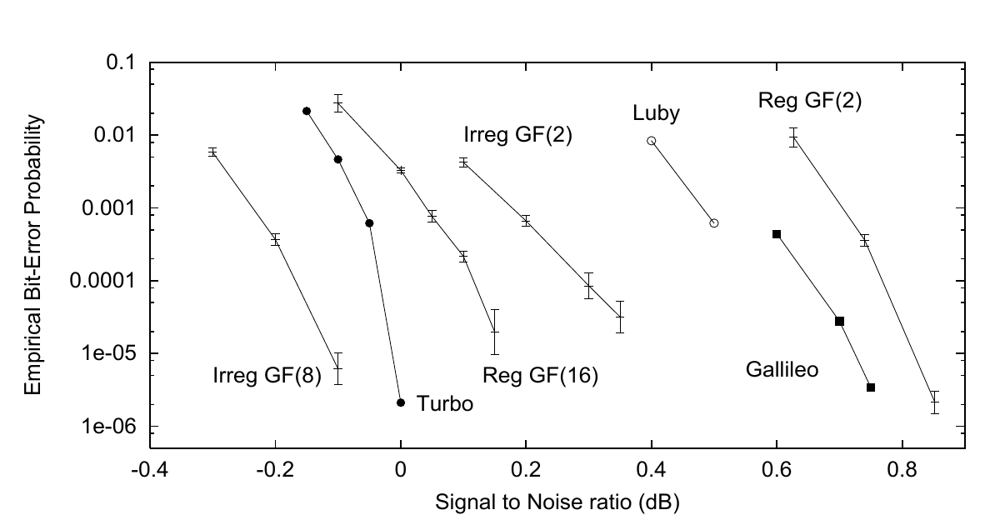

<!-- 原书 PDF 物理页 580；印刷页 568。算法 47.16 描边框、图 47.17、式 (47.15)、§47.6 续。页首续句已在 PDF 579 合完；页末段续 PDF 581 并在本页合完。 -->

$$\begin{aligned}F^{0}&=[f^{0}+f^{1}]+[f^{A}+f^{B}]\\F^{1}&=[f^{0}-f^{1}]+[f^{A}-f^{B}]\\F^{A}&=[f^{0}+f^{1}]-[f^{A}+f^{B}]\\F^{B}&=[f^{0}-f^{1}]-[f^{A}-f^{B}]\end{aligned}$$

算法 47.16　$GF(4)$ 上的傅里叶变换。函数 $f$ 在 $GF(2)$ 上的傅里叶变换 $F$ 定义为 $F^{0}=f^{0}+f^{1}$、$F^{1}=f^{0}-f^{1}$。$GF(2^{k})$ 上的变换，可以看成在 $k$ 个维度上依次进行二元变换。逆变换与傅里叶变换相同，只需再除以 $2^{k}$。

图内文字译注：纵轴 “Empirical Bit-Error Probability”为“经验比特错误概率”，横轴 “Signal to Noise ratio (dB)”为“信噪比（dB）”；“Irreg GF(8)”指 $GF(8)$ 上的不规则码，“Turbo”为 Turbo 码，“Reg GF(16)”指 $GF(16)$ 上的规则码，“Irreg GF(2)”指二元不规则码，“Luby”为 Luby *等*的码，“Gallileo”为 Galileo 用码，“Reg GF(2)”指二元规则码。图中印本拼写为 “Gallileo”，图注写 “Galileo”。

图 47.17　比较规则二元 Gallager 码、不规则码、$GF(q)$ 上的码和其他优秀的码，码率均为 $1/4$。从左（性能最好）到右依次为：$GF(8)$ 上的不规则低密度奇偶校验码，块长 $48\,000$ 比特（Davey，1999）；JPL Turbo 码，块长 $65\,536$ 比特（JPL，1996）；$GF(16)$ 上的规则低密度奇偶校验码，块长 $24\,448$ 比特（Davey 和 MacKay，1998）；不规则二元低密度奇偶校验码，块长 $16\,000$ 比特（Davey，1999）；Luby *等*（1998）的不规则二元低密度奇偶校验码，块长 $64\,000$ 比特；用于 Galileo 的 JPL 码（在 1992 年，它是当时已知最好的码率 $1/4$ 的码）；规则二元低密度奇偶校验码，块长 $40\,000$ 比特（MacKay，1999b）。香农极限约为 $-0.79\,\mathrm{dB}$。截至 2003 年，已经构造出性能更好的稀疏图码。

如果在校验结点使用合适的傅里叶变换，那么 $GF(q)$ 上的译码计算代价随 $q\log q$ 增长：从校验结点发往变量结点的消息，其更新规则为

$$r_{mn}^{a}=\sum_{\mathbf x:\,x_n=a}\mathbb{1}\!\left[\sum_{n'\in\mathcal N(m)}H_{mn'}x_{n'}=z_m\right]\prod_{j\in\mathcal N(m)\setminus n}q_{mj}^{x_j},\tag{47.15}$$

它是各个 $q_{mj}^{a}$ 的卷积。因此，对 $j\in\mathcal N(m)\setminus n$，可以把求和改为各 $q_{mj}^{a}$ 的傅里叶变换之积，再作一次逆傅里叶变换。$GF(4)$ 上的傅里叶变换见算法 47.16。

*让图变得不规则*

Luby *等*（2001b）提出了改进 Gallager 码的第二种方法：让图变得不规则。我们不必让所有变量结点都有相同的度 $j$；可以让一些变量结点的度为 $2$，一些为 $3$，一些为 $4$，少数为 $20$。校验结点也可以有不同的度；这有助于提高在擦除信道上的性能，但对于高斯信道，事实证明最好的图具有规则的校验结点度。

图 47.17 展示了这两种改进 Gallager 码的方法带来的好处，重点比较码率为 $1/4$ 的码。仅让二元码不规则，就可提高约 $0.4\,\mathrm{dB}$；从 $GF(2)$ 改用 $GF(16)$，可提高约 $0.6\,\mathrm{dB}$；Matthew Davey 将这两种特征结合起来的码——$GF(8)$ 上的不规则码——比规则二元 Gallager 码提高约 $0.9\,\mathrm{dB}$。
