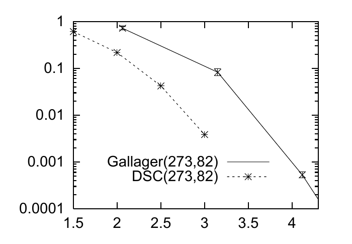
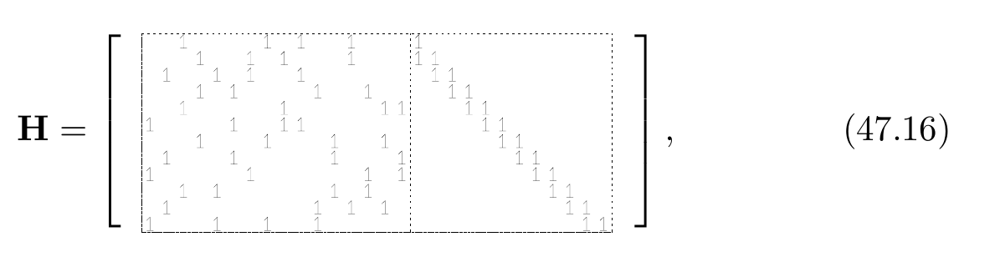

<!-- 原书 PDF 物理页 581；印刷页 569。图 47.18（可复制数据表与曲线）、§47.6 终段、§47.7 起段及图形矩阵式 (47.16)。页首续句已在 PDF 580 合完，页末句续 PDF 582 并在本页合完。 -->

<table>
<thead><tr><th colspan="7">差集循环码（DIFFERENCE SET CYCLIC CODES）</th></tr></thead>
<tbody>
<tr><th>$N$</th><td>$7$</td><td>$21$</td><td>$73$</td><td>$273$</td><td>$1057$</td><td>$4161$</td></tr>
<tr><th>$M$</th><td>$4$</td><td><strong>$10$</strong></td><td><strong>$28$</strong></td><td><strong>$82$</strong></td><td><strong>$244$</strong></td><td><strong>$730$</strong></td></tr>
<tr><th>$K$</th><td>$3$</td><td>$11$</td><td>$45$</td><td>$191$</td><td>$813$</td><td>$3431$</td></tr>
<tr><th>$d$</th><td>$4$</td><td><strong>$6$</strong></td><td><strong>$10$</strong></td><td><strong>$18$</strong></td><td>$34$</td><td>$66$</td></tr>
<tr><th>$k$</th><td><strong>$3$</strong></td><td><strong>$5$</strong></td><td><strong>$9$</strong></td><td>$17$</td><td>$33$</td><td>$65$</td></tr>
</tbody>
</table>

图内文字译注：实线 “Gallager(273,82)”为 Gallager 码，虚线 “DSC(273,82)”为差集循环码（difference-set cyclic code）。

图 47.18　一个通过代数方法构造、满足许多冗余约束的低密度奇偶校验码，其性能优于同等条件的随机 Gallager 码。表中列出一些差集循环码的 $N$、$M$、$K$、距离 $d$ 和行重 $k$，并突出显示 $d/N$ 大、$k$ 小且 $N/M$ 大的码。作比较的 Gallager 码有 $(j,k)=(4,13)$，码率与 $N=273$ 的差集循环码相同。纵轴为块错误概率，横轴为信噪比 $E_b/N_0$（dB）。

Richardson *等*（2001）提出了优化 Gallager 码*度分布轮廓*（profile）的方法，即优化各个度对应的行数与列数。由此构造出的低密度奇偶校验码，在使用和积算法译码时，其性能与香农极限只差极小的一点。

*Gallager 码的代数构造*

还有第三种提高规则 Gallager 码性能的方法：设计码，使它含有*冗余的稀疏约束*。例如，有一个*差集循环码*，其 $N=273$、$K=191$，但它满足的低权重约束并非只有 $M=82$ 条，而是 $N$ 条，即 $273$ 条（图 47.18）。随机 Gallager 码的校验之间不可能具有接近这种程度的冗余。这个差集循环码的性能比同等条件的随机 Gallager 码好约 $0.7\,\mathrm{dB}$。

一个尚未解决的问题是，寻找在不同块长和码率下仍具有差集循环码出色性质的码。我把这项任务称为*Tanner 挑战*（Tanner challenge）。

## 47.7　低密度奇偶校验码的快速编码

下面讨论比标准方法更快的低密度奇偶校验码编码方法。标准方法先通过高斯消元求得生成矩阵 $\mathbf G$，代价为 $M^3$ 阶；然后将每个块与 $\mathbf G$ 相乘完成编码，代价为 $M^2$ 阶。

*阶梯码*

某些低密度奇偶校验矩阵有 $M$ 列的列重不超过 $2$，因此可以容易地在线性时间内编码。例如，若矩阵具有式 (47.16) 右半部分所示的阶梯结构，且把数据 $\mathbf s$ 装入前 $K$ 个比特，则可从左到右在线性时间内算出 $M$ 个奇偶校验比特 $\mathbf p$。

式 (47.16) 的可复制转写（原图的空白格以 $0$ 表示）：

$$\mathbf H=\left[\begin{array}{cccccccccccccccc|cccccccccccc}0&0&1&0&0&0&0&1&0&1&0&0&1&0&0&0&1&0&0&0&0&0&0&0&0&0&0&0\\0&0&0&1&0&0&1&0&1&0&0&0&1&0&0&0&1&1&0&0&0&0&0&0&0&0&0&0\\0&1&0&0&1&0&1&0&0&1&0&0&0&0&0&0&0&1&1&0&0&0&0&0&0&0&0&0\\0&0&0&1&0&1&0&0&0&0&1&0&0&1&0&0&0&0&1&1&0&0&0&0&0&0&0&0\\0&0&1&0&0&0&0&0&1&0&0&0&0&0&1&1&0&0&0&1&1&0&0&0&0&0&0&0\\1&0&0&0&0&1&0&0&1&1&0&0&0&0&0&0&0&0&0&0&1&1&0&0&0&0&0&0\\0&0&0&1&0&0&0&1&0&0&0&1&0&0&1&0&0&0&0&0&0&1&1&0&0&0&0&0\\0&1&0&0&0&1&0&0&0&0&0&1&0&0&0&1&0&0&0&0&0&0&1&1&0&0&0&0\\1&0&0&0&0&0&1&0&0&0&0&0&0&1&0&1&0&0&0&0&0&0&0&1&1&0&0&0\\0&0&1&0&1&0&0&0&0&0&0&1&0&1&0&0&0&0&0&0&0&0&0&0&1&1&0&0\\0&1&0&0&0&0&0&0&0&0&1&0&1&0&1&0&0&0&0&0&0&0&0&0&0&1&1&0\\1&0&0&0&1&0&0&1&0&0&1&0&0&0&0&0&0&0&0&0&0&0&0&0&0&0&1&1\end{array}\right],\tag{47.16}$$
