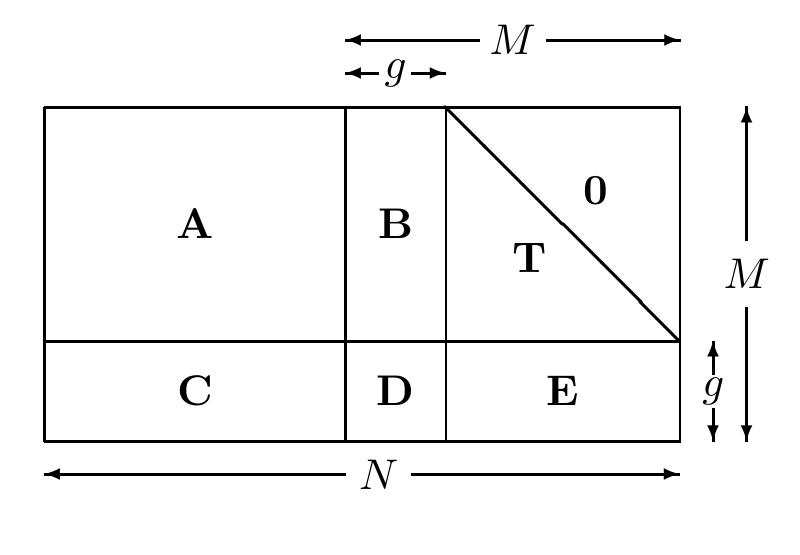

<!-- 原书 PDF 物理页 582；印刷页 570。§47.7 续，式 (47.17)–(47.20)、图 47.19、快速编码前两步。页首阶梯码条件句已接在 PDF 581 译完。 -->

$$\begin{aligned}p_1&=\sum_{n=1}^{K}H_{1n}s_n\\p_2&=p_1+\sum_{n=1}^{K}H_{2n}s_n\\p_3&=p_2+\sum_{n=1}^{K}H_{3n}s_n\\&\vdots\\p_M&=p_{M-1}+\sum_{n=1}^{K}H_{Mn}s_n.\end{aligned}\tag{47.17}$$

如果把矩阵 $\mathbf H$ 的两部分称为 $[\mathbf H_s\mid\mathbf H_p]$，编码操作就可以分成两步：先计算中间奇偶向量 $\mathbf v=\mathbf H_s\mathbf s$；再使 $\mathbf v$ 通过一个累加器，生成 $\mathbf p$。

计算式 (47.17) 中的求和时，若利用 $\mathbf H$ 的稀疏性，这种编码方法的代价就是线性的。

*一般低密度奇偶校验码的快速编码*

Richardson 和 Urbanke（2001b）提出了一种巧妙的方法，可将任意低密度奇偶校验码的编码代价从直接方法的 $M^2$ 降至 $N+g^2$。其中 $g$ 称为*缺口*（gap），理想情况下它是一个很小的常数；即使在最坏情况下，也只是 $N$ 的一个很小的比例。

图内文字译注：$\mathbf A$、$\mathbf B$、$\mathbf T$、$\mathbf C$、$\mathbf D$、$\mathbf E$ 为六个子矩阵；右上角标 $0$ 的部分为零；$M$、$N$ 是矩阵尺寸，$g$ 是缺口的尺寸。

图 47.19　近似下三角形式的奇偶校验矩阵。

第一步，通过交换行和列，把奇偶校验矩阵重新排成图 47.19 所示的*近似下三角形式*。原矩阵 $\mathbf H$ 非常稀疏，因此六个子矩阵 $\mathbf A$、$\mathbf B$、$\mathbf T$、$\mathbf C$、$\mathbf D$ 和 $\mathbf E$ 也都非常稀疏。矩阵 $\mathbf T$ 是下三角矩阵，对角线上的元素全为 $1$。

$$\mathbf H=\begin{bmatrix}\mathbf A&\mathbf B&\mathbf T\\\mathbf C&\mathbf D&\mathbf E\end{bmatrix}.\tag{47.18}$$

长度为 $K=N-M$ 的信源向量 $\mathbf s$，按以下步骤编码为发送向量 $\mathbf t=[\mathbf s,\mathbf p_1,\mathbf p_2]$。

1. 计算信源向量的上部伴随式：

$$\mathbf z_A=\mathbf A\mathbf s.\tag{47.19}$$

这可以在线性时间内完成。

2. 求第二组奇偶比特 $\mathbf p_2^{A}$ 的一个取值，使上部伴随式为零：

$$\mathbf p_2^{A}=-\mathbf T^{-1}\mathbf z_A.\tag{47.20}$$

用回代即可在线性时间内求出这个向量：依次计算 $\mathbf p_2^{A}$ 的第一位、第二位、第三位，等等。
