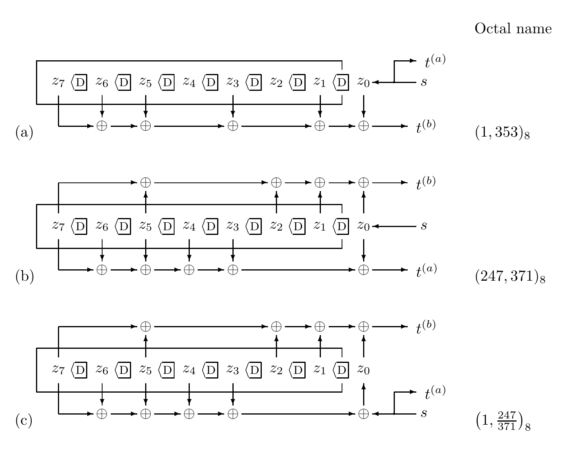
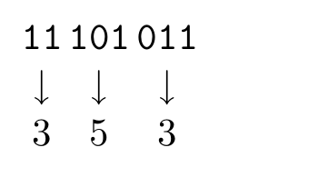

<!-- 原书 PDF 物理页 587；印刷页 575。页首接 PDF 586 的同一句，译文已合入前页；本页包括图 48.1、表 48.2、两类无反馈卷积码。 -->

图 48.1　用于生成码率为 $1/2$ 的卷积码的线性反馈移位寄存器。图中的 $\mathrm D$ 符号表示复制比特，并延迟一个时钟周期；$\oplus$ 表示无延迟的模 2 线性加法。三种滤波器分别是：（a）系统式、非递归式；（b）非系统式、非递归式；（c）系统式、递归式。图内 `Octal name` 为“八进制名称”，三种滤波器依次标为 $(1,353)_8$、$(247,371)_8$ 和 $(1,247/371)_8$；$s$ 为信源输入比特，$z_0,\ldots,z_7$ 为移位寄存器各位置的比特，$t^{(a)}$、$t^{(b)}$ 为两路发送输出比特，向下或向上的箭头表示相应位置接入输出函数，图（c）还显示了反馈连接。

卷积码有三种类型，对应图 48.1 中的三类滤波器。

*系统式非递归码*

图 48.1a 中的滤波器没有反馈。它还有一个性质：其中一路输出比特 $t^{(a)}$ 与信源比特 $s$ 完全相同。因此，这个编码器称为*系统式*，因为信源比特在发送比特流中原样出现；它也称为*非递归式*，因为它没有反馈。另一路发送比特 $t^{(b)}$ 是滤波器状态的线性函数。描述这个函数的一种方法是取两个长度均为 $k+1$ 的二元向量的模 2 点积：二元向量 $\mathbf g^{(b)}=(1,1,1,0,1,0,1,1)$，以及状态向量 $\mathbf z=(z_k,z_{k-1},\ldots,z_1,z_0)$。状态向量包含比特 $z_0$，它将在下一周期进入记忆的第一个位置。凡状态比特 $z_\kappa$ 有一个抽头（一支向下的箭头）接入发送比特 $t^{(b)}$，向量 $\mathbf g^{(b)}$ 的对应分量 $g_\kappa^{(b)}$ 就等于 1。

用八进制表示这些二元抽头向量很方便。因此，这个滤波器使用抽头向量 $353_8$。我把延迟线画成从右向左运行，以便将图与这些八进制数对应起来。

表 48.2　如何将延迟线中的抽头转换为八进制。图内的二进制分组 $11\mid101\mid011$ 依次对应八进制数字 $3\mid5\mid3$，即 $11101011_2=353_8$。

*非系统式非递归码*

图 48.1b 中的滤波器也没有反馈，但它不是系统式的。它使用两个抽头向量 $\mathbf g^{(a)}$ 和 $\mathbf g^{(b)}$ 生成两路发送比特。因此，这个编码器是*非系统式*、*非递归式*的。由于增加了复杂性，在约束长度相同的条件下，非系统式码的纠错能力可以优于系统式非递归码。
