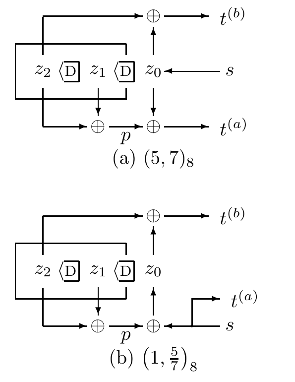

<!-- 原书 PDF 物理页 588；印刷页 576。系统递归码、两类码的等价、图 48.3、式 (48.1)–(48.3)、习题 48.1。 -->

*系统式递归码*

图 48.1c 中的滤波器与图 48.1b 的非系统式非递归滤波器相似，但它将原来构成 $\mathbf g^{(a)}$ 的抽头用于产生一个线性信号，让这个信号与信源比特一起反馈到移位寄存器中。输出 $t^{(b)}$ 与前面一样，是状态向量的线性函数。另一路输出为 $t^{(a)}=s$，所以这个滤波器是系统式的。

递归码通常用两个八进制数之比来标识。例如，图 48.1c 中的码记为 $(247/371)_8$。

*系统式递归码与非系统式非递归码的等价性*

图 48.1b、c 的两个滤波器在*码*的意义上等价，因为它们定义的*码字集合*相同。对非系统式非递归码的每一个码字，都可以为另一个编码器选择一条信源比特流，使其输出完全相同（*反之亦然*）。

图 48.3　两个码率为 $1/2$、约束长度 $k=2$ 的卷积码：（a）非递归式，八进制名称 $(5,7)_8$；（b）递归式，八进制名称 $(1,5/7)_8$。这两个码等价。图内 $s$ 为信源比特，$z_0,z_1,z_2$ 为寄存器各位置的比特，$p$ 为抽头组成的模 2 和，$t^{(a)}$、$t^{(b)}$ 为两路发送比特，$\mathrm D$ 表示延迟一个时钟周期，$\oplus$ 表示模 2 加法；图（b）向上的抽头箭头用于反馈。

为证明这一点，如图 48.3a、b 所示，令 $p$ 表示 $\sum_{\kappa=1}^{k}g_{\kappa}^{(a)}z_{\kappa}$。图 48.3 给出了一对规模较小、但同样彼此等价的滤波器。如果两次发送要等价，即两图中的 $t^{(a)}$ 相同、$t^{(b)}$ 也相同，那么系统式码在每个周期的信源比特必为 $s=t^{(a)}$。接下来只需确认：在这样选择 $s$、并假定两者初始状态相同的条件下，系统式码的移位寄存器将沿着与非系统式码相同的状态序列运行。在图 48.3a 中，

$$t^{(a)}=p\oplus z_0^{\mathrm{nonrecursive}}.\tag{48.1}$$

而在图 48.3b 中，

$$z_0^{\mathrm{recursive}}=t^{(a)}\oplus p.\tag{48.2}$$

代入 $t^{(a)}$，再利用 $p\oplus p=0$，立刻得到

$$z_0^{\mathrm{recursive}}=z_0^{\mathrm{nonrecursive}}.\tag{48.3}$$

因此，非系统式非递归码的任何码字，也是使用相同抽头的系统式递归码的一个码字。这里说“相同抽头”，是指图 48.3（a）和（b）中竖直箭头都出现在相同位置，尽管图（b）有一个箭头向上而不是向下。

虽然这两个码等价，但两个编码器的行为不同。非递归编码器具有*有限冲激响应*：如果输入序列除了一个 1 以外全是 0，输出序列中 1 的个数就是有限的。这个 1 比特依次经过记忆中的全部状态后，延迟线会返回全零状态。图 48.4a 展示了信源序列 $\mathbf s=(0,0,1,0,0,0,0,0)$ 所产生的状态序列。

图 48.4b 展示了图 48.3b 中递归码的网格图，以及它对同一信源序列 $\mathbf s=(0,0,1,0,0,0,0,0)$ 的响应。这个滤波器具有*无限冲激响应*，其响应最终进入周期为三个时钟周期的状态循环。

▷ **习题 48.1**（难度 1）　递归滤波器需要什么输入，才能使它的状态序列和发送序列都与非递归滤波器相同？（提示：见图 48.5。）
