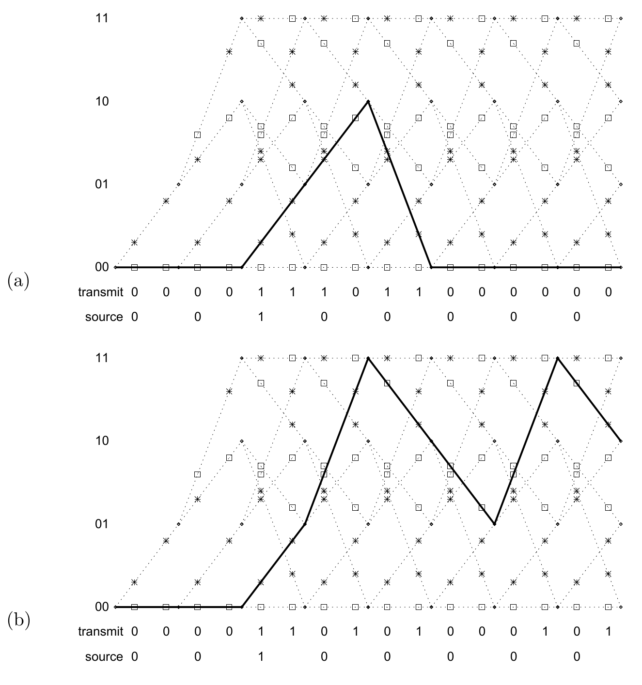
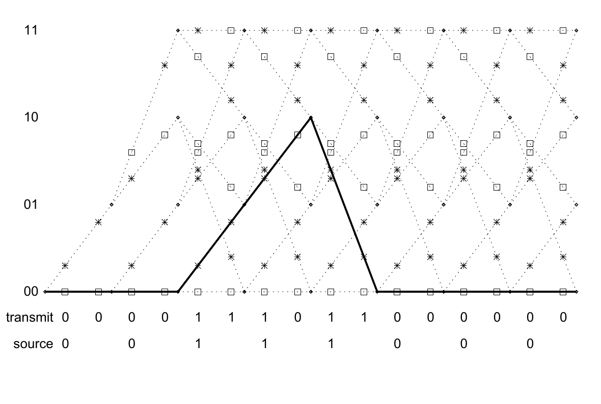

<!-- 原书 PDF 物理页 589；印刷页 577。整页为图 48.4 和图 48.5 及图注。 -->

图 48.4　图 48.3 中两个码率为 $1/2$ 的卷积码的网格图。假定滤波器的初始状态为 $(z_2,z_1)=(0,0)$。横轴表示时间，纵坐标表示每个时刻滤波器的状态。线段上的星号表示发送符号 $t^{(a)}$ 或 $t^{(b)}$ 为“1”，小方框表示“0”。信源序列为 $00100000$ 时，网格图中对应的路径用实线标出；浅色虚点线表示其他信源序列可能产生的状态轨迹。图（a）为非递归码，图（b）为递归码。两幅图内的 `transmit` 意为“发送序列”，`source` 意为“信源序列”；纵轴的 $00,01,10,11$ 是状态 $(z_2,z_1)$ 的四个取值。

图 48.5　系统式递归码的信源序列 $00111000$ 在网格图中走出的路径，与非系统式非递归码的信源序列 $00100000$ 所走出的路径相同。图内的 `transmit` 意为“发送序列”，`source` 意为“信源序列”；纵轴的 $00,01,10,11$ 是状态 $(z_2,z_1)$ 的四个取值，实线为上述路径，其余虚点线为其他可能路径。
