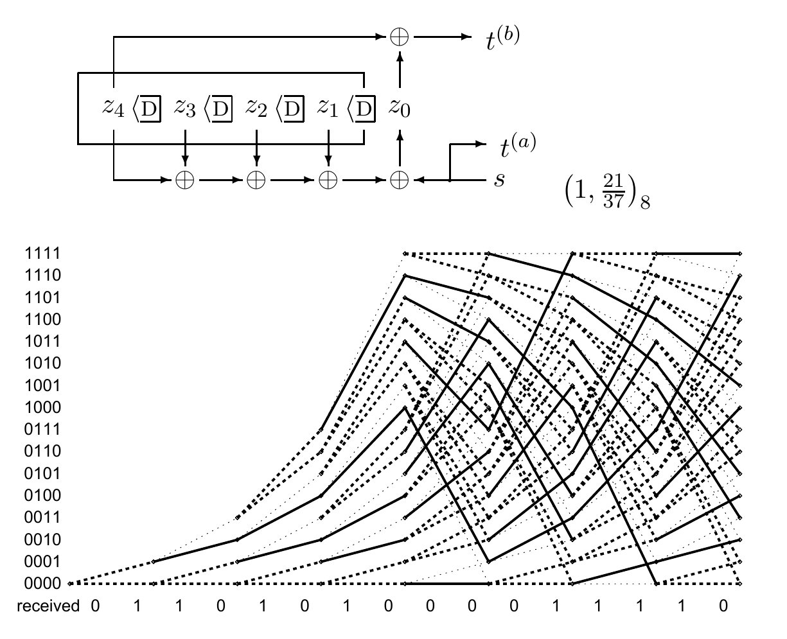

<!-- 原书 PDF 物理页 590；印刷页 578。图 48.6、移位寄存器周期、§48.3 译码和习题 48.2。 -->

图 48.6　一个 $k=4$ 的码的网格图；当接收向量与某个码字只相差一个翻转比特时，图中的边按似然函数分为三种线型。粗实线表示该边的两位输出与接收序列对应的两位完全相同；粗点线表示一位相同、一位不同；细点线表示两位均不同。上方滤波器的八进制名称为 $(1,21/37)_8$。图内 `received` 为“接收序列”；$s$ 为信源输入比特，$z_0,\ldots,z_4$ 为寄存器位置比特，$t^{(a)}$ 和 $t^{(b)}$ 为两路发送比特；$\mathrm D$ 表示一个时钟周期的延迟，$\oplus$ 表示模 2 加法；纵轴从 $0000$ 到 $1111$ 标出十六个状态。

一般来说，有 $k$ 位记忆的线性反馈移位寄存器，其冲激响应是周期性的，周期最长为 $2^k-1$；这对应滤波器遍历状态空间中的每一个非零状态。

顺便说一下，廉价的伪随机数发生器和密码产品也使用这类周期序列，只是它们的 $k$ 值大于 7；随机数种子或密码密钥用于选择记忆的初始状态。因此，某些密码分析问题与卷积码译码之间存在密切联系。

## 48.3　卷积码译码

接收器收到一条比特流，希望推断状态序列，进而推断信源比特流。每个比特的后验概率可以用第 25.3 节介绍的和积算法求出；该算法也称为前向—后向算法或 BCJR 算法。最可能的状态序列可由第 25.3 节的最小和算法求出；它也称为 Viterbi 算法。图 48.6 说明了这个任务：图中给出十六状态码的网格图里每条边所对应的代价。这里假定信道是二元对称信道，接收向量与某个码字相比，只有一个比特被翻转。边按似然分为三种线型：粗实线的两位都与接收序列对应的两位相同；粗点线只有一位相同，另一位不同；细点线两位都不同。最小和算法寻找经过网格图的路径，尽量多走实线边；更准确地说，它最小化路径总代价，其中实线边代价为零，粗点线边为一，细点线边为二。

▷ **习题 48.2**（难度 1；原书第 581 页有解答）　你能找出最可能的路径，以及那个翻转的比特吗？
