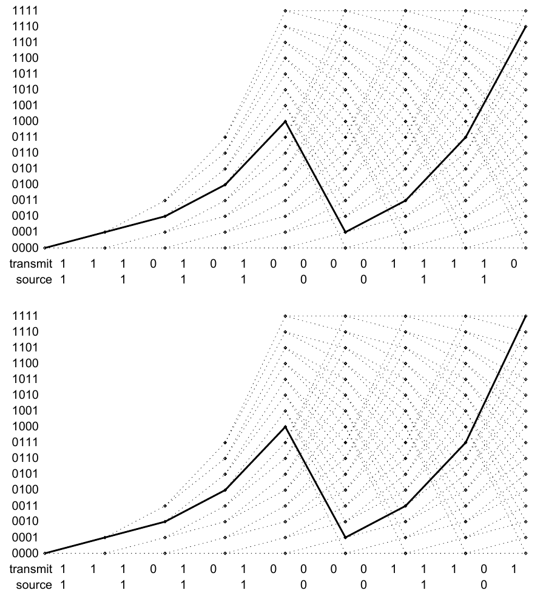
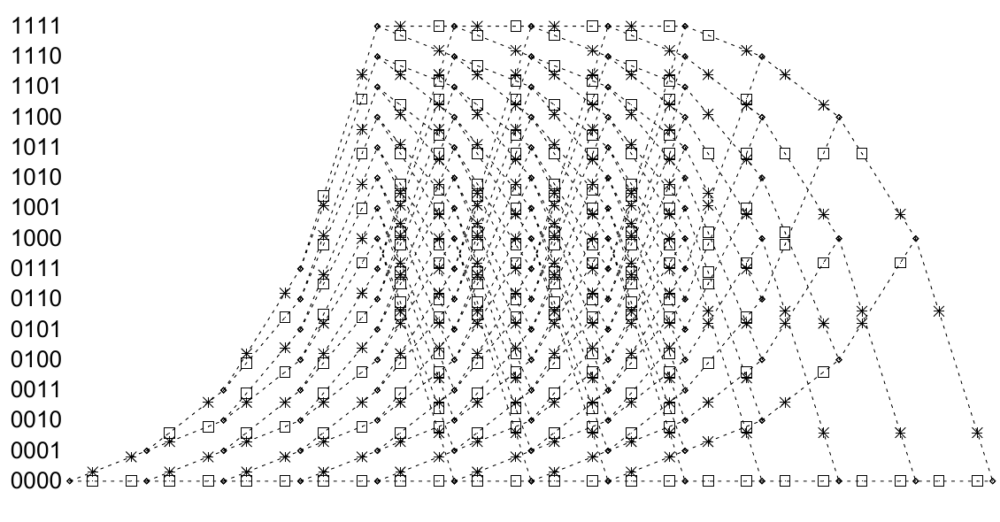
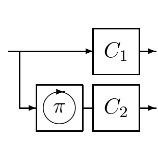

<!-- 原书 PDF 物理页 591；印刷页 579。图 48.7、48.8、48.10，非均等保护与 §48.4 起段；末句续 PDF 592，在本页合为完整句。 -->

图 48.7　两条路径仅在两个发送比特上不同。两幅图内的 `transmit` 表示“发送序列”，`source` 表示“信源序列”；纵轴 $0000$ 至 $1111$ 为滤波器的十六个状态，粗实线突出显示所比较的两条路径。

图 48.8　终止的网格图。任一码字结束时，滤波器的状态都是 $0000$。图中纵轴 $0000$ 至 $1111$ 标出十六个状态；线段上的星号和小方框分别标记发送比特 1 和 0。

*非均等保护*

迄今介绍的卷积码有一个缺点：它们对信源比特提供的保护并不均等。图 48.7 给出了穿过网格图的两条路径，它们只有两个发送比特不同。最后一个信源比特所得到的保护弱于其他信源比特。正是这种保护不均等的现象，促使我们将网格图*终止*。

图 48.8 展示了终止的网格图。终止会略微减少每个码字所能承载的信源比特数。在这里，有四个信源比特被用来充当校验比特，因为必须使 $k=4$ 个记忆比特回到零。

图 48.10　Turbo 码的编码器。两个方框 $C_1$、$C_2$ 各包含一个卷积码。信源比特先经置换 $\pi$ 改变顺序，再送入 $C_2$。把两个卷积码的输出连接起来或交织起来，即得到发送码字。图内 $C_1$、$C_2$ 为两个卷积编码器，$\pi$ 为置换器，两条右向箭头分别为两路输出。

## 48.4　Turbo 码

一个 $(N,K)$ Turbo 码由若干个组成它的卷积编码器（通常为两个）和数目相同的交织器定义；这些交织器是 $K\times K$ 置换矩阵。不失一般性，我们把第一个交织器取为单位矩阵。将一段 $K$ 个信源比特按相应交织器规定的次序送入每个组成编码器，并发送各编码器输出的比特。通常，第一个组成编码器选为系统式编码器，如图 48.6 所示的递归滤波器；第二个则是码率为 1、仅输出校验比特的非系统式编码器。于是，发送码字由 $K$ 个信源比特、第一组卷积码生成的 $M_1$ 个校验比特，以及第二组生成的 $M_2$ 个校验比特构成。所得 Turbo 码的码率为 $1/3$。
