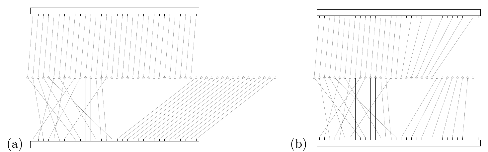

<!-- 原书 PDF 物理页 592；印刷页 580。图 48.9、Turbo 码因子图、迭代译码与停止准则。页首续句已合入 PDF 591；页末“of the code...”续 PDF 593，在本页合为完整句。 -->

图 48.9　用因子图表示的码率 $1/3$（a）和码率 $1/2$（b）Turbo 码。圆圈表示码字比特；两个长方形表示码率 $1/2$ 的卷积码网格图，其中系统比特占长方形左半部，校验比特占右半部。对于图（b）的码率 $1/2$ Turbo 码，每个组成码的一半校验比特没有连接线，表示这些比特被删余。

Turbo 码可以表示为一个因子图：两个网格图各由一个大的长方形节点表示（图 48.9a）。$K$ 个信源比特和第一组 $M_1$ 个校验比特参与第一个网格图，$K$ 个信源比特和后一组 $M_2$ 个校验比特参与第二个网格图。码字的每个比特参加一个或两个网格图，取决于它是校验比特还是信源比特。每个网格图节点所包含的网格图都与图 48.8 的终止网格图完全一样，只是长度为其一千倍。［Turbo 码还可以用更多基本节点表示为其他因子图，但这里的因子图导出 Turbo 码所用的标准和积算法。］

如果需要码率较小的 Turbo 码，例如码率 $1/2$，一种常见做法是对码率 $1/3$ 的码进行修改，*删余*（puncture）其中一些校验比特（图 48.9b）。

Turbo 码使用第 26 章所述的和积算法译码。第一次迭代时，每个网格图接收信道似然，然后运行前向—后向算法，根据其他比特的信息，计算每个比特为 1 或 0 的相对似然。随后，将每个网格图得到的似然传递给另一个网格图，并在传递时乘上信道似然。这样就可以开始第二次迭代：在每个网格图中用更新后的概率再次运行前向—后向算法。经过大约十次或二十次这样的迭代，我们希望找到正确的译码结果。通常在固定迭代次数后停止，但还可以做得更好。

下面的程序可以在每次迭代时用作停止准则。在每个网格图的每个时间步，根据局部消息找出最可能的边。如果这些最可能的边在两个网格图中各自连成一条有效路径，而且两条路径相互一致，那么合理的做法是停止，因为后续迭代不大可能再把译码器带离这个码字。如果达到最大迭代次数时仍不满足这一停止准则，就可以报告译码错误。推荐这样停止有几个原因：它能大幅节省译码时间，而不增大错误概率；它能识别译码器检测到的失败——接收器知道某个特定码块确实已经损坏，这当然是有用的信息！此外，将已检测到和未检测到的错误区分开，还能从未检测到的错误中了解该码的低重量码字，进而改进码的设计过程。
