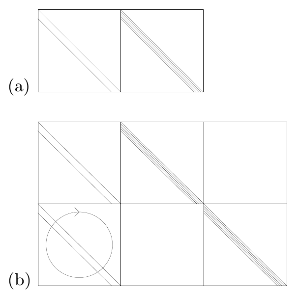

<!-- 原书 PDF 物理页 593；印刷页 581。页首承接 PDF 592 的完整句，译文已合入前页；本页含图 48.11、§48.5、习题 48.3、延伸阅读和 §48.6 对习题 48.2 的解答。PDF 594 为下一章。 -->

这里描述的 Turbo 码，在译码错误概率降至约 $10^{-5}$ 时仍表现优异；但随机构造的 Turbo 码往往从这一水平开始出现*误码平台*（error floor）。这个平台由低重量码字引起。为了降低误码平台，可以尝试修改随机构造过程，提高这些低重量码字的重量。调校 Turbo 码是一门靠经验摸索的“黑色艺术”，而且永远无法彻底消除低重量码字；更准确地说，只有牺牲 Turbo 码的优异性能，才能消除它们。相比之下，只要重量为 2 的列不太多，低密度奇偶校验码很少出现误码平台（参见习题 47.3，原书第 572 页）。

图 48.11　奇偶校验矩阵示意图：（a）码率 $1/2$ 的卷积码；（b）码率 $1/3$ 的 Turbo 码。记号说明：一条对角线表示单位矩阵；一束对角线表示一条由 1 组成的对角带；方块内的圆圈表示将该方块的所有列随机置换；方块内的数字表示叠加在该方块中的随机置换矩阵个数；水平线和竖直线标出矩阵内部各分块的边界。

## 48.5　卷积码与 Turbo 码的奇偶校验矩阵

最后，我们把一个码率为 $1/2$ 的卷积码看作线性分组码，讨论它的奇偶校验矩阵。我们约定，一个码块的 $N$ 个比特由前 $N/2$ 个 $t^{(a)}$ 比特和随后的 $N/2$ 个 $t^{(b)}$ 比特组成。

▷ **习题 48.3**（难度 2）　证明卷积码有一个低密度奇偶校验矩阵，其示意形式如图 48.11a 所示。

提示：要弄清卷积码满足哪些奇偶校验约束，最容易的方法是考虑非系统式非递归编码器（图 48.1b）。设一条比特流先经过卷积滤波器 $b$，再通过滤波器 $a$；然后把滤波器的顺序反过来，比较所得到的两条比特流。忽略网格图的终止。

Turbo 码的奇偶校验矩阵可以通过列出其两个组成网格图所满足的约束写出（图 48.11b）。因此，Turbo 码也是低密度奇偶校验码的特例。如果对 Turbo 码进行删余，它未必仍有低密度奇偶校验矩阵，但它始终有一个稀疏的*广义奇偶校验矩阵*；下一章将对此作出解释。

### 延伸阅读

如需进一步了解卷积码，强烈推荐 Johannesson 和 Zigangirov（1999）。我原本希望介绍的一个主题是*序列译码*。序列译码只探索网格图中最有希望的路径；当证据逐渐表明先前选错了岔路时，再回溯。网格图太大，无法应用最大似然算法——即最小和算法——时，就会使用序列译码。关于序列译码，可以参阅 Johannesson 和 Zigangirov（1999）。

若想进一步了解和积算法在 Turbo 码中的应用，以及很少使用但十分值得推荐的译码停止准则，Frey（1998）是必读文献。（那本书里还有许多其他精彩内容！）

## 48.6　解答

习题 48.2 的解答（原书第 578 页）。第一个比特被翻转了。最可能的路径是图 48.7 上面那条。
