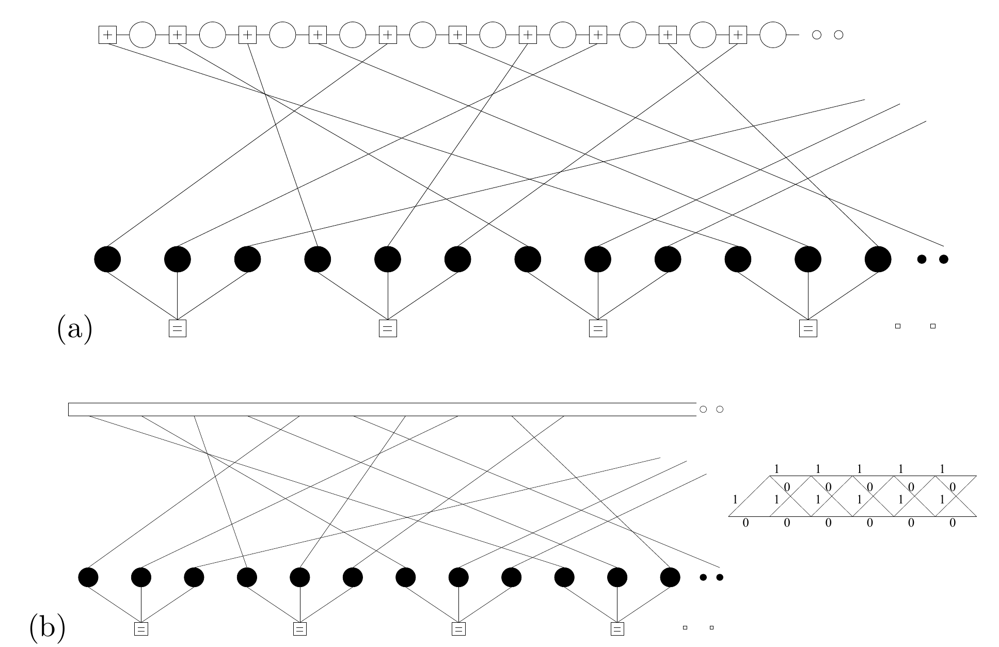
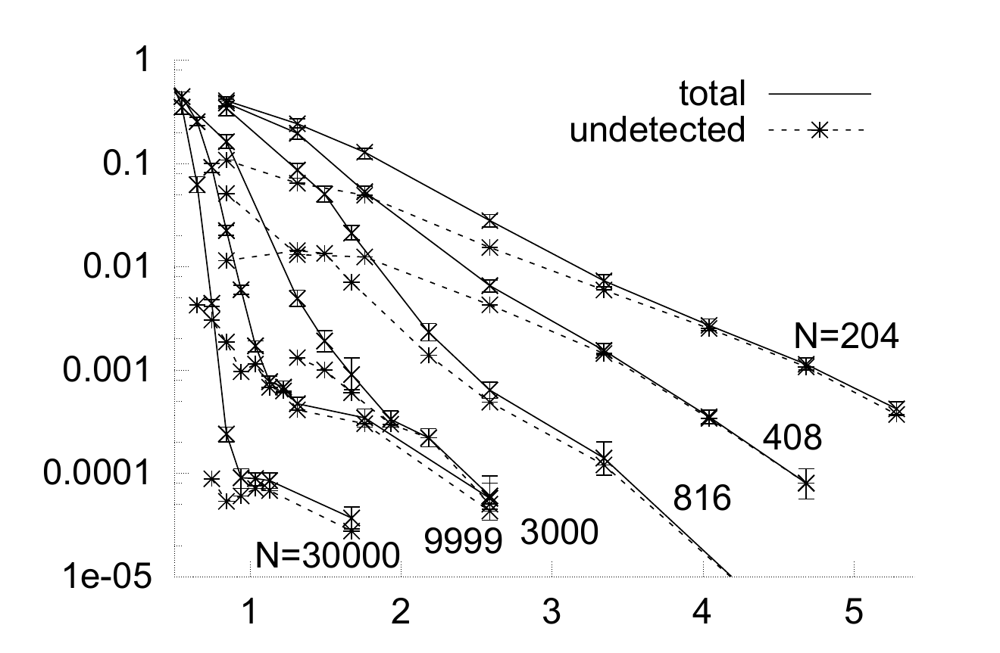

<!-- 原书 PDF 物理页 595；印刷页 583。图 49.1、49.2 与图注、§49.2 续段、§49.3 全部正文。 -->

图 49.1　码率为 $1/3$ 的重复—累积码的因子图。(a) 使用基本节点的表示法。每个白色圆点表示一个发送比特。每个 $\boxed{+}$ 约束要求与它相连的三个比特之和为偶数。每个黑色圆点表示一个中间二元变量。每个 $\boxed{=}$ 约束要求与它相连的三个变量相等。(b) 通常用于译码的因子图。顶部的矩形表示累积器的网格图，图中小插图展示了该网格图；小插图边上的 $0$、$1$ 为状态和转移标记。

图 49.2　六个码率为 $1/3$ 的重复—累积码在高斯信道上的性能。分组长度从 $N=204$ 到 $N=30\,000$。纵轴为分组错误概率；横轴为 $E_b/N_0$。虚线给出未检测出的错误的发生频率。图内图例 `total` 表示全部错误，`undetected` 表示未检测出的错误；曲线旁的 $204$、$408$、$816$、$3000$、$9999$ 和 $30\,000$ 为分组长度 $N$。

此图是码字先验概率的因子图：圆点是二元变量节点，方框表示两种因子节点。与前文一样，每个 $\boxed{+}$ 节点贡献一个形如 $\mathbb{1}[\sum x=0\pmod 2]$ 的因子；每个 $\boxed{=}$ 节点贡献一个形如 $\mathbb{1}[x_1=x_2=x_3]$ 的因子。

## 49.3　译码

重复—累积码通常在图 49.1b 所示的因子图上使用和积算法译码。顶部的方框表示累积器的网格图，包括信道似然。在每次迭代的前半段，顶部网格图接收对其中每种状态转移的似然，并运行前向—后向算法，产生各变量节点的似然。在后半段，这些似然在 $\boxed{=}$ 节点相乘，形成送回网格图的新似然消息。

与 Gallager 码和 Turbo 码一样，这里也可以采用“译出即停”的译码方法，因此可以区分未检测出的错误与检测出的错误。前者是由码中低权重码字造成的；后者发生在译码器陷入停滞，并且知道自己未能找到有效答案时。

图 49.2 给出了六个随机构造的重复—累积码在高斯信道上的性能。如果不介意分组错误概率降到约 $10^{-4}$ 时出现的误码平台，那么对于这样简单的码，它的性能好得惊人（可与图 47.17 比较）。
