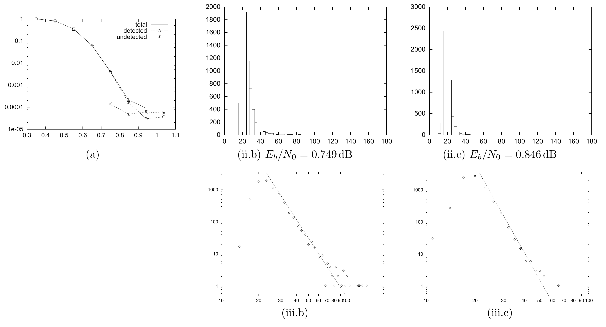

<!-- 原书 PDF 物理页 596；印刷页 584。图 49.3 五联图与图注、§49.4 全段、习题 49.1、§49.5 起段。末句跨 PDF 597，在本页合为完整句，五条记号列表留在下一页。 -->

图 49.3　信源分组长度 $K=10\,000$、发送分组长度 $N=30\,000$ 的重复—累积码找到有效译码所需迭代次数的直方图。(a) 该 RA 码的分组错误概率随信噪比的变化；图内图例 `total`、`detected`、`undetected` 分别为全部错误、检测出的错误和未检测出的错误。(ii.b) $x/\sigma=0.89$、$E_b/N_0=0.749\,\mathrm{dB}$ 时的直方图。(ii.c) $x/\sigma=0.90$、$E_b/N_0=0.846\,\mathrm{dB}$ 时的直方图。(iii.b、iii.c) 分别对 (ii.b) 与 (ii.c) 作幂律拟合，幂律分别为 $1/\tau^6$ 和 $1/\tau^9$。

## 49.4　译码时间的经验分布

研究和积算法译出一个稀疏图码需要多少次迭代 $\tau$，很有意思。对于给定的码和一组信道条件，不同试验中的译码时间会随机变化。我们发现，当 $\tau$ 较大时，译码时间的直方图遵循幂律 $P(\tau)\propto\tau^{-p}$。幂指数 $p$ 取决于信噪比；信噪比降低时，$p$ 变小，因此分布的尾部更重。我们在重复—累积码以及不规则和规则的 Gallager 码中都观察到了幂律。图 49.3(ii) 和 (iii) 显示了一个重复—累积码在两个不同信噪比下的译码时间分布。幂律延伸了好几个数量级。

**习题 49.1**（难度 5）研究这些幂律：密度演化能预测它们吗？能否通过设计码，以有用的方式调节幂律？

## 49.5　广义奇偶校验矩阵

在比较稀疏图码时，我发现用一种统一的表示方式描述所有这些码很有帮助。Forney（2001）提出了*正规图*（normal graph）的概念：其中只有 $\boxed{+}$ 和 $\boxed{=}$ 两类节点，而所有变量节点的度都是 1 或 2；度为 2 的变量节点可以表示为连接一个 $\boxed{+}$ 节点和一个 $\boxed{=}$ 节点的边。*广义奇偶校验矩阵*是表示正规图的一种图示方法。在通常的奇偶校验矩阵中，列对应发送比特，行对应线性约束。广义奇偶校验矩阵还可以有额外的列，表示不发送的状态变量。理解这些状态变量的一种方式是：发送之前，它们已从码中被删余。

状态变量用对应列上方的一条水平线标出。广义奇偶校验矩阵的其他图示记号如下（见 MacKay，1999b；MacKay 等，1998）：
