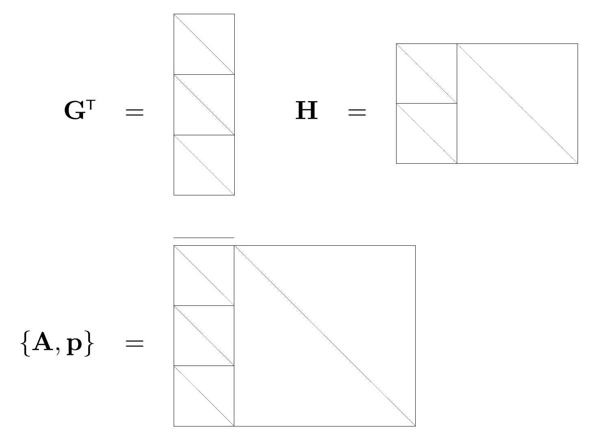

<!-- 原书 PDF 物理页 597；印刷页 585。图 49.4、§49.5 五条图示记号、定义、式 (49.2)–(49.5)。页首接续 PDF 596 已补全的句子。 -->

图 49.4　码率为 $1/3$ 的重复码的生成矩阵、奇偶校验矩阵和广义奇偶校验矩阵。图内 $\mathbf G^{\mathsf T}$ 表示生成矩阵的转置，$\mathbf H$ 表示奇偶校验矩阵，$\{\mathbf A,\mathbf p\}$ 表示广义奇偶校验矩阵及删余比特列表；第三幅图上方的横线标记不发送的状态变量列。

- 方格中的一条对角线表示矩阵的这一部分包含一个单位矩阵。

- 两条或更多平行的对角线表示一个带状对角矩阵；每行的 $1$ 的数量与对角线的数量相应。

- 带箭头的水平椭圆表示对应区块中的各列经过随机置换。

- 带箭头的竖直椭圆表示对应区块中的各行经过随机置换。

- 圈起来的整数表示相应数量的随机置换矩阵叠加在一起。

**定义。**广义奇偶校验矩阵是一个二元组 $\{\mathbf A,\mathbf p\}$，其中 $\mathbf A$ 是二元矩阵，$\mathbf p$ 是删余比特的列表。该矩阵定义一组满足下式的*有效向量* $\mathbf x$：

$$\mathbf A\mathbf x=0;\tag{49.2}$$

对于每个有效向量，都有一个码字 $\mathbf t(\mathbf x)$：从 $\mathbf x$ 中删去 $\mathbf p$ 所指定的比特，就得到这个码字。对于同一个码，可以有许多种广义奇偶校验矩阵。

具有广义奇偶校验矩阵 $\{\mathbf A,\mathbf p\}$ 的码，其码率可以按下述方式估算。若 $\mathbf A$ 是一个 $L\times M'$ 矩阵，$\mathbf p$ 删余 $S$ 个比特并选出 $N$ 个比特发送（$L=N+S$），则码字上的有效约束数 $M$ 为

$$M=M'-S,\tag{49.3}$$

信源比特数为

$$K=N-M=L-M',\tag{49.4}$$

而码率大于或等于

$$R=1-\frac{M}{N}=1-\frac{M'-S}{L-S}.\tag{49.5}$$
