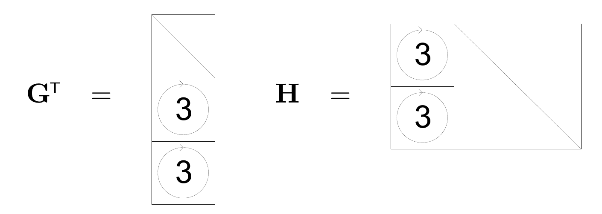
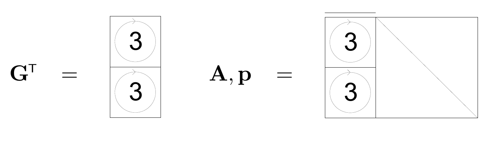
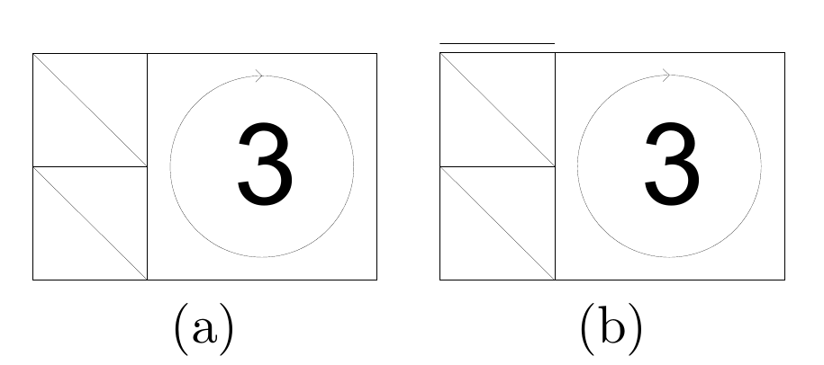

<!-- 原书 PDF 物理页 598；印刷页 586。§49.5 实例、图 49.5–49.7 与图注、式 (49.6)–(49.11)。 -->

图 49.5　一个*系统式*低密度生成矩阵码的生成矩阵和奇偶校验矩阵。该码的码率为 $1/3$。图中圈出的 $3$ 表示三个随机置换矩阵的叠加。

图 49.6　一个*非系统式*低密度生成矩阵码的生成矩阵和广义奇偶校验矩阵。该码的码率为 $1/2$。图中圈出的 $3$ 表示三个随机置换矩阵的叠加，左侧区块上方横线标记不发送的状态变量列。

*实例*

**重复码。**图 49.4 给出了一个码率为 $1/3$ 的简单重复码的生成矩阵、奇偶校验矩阵和广义奇偶校验矩阵。

**系统式低密度生成矩阵码。**在一个 $(N,K)$ 系统式低密度生成矩阵码中，没有状态变量。长度为 $N$ 的发送码字 $\mathbf t$ 为

$$\mathbf t=\mathbf G^{\mathsf T}\mathbf s,\tag{49.6}$$

其中

$$\mathbf G^{\mathsf T}=\begin{bmatrix}\mathbf I_K\\\mathbf P\end{bmatrix},\tag{49.7}$$

$\mathbf I_K$ 表示 $K\times K$ 单位矩阵，$\mathbf P$ 是一个非常稀疏的 $M\times K$ 矩阵，$M=N-K$。该码的奇偶校验矩阵为

$$\mathbf H=[\mathbf P\mid\mathbf I_M].\tag{49.8}$$

对于码率为 $1/3$ 的码，这个奇偶校验矩阵可以表示成图 49.5 的样子。

**非系统式低密度生成矩阵码。**在一个 $(N,K)$ 非系统式低密度生成矩阵码中，长度为 $N$ 的发送码字 $\mathbf t$ 为

$$\mathbf t=\mathbf G^{\mathsf T}\mathbf s,\tag{49.9}$$

其中 $\mathbf G^{\mathsf T}$ 是一个非常稀疏的 $N\times K$ 矩阵。该码的广义奇偶校验矩阵为

$$\mathbf A=[\overline{\mathbf G^{\mathsf T}}\mid\mathbf I_N],\tag{49.10}$$

相应的广义奇偶校验方程为

$$\mathbf A\mathbf x=0,\qquad\text{其中 }\mathbf x=\begin{bmatrix}\mathbf s\\\mathbf t\end{bmatrix}.\tag{49.11}$$

图 49.7　(a) 一个码率为 $1/3$ 的 Gallager 码的广义奇偶校验矩阵，其中有 $M/2$ 列的权重为 $2$；(b) 一个码率为 $1/2$ 的线性 MN 码的广义奇偶校验矩阵。图中圈出的 $3$ 表示三个随机置换矩阵的叠加；(b) 的左侧区块上方横线标记不发送的状态变量列。

尽管这个简单码的通常奇偶校验矩阵一般是一个复杂的稠密矩阵，广义奇偶校验矩阵却保留了该码的底层简洁结构。对于码率为 $1/2$ 的码，这个广义奇偶校验矩阵可以表示成图 49.6 的样子。

**低密度奇偶校验码与线性 MN 码。**图 49.7a 给出了一个码率为 $1/3$ 的低密度奇偶校验码的奇偶校验矩阵。
