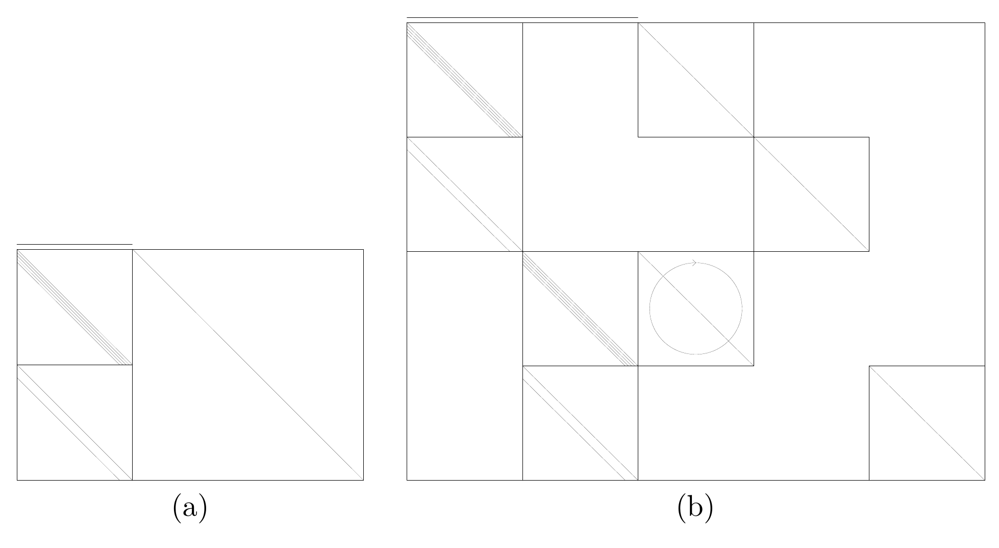
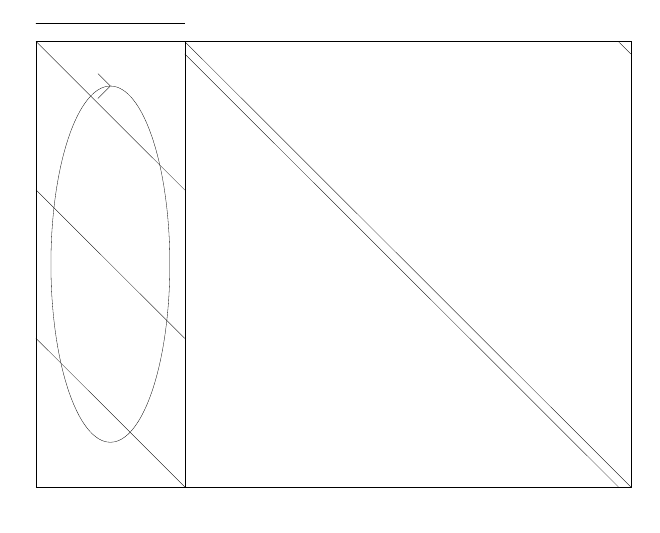

<!-- 原书 PDF 物理页 599；印刷页 587。§49.5 终页，图 49.8、49.9 与图注，线性 MN 码及卷积码、拼接、Turbo 码、重复—累积码、码的交集诸段。 -->

图 49.8　(a) 码率为 $1/2$ 的卷积码的广义奇偶校验矩阵。(b) 两个卷积码并行拼接得到的码率为 $1/3$ 的 Turbo 码的广义奇偶校验矩阵。矩阵示意图中的上方横线标记状态变量列，斜线与带箭头椭圆的意义见图 49.4 后的记号说明。

线性 MN 码是一种非系统式低密度奇偶校验码。MN 码的 $K$ 个状态比特就是信源比特。图 49.7b 给出了码率为 $1/2$ 的线性 MN 码的广义奇偶校验矩阵。

**卷积码。**在非系统式、非递归卷积码中，充当状态比特的信源比特被送入延迟线，发送的是延迟线的两个线性函数值。在图 49.8a 中，这两个奇偶比特流画成两个连续的、长度为 $K$ 的向量。[通常会对这两个奇偶比特流进行交织，即对比特重新排序；这与此处的讨论无关，因此图中没有画出。]

**拼接。**要在这种图示中表示两个码的“并行拼接”，就把两个码的矩阵对齐，使其“信源比特”列对齐，并在矩阵中加入全零区块，使两个码的状态比特列与奇偶比特列各自占据不同的列。后面给出的 Turbo 码就是一个例子。在“串行拼接”中，第一个码的*发送比特*所对应的列与第二个码的*信源比特*所对应的列对齐。

**Turbo 码。**Turbo 码由两个卷积码并行拼接而成。码率为 $1/3$ 的 Turbo 码的广义奇偶校验矩阵见图 49.8b。

**重复—累积码。**码率为 $1/3$ 的重复—累积码的广义奇偶校验矩阵见图 49.9。重复—累积码等价于阶梯码（§47.7，原书第 569 页）。

图 49.9　码率为 $1/3$ 的重复—累积码的广义奇偶校验矩阵。左侧区块上方横线标记不发送的状态变量列；竖直椭圆箭头表示对该区块各行作随机置换。

**交集。**要得到两个码的交集的广义奇偶校验矩阵，可将两者的广义奇偶校验矩阵上下堆叠，同时将所有“发送比特”列正确对齐，并让与两个分量码相关的删余比特各自占据不同的列。
