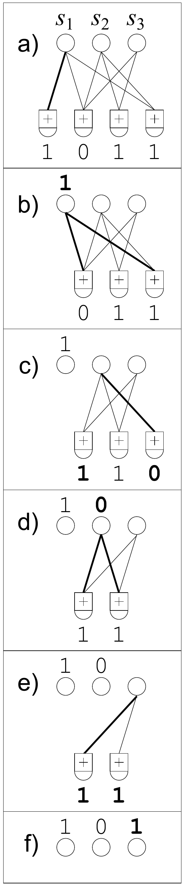

<!-- 原书 PDF 物理页 603；印刷页 591。页首续 PDF 602 已合入上一页；末段续 PDF 604 页首，在本页合为完整段落。 -->

## 50.2　译码器

在擦除信道中，稀疏图码的译码特别容易。译码器要从 $\mathbf t=\mathbf G\mathbf s$ 恢复 $\mathbf s$，其中 $\mathbf G$ 是与这张图对应的矩阵。尝试解决这个问题的一种简单方法是消息传递。如果愿意，也可以将译码算法看成和积算法，不过所有消息要么是*完全不确定*的，要么是*完全确定*的。不确定的消息表示消息分组 $s_k$ 可以等概率地取任意值；确定的消息表示 $s_k$ 以概率 1 取某个特定值。

由于消息如此简单，译码过程也可以用简洁的步骤描述。我们把编码分组 $\{t_n\}$ 称为校验节点。

1. 找到一个*只连接一个*源分组 $s_k$ 的校验节点 $t_n$。（如果不存在这样的校验节点，译码算法就在这里停止，未能恢复全部源分组。）

   (a) 令 $s_k=t_n$。

   (b) 对所有连接到 $s_k$ 的校验节点 $t_{n'}$，将 $s_k$ 加到它们上面：

   $$t_{n'}:=t_{n'}+s_k\quad\text{对所有满足 }G_{n'k}=1\text{ 的 }n'.\tag{50.1}$$

   (c) 移除与源分组 $s_k$ 相连的所有边。

2. 重复步骤 1，直到全部 $\{s_k\}$ 都确定下来。

图 50.1　数字喷泉码的译码示例，其中有 $K=3$ 个源比特和 $N=4$ 个编码比特。图内上方的 $s_1,s_2,s_3$ 是源比特，带“$+$”的下方节点表示模 2 校验；(a)–(f) 依次展示恢复过程，节点旁的 0、1 为相应比特值。

图 50.1 用一个每个分组都只有一个比特的简单例子展示了这一译码过程。共有三个源分组（上方的圆圈）和四个收到的分组（下方的校验符号），在算法开始时其值为 $t_1t_2t_3t_4=1011$。

在第一次迭代时，唯一只连接一个源比特的校验节点是第一个校验节点［图 (a)］。于是设定相应的源比特 $s_1$［图 (b)］，丢弃该校验节点，再将 $s_1$ 的值（1）加到它连接的校验节点上［图 (c)］，从而将 $s_1$ 从图中断开。第二次迭代开始时［图 (c)］，第四个校验节点只连接一个源比特 $s_2$。我们令 $s_2=t_4$［图 (d)，其值为 0］，并将 $s_2$ 加到它连接的两个校验节点上［图 (e)］。最后，我们发现两个校验节点都连接着 $s_3$，并且它们对 $s_3$ 的取值一致（但愿如此！）；图 (f) 展示了恢复出来的 $s_3$。

## 50.3　设计度分布

度的概率分布 $\rho(d)$ 是设计的关键：必须偶尔生成高度的编码分组（即 $d$ 与 $K$ 相近），以确保没有源分组完全不与任何编码分组相连。许多分组则必须具有较低的度，这样译码过程才能开始并持续下去，同时使编码与译码中的加法运算总数保持较小。给定度分布 $\rho(d)$，可以用适当形式的密度演化来预测译码过程的统计行为。
