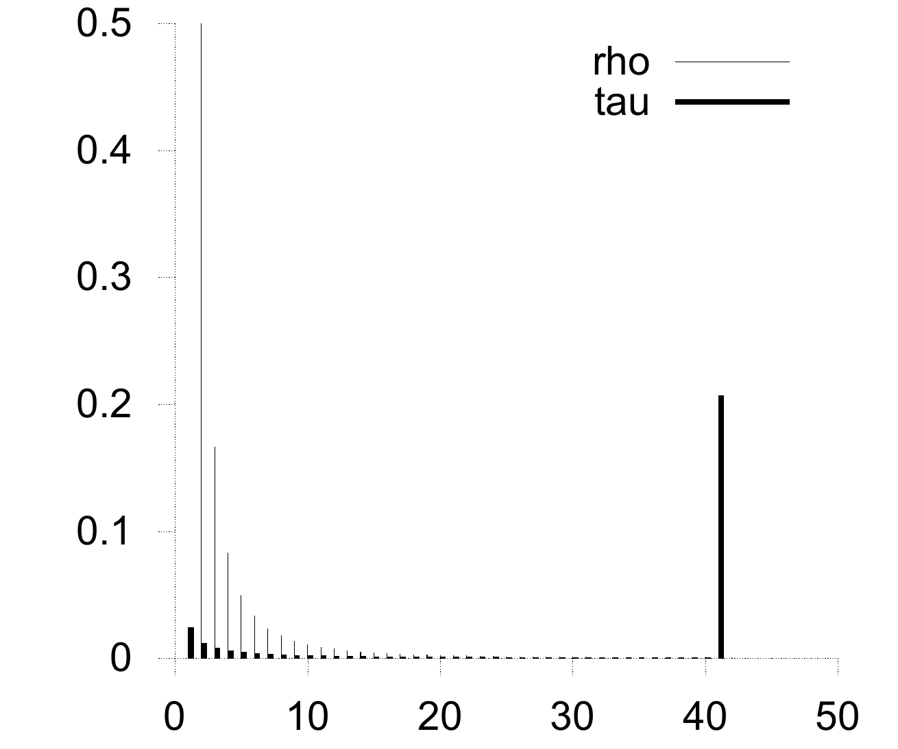
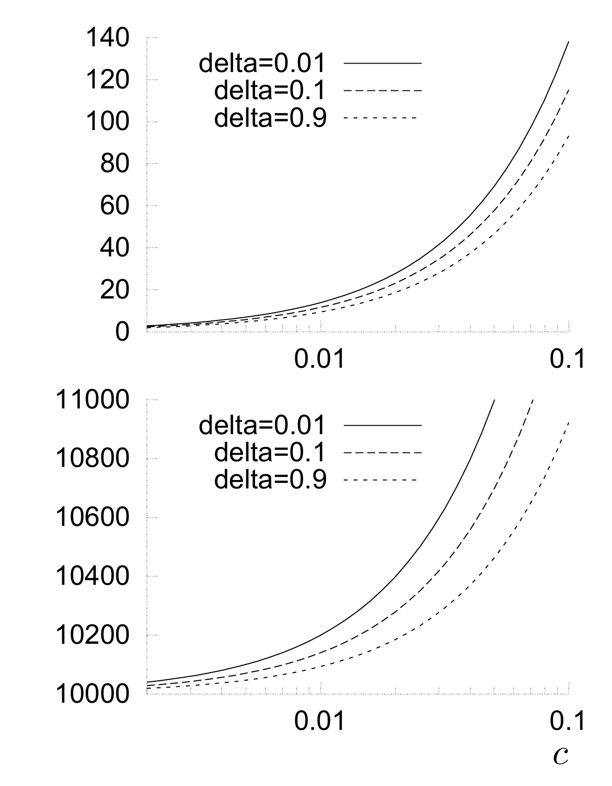

<!-- 原书 PDF 物理页 604；印刷页 592。页首接续 §50.3 段落已合入 pdf-603.md。 -->

理想情况下，为避免冗余，我们希望收到的图在每次迭代时恰好只有一个度为 1 的校验节点。每次处理这个校验节点，图中的度就以这样一种方式降低：出现一个新的度为 1 的校验节点。*在期望意义下*，理想孤波分布（ideal soliton distribution）可以实现这种理想行为：

$$\begin{aligned}\rho(1)&=1/K,\\ \rho(d)&=\frac{1}{d(d-1)}\quad\text{对 }d=2,3,\ldots,K.\end{aligned}\tag{50.2}$$

在这个分布下，期望度约为 $\ln K$。

图 50.2　在 $K=10\,000$、$c=0.2$、$\delta=0.05$ 时，$\rho(d)$ 和 $\tau(d)$ 的分布；由此得到 $S=244$、$K/S=41$、$Z\simeq1.3$。$\tau$ 在 $d=1$ 和 $d=K/S$ 处最大。图内图例 `rho` 表示 $\rho$（细线），`tau` 表示 $\tau$（粗线）；横轴是度 $d$。

▷ **习题 50.2**（难度 2）推导理想孤波分布。在第一次迭代（$t=0$）时，设度为 $d$ 的分组数为 $h_0(d)$；证明：当 $d>1$ 时，度从 $d$ 降为 $d-1$ 的分组的期望数为 $h_0(d)d/K$。在第 $t$ 次迭代时，若 $K$ 个分组中已有 $t$ 个恢复，度为 $d$ 的分组数是 $h_t(d)$，则度从 $d$ 降为 $d-1$ 的分组的期望数为 $h_t(d)d/(K-t)$。据此证明：若要使所有 $t\in\{0,\ldots,K-1\}$ 的度为 1 的分组期望数满足 $h_t(1)=1$，开始时必须有 $h_0(1)=1$ 和 $h_0(2)=K/2$；更一般地，$h_t(2)=(K-t)/2$。然后利用递推，依次求出 $d\geq3$ 时的 $h_0(d)$。

这个度分布在实际中效果很差，因为围绕期望行为的波动使译码过程中很可能在某个时刻没有度为 1 的校验节点；而且，一些源节点会完全得不到连接。稍作修改就能解决这些问题。

*稳健孤波分布*（robust soliton distribution）另有两个参数 $c$ 和 $\delta$；它的设计目标是让整个译码过程中度为 1 的校验节点期望数保持在大约

$$S\equiv c\ln(K/\delta)\sqrt K,\tag{50.3}$$

而不是 1。参数 $\delta$ 是一个上界：接收到一定数量 $K'$ 的分组后，译码仍未能运行到结束的概率不超过它。如果我们要证明 Luby 关于 LT 码的主要定理，$c$ 是一个数量级为 1 的常数；但在实际应用中，可以把它当作自由参数，取略小于 1 的值会有不错的结果。我们定义一个正函数

$$\tau(d)=\begin{cases}\displaystyle\frac{S}{K}\frac{1}{d},&\text{对 }d=1,2,\ldots,(K/S)-1,\\[4pt]\displaystyle\frac{S}{K}\ln(S/\delta),&\text{对 }d=K/S,\\[4pt]0,&\text{对 }d>K/S.\end{cases}\tag{50.4}$$

（见图 50.2 和习题 50.4，印刷页 594），再将理想孤波分布 $\rho$ 加到 $\tau$ 上并归一化，得到稳健孤波分布 $\mu$：

$$\mu(d)=\frac{\rho(d)+\tau(d)}{Z},\tag{50.5}$$

其中 $Z=\sum_d\rho(d)+\tau(d)$。为了以至少 $1-\delta$ 的概率保证译码能够运行到结束，接收方所需的编码分组数为 $K'=KZ$。

图 50.3　$K=10\,000$ 时，度为 1 的校验节点数 $S$（上图）和 $K'$（下图）随参数 $c$、$\delta$ 的变化。图内三种线型依次表示 `delta=0.01`、`delta=0.1` 和 `delta=0.9`，横轴为 $c$。Luby 的主要定理证明：存在某个 $c$ 值，使得给定 $K'$ 个收到的分组时，译码算法以 $1-\delta$ 的概率恢复 $K$ 个源分组。
