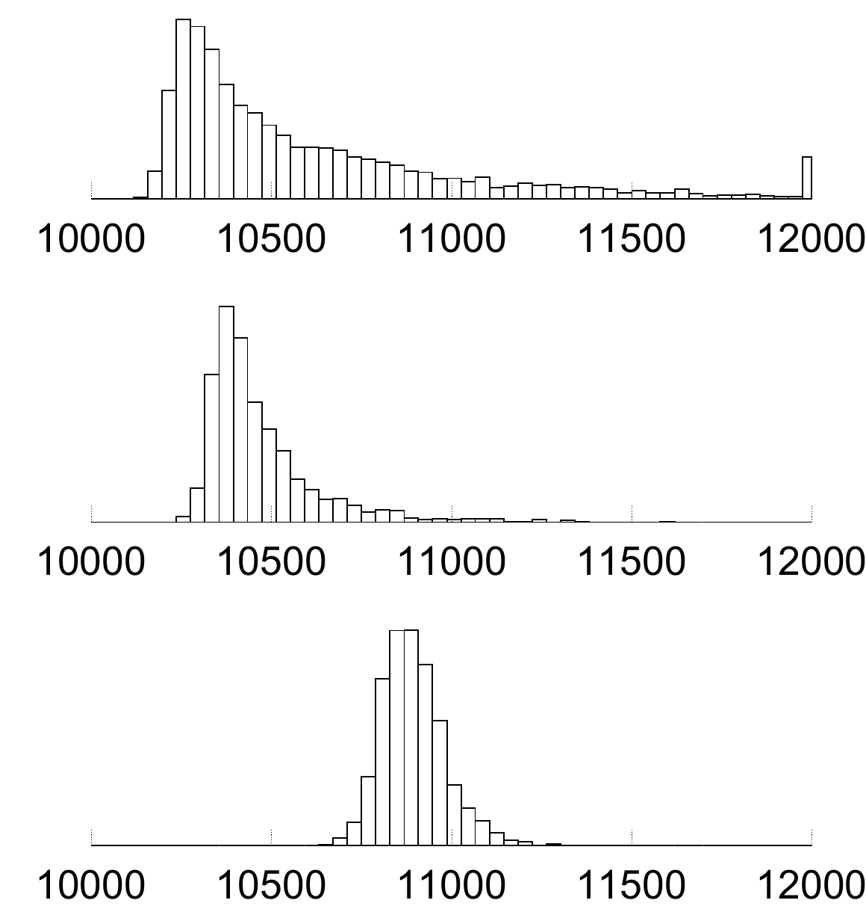

<!-- 原书 PDF 物理页 605；印刷页 593。页末“广播”首段跨 PDF 606 页首，在本页合成完整句。 -->

Luby（2002）的分析解释了 $\tau$ 在小 $d$ 一端的作用：它确保译码过程能够开始；$\tau$ 在 $d=K/S$ 处的尖峰，则用来保证每个源分组都很可能至少连接到一个校验节点。Luby 的关键结果是：当常数 $c$ 取合适值时，只要收到 $K'=K+2\ln(S/\delta)S$ 个校验分组，就能以至少 $1-\delta$ 的概率恢复全部分组。在示例图中，我把允许的译码失败概率 $\delta$ 设得相当大，因为实际失败概率远小于 Luby 的保守分析给出的值。

实际中，可以调节 LT 码的参数，使原始大小约为 $K\simeq10\,000$ 个分组的文件只需约 $5\%$ 的额外开销便可恢复。图 50.4 给出了两种参数设定下，实际所需分组数的直方图；其平均额外开销分别小于 $5\%$ 和 $10\%$。

图 50.4　恢复一个大小为 $K=10\,000$ 个分组的文件时，实际所需分组数 $N$ 的直方图。参数如下：上图 $c=0.01$、$\delta=0.5$（$S=10$、$K/S=1010$、$Z\simeq1.01$）；中图 $c=0.03$、$\delta=0.5$（$S=30$、$K/S=337$、$Z\simeq1.03$）；下图 $c=0.1$、$\delta=0.5$（$S=99$、$K/S=101$、$Z\simeq1.1$）。图内三幅横轴均为所需的分组数 $N$，刻度从 $10\,000$ 到 $12\,000$。

## 50.4　应用

数字喷泉码能在许多场景中提供出色的解决方案。下面举两个例子。

*存储*

你想为一个大文件做备份，但知道自己的磁带和硬盘都不可靠：单台设备可能发生灾难性故障，使其中一些已存储的分组永久丢失；这类故障的发生率大约为每天 $10^{-3}$。该如何存储文件？

可以用数字喷泉把编码分组撒到各处，存入所有可用的存储设备。之后若要恢复原本大小为 $K$ 个分组的备份文件，只需从任何地方找到 $K'\simeq K$ 个分组即可。损坏的分组无关紧要；跳过它们，再到别处找更多分组就行。

这种存储方法在恢复文件的*速度*方面也有优势。在硬盘上，通常把文件存放在连续的扇区，以便快速读取。但如果偶尔丢失一个分组（例如读写磁头短暂偏离磁道，形成一阵该分组自身纠错码也无法纠正的错误），磁盘就必须完整转过一圈，把该分组再次带到磁头下面读取。磁盘转一圈所需的时间会给文件系统带来不希望出现的延迟。

如果改用数字喷泉原理存储文件，让数字水滴分布在磁盘上一个或多个连续扇区中，就无须再忍受重读分组的延迟：分组丢失会变得不那么重要，因此硬盘可以运行得更快，容许更高的噪声水平，并将更少的资源用于有噪信道编码。

▷ **习题 50.3**（难度 2）比较使用数字喷泉在多块硬盘上实现可靠存储的方法，与 RAID（独立磁盘冗余阵列，redundant array of independent disks）。

*广播*

设想某地区有一万名订阅者，都想从一家广播机构接收一部数字电影。广播机构可以通过广播网络以分组形式发送电影，例如通过宽带电话线路或卫星。
