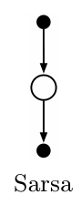

## 6.4 Sarsa：同策略 TD 控制

现在转向用 TD 预测方法解决控制问题。和以往一样，我们遵循广义策略迭代（GPI）的思路，只是这次用 TD 方法完成评估或预测。与蒙特卡洛方法一样，我们需要权衡探索与利用；方法也同样分为两大类：同策略和异策略。本节介绍一种同策略 TD 控制方法。

第一步是学习动作价值函数，而不是状态价值函数。具体来说，同策略方法必须针对当前行为策略 \(\pi\)，估计所有状态 \(s\) 和行动 \(a\) 的 \(q_\pi(s,a)\)。这基本可以用前面学习 \(v_\pi\) 的 TD 方法来做。回想一下，一个回合由状态和状态—行动对交替组成：

图内文字译注：圆圈中的 \(S_t,S_{t+1},S_{t+2},S_{t+3}\) 表示状态；黑点旁的 \(A_t,A_{t+1},A_{t+2},A_{t+3}\) 表示行动；相邻状态之间的 \(R_{t+1},R_{t+2},R_{t+3}\) 表示奖励。两端省略号表示序列继续。

上一节考虑从一个状态到下一个状态的转移，学习状态价值。现在我们考虑从一个状态—行动对到下一个状态—行动对的转移，学习状态—行动对的价值。从形式上看，两者完全相同：都是带有奖励过程的马尔可夫链。保证 TD(0) 状态价值收敛的定理，也适用于对应的动作价值算法：

公式（6.7）：\(Q(S_t,A_t) \leftarrow Q(S_t,A_t)+\alpha\bigl[R_{t+1}+\gamma Q(S_{t+1},A_{t+1})-Q(S_t,A_t)\bigr].\)

每当从非终止状态 \(S_t\) 发生一次转移，就进行这项更新。如果 \(S_{t+1}\) 是终止状态，则定义 \(Q(S_{t+1},A_{t+1})=0\)。这条规则用到了从一个状态—行动对转移到下一个状态—行动对时的五个事件元素：\((S_t,A_t,R_{t+1},S_{t+1},A_{t+1})\)。算法名称 **Sarsa** 就由这五个元素得来。右侧是 Sarsa 的备份图。

图内文字译注：顶部实心行动节点经由下一状态的空心节点，连到下一个实心行动节点；下方原文标注为“Sarsa”。

基于 Sarsa 预测方法设计同策略控制算法并不困难。与所有同策略方法一样，我们不断估计行为策略 \(\pi\) 的 \(q_\pi\)，同时根据 \(q_\pi\) 使 \(\pi\) 趋向贪心。下一页方框给出 Sarsa 控制算法的一般形式。

Sarsa 的收敛性质取决于策略如何依赖 \(Q\)。例如，可以采用 \(\varepsilon\)-贪心策略或 \(\varepsilon\)-soft 策略。在满足关于步长的通常条件（式（2.7））、所有状态—行动对都被无限次访问、且策略最终收敛到贪心策略时，Sarsa 以概率 1 收敛到最优策略和最优动作价值函数。例如，令 \(\varepsilon=1/t\)，就可以使 \(\varepsilon\)-贪心策略满足最后这一条件。

**习题 6.8：**证明式（6.6）的动作价值版本对动作价值 TD 误差 \(\delta_t=R_{t+1}+\gamma Q(S_{t+1},A_{t+1})-Q(S_t,A_t)\) 也成立，同样假设价值在各时间步之间不变。□
