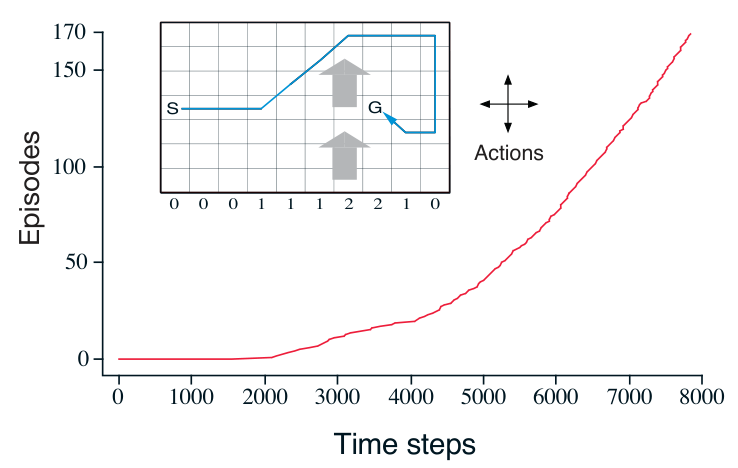

**Sarsa（同策略 TD 控制），用于估计 \(Q\approx q_*\)**

```text
算法参数：步长 α∈(0,1]；较小的 ε>0
对所有 s∈𝒮⁺、a∈𝒜(s) 任意初始化 Q(s,a)，但 Q(终止状态,·)=0
对每个回合重复：
    初始化 S
    在 S 根据由 Q 导出的策略选择 A（例如 ε-贪心）
    对回合中的每一步重复：
        执行行动 A，观察 R、S′
        在 S′ 根据由 Q 导出的策略选择 A′（例如 ε-贪心）
        Q(S,A) ← Q(S,A)+α[R+γQ(S′,A′)−Q(S,A)]
        S ← S′；A ← A′
    直到 S 为终止状态
```

**示例 6.5：有风的网格世界（Windy Gridworld）** 下方插图是一种标准的网格世界，有起点和目标，但中部有一股向上的侧风。行动仍是标准的四种：上、下、右、左；不过在中部区域，风会使实际到达的下一个状态向上偏移，偏移量随所在列而变。每列下方给出的风力，就是向上偏移的格数。例如，如果你在目标右侧一格，那么执行“左”会把你带到目标正上方一格。这个回合式任务没有折扣；在到达目标状态之前，每一步的奖励恒为 \(-1\)。



图内文字译注：横轴“Time steps”为时间步数，纵轴“Episodes”为已完成回合数。小图中 \(S\) 是起点，\(G\) 是目标；各列下方的数字 \(0,0,0,1,1,1,2,2,1,0\) 是该列向上的风力，灰色箭头表示风向；“Actions”旁的四向箭头表示可执行上、下、左、右四种行动。蓝色线是学得的贪心策略的一条路径；红色曲线展示随时间步数增长，累计完成的回合数。

右图展示对该任务应用 \(\varepsilon\)-贪心 Sarsa 的结果，其中 \(\varepsilon=0.1\)、\(\alpha=0.5\)，并且所有 \(s,a\) 的初始值 \(Q(s,a)=0\)。曲线的斜率不断增大，表明到达目标所需的时间越来越短。到第 8000 个时间步时，贪心策略早已达到最优（插图展示了它的一条路径）；但持续的 \(\varepsilon\)-贪心探索使平均每回合仍需约 17 步，比最少的 15 步多两步。注意，蒙特卡洛方法在这里不容易使用，因为并非所有策略都保证终止。如果某个策略使智能体一直停留在同一状态，下一回合就永远不会结束。Sarsa 等在线学习方法没有这个问题，因为它们能在回合进行期间很快学到这类策略很差，并转而采用其他选择。
