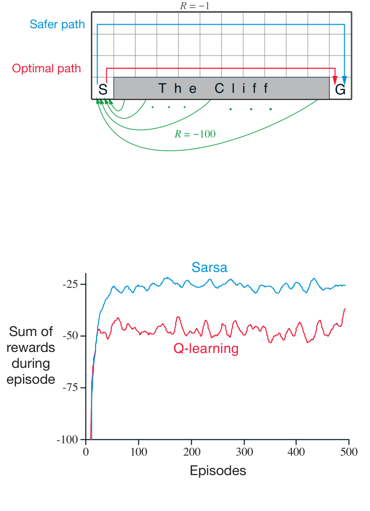

Q-learning 的备份图是什么样的？规则（6.8）更新一个状态—行动对，因此作为更新根节点的顶部节点必须是一个小的实心行动节点。更新值也来自行动节点，要对下一状态中所有可能行动取最大值。因此，备份图底部的节点应当是所有这些行动节点。最后请记住：我们用横跨这些“下一行动”节点的一道弧线表示取最大值（图 3.4 右图）。现在你能猜出备份图的形状吗？如果能，请先猜一猜，再翻到第 134 页图 6.4 查看答案。

**示例 6.6：悬崖行走（Cliff Walking）。**这个网格世界示例比较 Sarsa 和 Q-learning，突出同策略方法（Sarsa）与异策略方法（Q-learning）的差异。看右侧的网格世界：这是一个标准的无折扣回合式任务，设有起点和目标，通常的行动可以使智能体向上、下、右、左移动。除了进入标为“悬崖”的区域之外，所有转移的奖励都是 \(-1\)。踏入悬崖的奖励为 \(-100\)，并使智能体立即返回起点。

图内文字译注：上图中 \(S\) 是起点、\(G\) 是目标；灰色区域“The Cliff”是悬崖。“Safer path”（蓝线）是更安全的路径，“Optimal path”（红线）是最优路径；普通转移 \(R=-1\)，跌入悬崖 \(R=-100\) 并回到起点。下图横轴“Episodes”为回合数，纵轴“Sum of rewards during episode”为该回合奖励之和；蓝线“Sarsa”与红线“Q-learning”分别表示两种方法的在线表现。

右侧曲线展示采用 \(\varepsilon\)-贪心行动选择、\(\varepsilon=0.1\) 时两种方法的表现。经过初始的过渡阶段，Q-learning 学到了最优策略的价值；这条策略沿着悬崖边缘向右走。遗憾的是，由于 \(\varepsilon\)-贪心行动选择，智能体偶尔会因此跌下悬崖。Sarsa 则把实际的行动选择也考虑进去，学到穿过网格上部、路程更长但更安全的路径。虽然 Q-learning 实际上学到了最优策略的价值，它的在线表现却不如学到绕行策略的 Sarsa。当然，如果逐步减小 \(\varepsilon\)，两种方法最终都会收敛到最优策略。

**习题 6.11：**为什么 Q-learning 被视为异策略控制方法？□

**习题 6.12：**假设行动选择是贪心的，此时 Q-learning 与 Sarsa 是完全相同的算法吗？它们会作出完全相同的行动选择和权重更新吗？□
