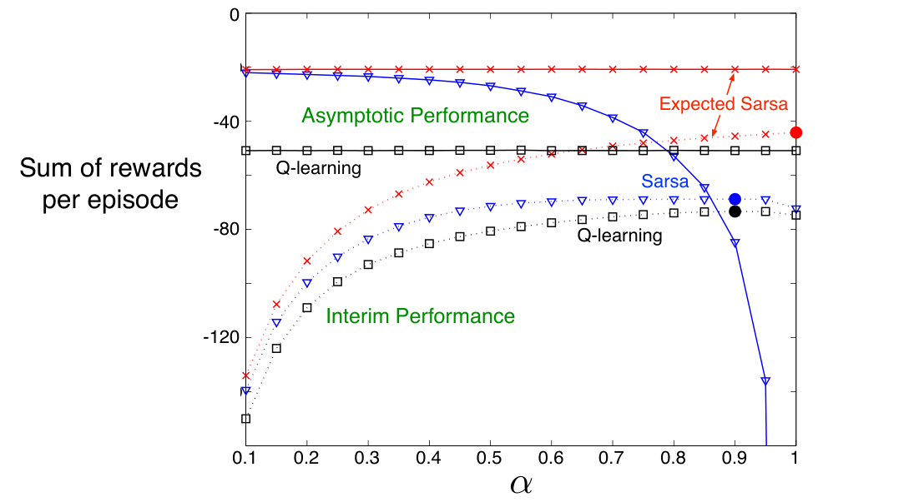

## 6.6 期望 Sarsa（Expected Sarsa）

设想一种学习算法：它与 Q-learning 相同，但不对下一状态—行动对取最大值，而是考虑当前策略选择各行动的概率，使用期望值。也就是说，考虑按下式更新的算法：

公式（6.9）：\(\begin{aligned}Q(S_t,A_t)&\leftarrow Q(S_t,A_t)+\alpha\bigl[R_{t+1}+\gamma\mathbb E_\pi[Q(S_{t+1},A_{t+1})\mid S_{t+1}]-Q(S_t,A_t)\bigr]\\&=Q(S_t,A_t)+\alpha\biggl[R_{t+1}+\gamma\sum_a\pi(a\mid S_{t+1})Q(S_{t+1},a)-Q(S_t,A_t)\biggr].\end{aligned}\)

除此之外，它遵循 Q-learning 的形式。给定下一状态 \(S_{t+1}\) 后，这种算法按照确定的方向移动，与 Sarsa 在期望意义上移动的方向相同，因此称为期望 Sarsa。它的备份图见右侧的图 6.4。

期望 Sarsa 在计算上比 Sarsa 更复杂，但作为回报，它消除了随机选择 \(A_{t+1}\) 带来的方差。在相同的经验量下，我们可以预期它的表现略好于 Sarsa；事实上，通常确实如此。图 6.3 汇总了在悬崖行走任务上，期望 Sarsa 与 Sarsa、Q-learning 的比较结果。在这个问题上，期望 Sarsa 保留了 Sarsa 相对于 Q-learning 的显著优势。此外，在广泛的步长参数 \(\alpha\) 取值范围内，期望 Sarsa 相对于 Sarsa 也有显著改进。

**图 6.3：**悬崖行走任务中，TD 控制方法的阶段性表现和渐近表现随 \(\alpha\) 变化的情况。所有算法都采用 \(\varepsilon=0.1\) 的 \(\varepsilon\)-贪心策略。渐近表现是对 100,000 个回合取平均，其结果又平均了超过 10 次运行；阶段性表现是对前 100 个回合取平均，其结果又平均了超过 50,000 次运行。实心圆点标出每种方法的最佳阶段性表现。改编自 van Seijen 等（2009）。图内文字译注：横轴为步长 \(\alpha\)，纵轴“Sum of rewards per episode”为每回合奖励之和；“Asymptotic Performance”为渐近表现，“Interim Performance”为阶段性表现；红色是期望 Sarsa，蓝色是 Sarsa，黑色是 Q-learning。
