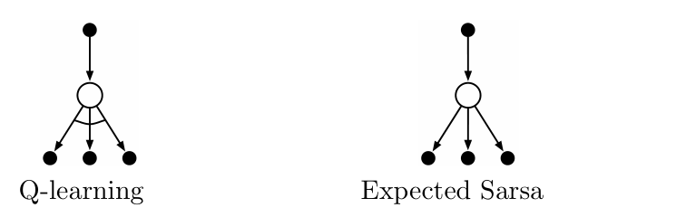

**图 6.4：**Q-learning（左）和期望 Sarsa（右）的备份图。图内文字译注：两者都从顶部的实心行动节点，经由空心状态节点，指向下一状态的所有可能行动；左图跨越底部行动节点的弧线表示取最大值，右图对这些行动按策略概率求期望。

在悬崖行走任务中，状态转移都是确定的，所有随机性都来自策略。在这种情况下，期望 Sarsa 可以安全地把 \(\alpha\) 设为 1，而不会损害渐近表现；Sarsa 却只有在 \(\alpha\) 很小时才能长期表现良好，而这又会使短期表现变差。在这个示例及其他示例中，期望 Sarsa 相对 Sarsa 显示出一致的经验优势。

上述悬崖行走结果将期望 Sarsa 作为同策略方法使用；但一般来说，产生行为的策略也可以不同于目标策略 \(\pi\)，这时它就成为异策略算法。例如，若 \(\pi\) 是贪心策略，而行为策略更倾向于探索，那么期望 Sarsa 恰好就是 Q-learning。从这个意义上说，期望 Sarsa 包含并推广了 Q-learning，同时可靠地优于 Sarsa。除了额外增加一点计算量，期望 Sarsa 可能全面胜过另外两种更广为人知的 TD 控制算法。

## 6.7 最大化偏差与双重学习

到目前为止讨论的所有控制算法，在构造目标策略时都涉及最大化。例如，Q-learning 的目标策略是由当前动作价值给出的贪心策略，其定义使用最大值；Sarsa 的策略通常是 \(\varepsilon\)-贪心，也涉及最大化。这些算法会隐含地把估计值的最大值当作真实价值最大值的估计，这可能造成显著的正偏差。为看清原因，考虑单一状态 \(s\)：许多行动 \(a\) 的真实价值 \(q(s,a)\) 都是零，但估计值 \(Q(s,a)\) 不确定，因此有些高于零，有些低于零。真实价值的最大值为零，估计值的最大值却为正，这就是正偏差。我们称之为**最大化偏差**。

**示例 6.7：最大化偏差示例。**图 6.5 插图中的小型马尔可夫决策过程（MDP），简单说明了最大化偏差如何损害 TD 控制算法的表现。该 MDP 有两个非终止状态 A 和 B。每个回合都从 A 开始，可选择左或右。向右会立即转移到终止状态，奖励和回报都为零。向左会转移到 B，奖励也为零；在 B 有许多可能的行动，任一行动都会立即终止，奖励取自均值为 \(-0.1\)、方差为 1.0 的正态分布。因此，任何以“左”开头的轨迹，其期望回报都是 \(-0.1\)；所以在状态 A 选择“左”始终是一个错误。尽管如此，最大化偏差可能使 B 看起来具有正价值，从而使我们的控制方法偏好向左。图 6.5 表明，在这个示例中，采用 \(\varepsilon\)-贪心行动选择的 Q-learning 起初学到强烈偏好向左。即使到了渐近阶段，在这里的参数设定 \((\varepsilon=0.1,\alpha=0.1,\gamma=1)\) 下，Q-learning 选择向左的频率仍比最优情况高出约 5%。
