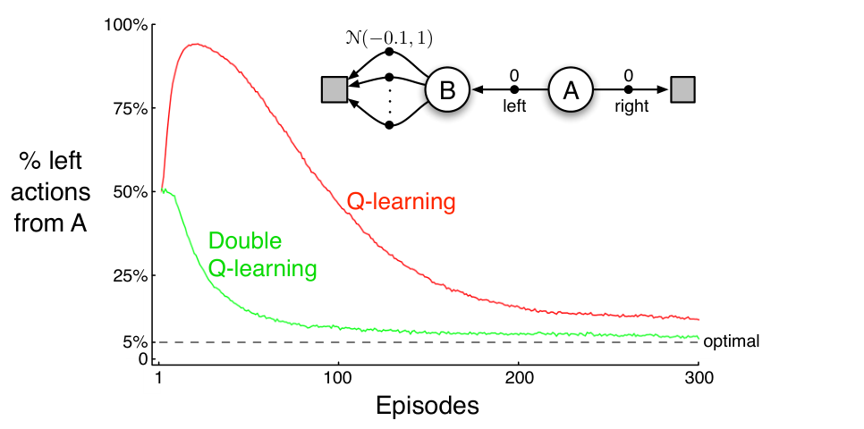

**图 6.5：**在插图所示的简单回合式 MDP 上比较 Q-learning 和双重 Q-learning。Q-learning 起初学到选择“左”的频率远高于“右”，而且选择“左”的频率始终显著高于 \(\varepsilon=0.1\) 的 \(\varepsilon\)-贪心行动选择所规定的最低概率 5%。相比之下，双重 Q-learning 基本不受最大化偏差影响。数据为 10,000 次运行的平均结果。初始动作价值估计均为零。\(\varepsilon\)-贪心行动选择中如遇估计值相同，则随机打破平局。图内文字译注：横轴“Episodes”为回合数；纵轴“% left actions from A”为在 A 状态选择“左”的百分比；红线为 Q-learning，绿线为双重 Q-learning，虚线“optimal”为最优情况下的 5%。插图中 A 向右获得 0 奖励并终止；向左以 0 奖励进入 B；B 的多个行动均立即终止，奖励服从均值 \(-0.1\)、方差 1 的正态分布 \(\mathcal N(-0.1,1)\)。

有没有避免最大化偏差的算法？先考虑一个多臂老虎机问题：对许多行动的价值，我们只有带噪声的估计，这些估计是每个行动历次被选择后所得奖励的样本平均值。如上所述，如果用这些估计值的最大值来估计真实价值的最大值，就会产生正的最大化偏差。一种理解方式是：同一批样本（行动选择）既被用来确定哪个行动的估计值最大，又被用来估计该行动的价值。假设把这些样本分成两组，学出两个独立估计 \(Q_1(a)\) 和 \(Q_2(a)\)，二者都估计所有 \(a\in\mathcal A\) 的真实价值 \(q(a)\)。我们可以用其中一个估计，例如 \(Q_1\)，确定最大化行动 \(A^*=\arg\max_a Q_1(a)\)，再用另一个估计 \(Q_2\) 给出该行动的价值估计 \(Q_2(A^*)=Q_2(\arg\max_a Q_1(a))\)。这个估计是无偏的，即 \(\mathbb E[Q_2(A^*)]=q(A^*)\)。交换两个估计的角色，还能得到第二个无偏估计 \(Q_1(\arg\max_a Q_2(a))\)。这就是**双重学习**的思想。注意，虽然要学习两个估计，但每次选择只更新其中一个；双重学习使存储需求翻倍，却不会增加每步的计算量。

双重学习的思想自然可以扩展到完整 MDP 的算法。例如，与 Q-learning 对应的双重学习算法称为**双重 Q-learning**；它把时间步分成两组，可以在每一步抛硬币决定分组。如果硬币正面朝上，则按下式更新：
