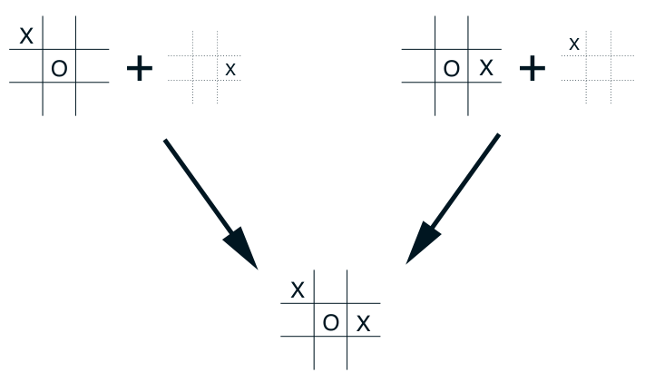

我们称这样的局面为**后继状态（afterstates）**，定义在它们之上的价值函数称为**后继状态价值函数**。如果我们知道环境动力学的起始一部分，却不一定知道完整动力学，后继状态就很有用。例如，在游戏中，我们通常知道自己走棋的直接效果。对于每一步可能的国际象棋走法，我们都知道它会形成什么局面，却不知道对手将如何应对。后继状态价值函数能自然地利用这类知识，从而提高学习效率。

井字棋的例子清楚地说明，为什么用后继状态设计算法会更高效。传统动作价值函数把“局面和走法”的组合映射到价值估计。但许多不同的“局面—走法”组合会产生同一个结果局面，如下图所示。在这种情况下，两个“局面—走法”组合虽然不同，却产生同一个“落子后局面”，因此必然具有相同的价值。传统动作价值函数需要分别评估这两个组合，而后继状态价值函数会立即给它们相同的评估。对左侧组合学到的任何知识，都会立即迁移到右侧组合。

图内文字译注：上方两种不同的棋盘局面分别加上一个 X 落子；向下箭头指向同一个落子后棋盘局面。O 和 X 为双方棋子，不是坐标或公式变量。

后继状态不仅出现在游戏中，还见于许多任务。例如，在排队任务中，行动可以是把顾客分配给服务器、拒绝顾客，或丢弃信息。在这些情况下，行动实际上是按其即时效果定义的，而这些效果完全已知。

不可能把所有特殊问题及相应的专门学习算法一一列出。不过，本书提出的原则应当广泛适用。例如，后继状态方法仍可恰当地用广义策略迭代来描述：策略与（后继状态）价值函数以基本相同的方式相互作用。在许多情况下，为满足持续探索的需要，人们仍须在同策略与异策略方法之间作出选择。

**习题 6.14：**请描述如何用后继状态重新表述杰克租车任务（示例 4.2）。结合这个具体任务说明，这种重新表述为什么可能加快收敛。□
